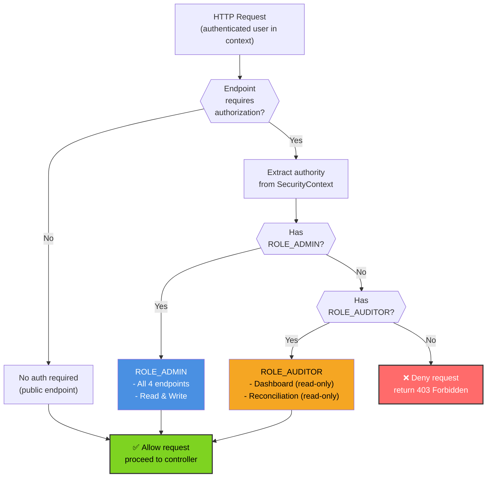
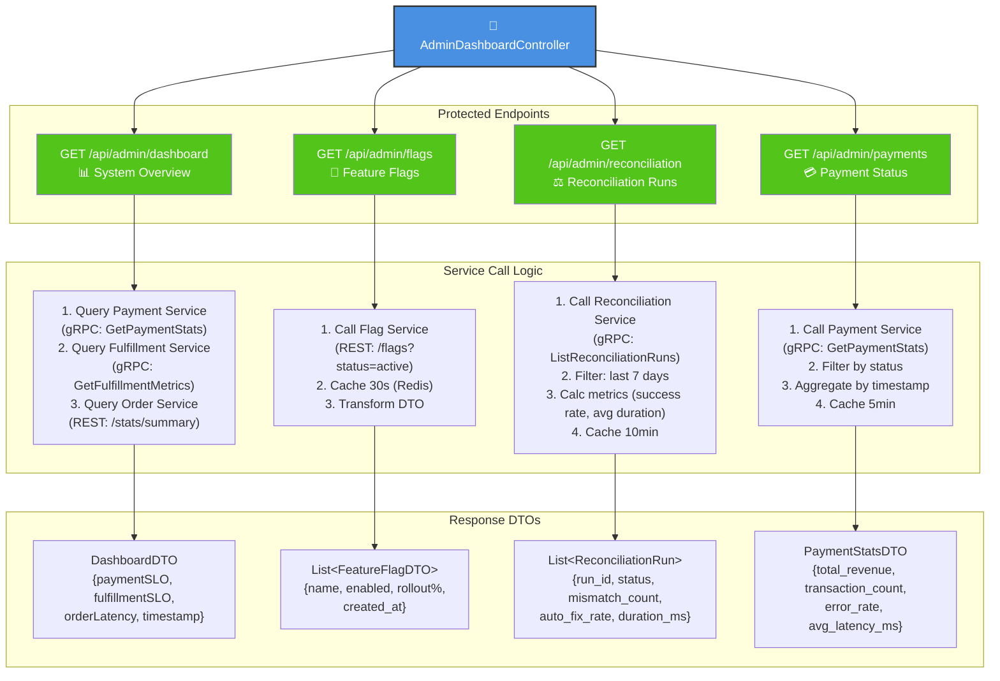
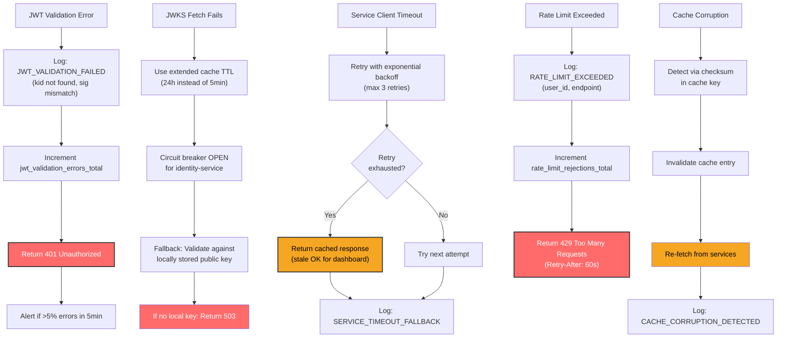

# Admin Gateway - Low-Level Design

## Component Architecture

```mermaid
graph TB
    HTTPRequest["🌐 HTTP Request<br/>(JWT in Authorization header)"]

    DispatcherServlet["DispatcherServlet<br/>(Spring MVC)"]
    JwtFilter["🔐 AdminJwtAuthenticationFilter<br/>(implements OncePerRequestFilter)"]
    ExtractJwt["Extract JWT from<br/>Authorization: Bearer"]
    ValidateJwt["Validate JWT Signature<br/>(RS256 against JWKS)"]

    JwksCache["JWKS Cache<br/>(refreshed every 5min)"]

    CheckAudience["✅ Audience Validator<br/>(aud: instacommerce-admin)"]
    ExtractClaims["📋 Claims Extractor<br/>(sub, roles, scope, exp)"]

    SecurityContext["🛡️ SecurityContext<br/>(set principal + authorities)"]

    AuthzFilter["🚨 RoleBasedAuthStrategy<br/>(authorization filter)"]
    CheckRoles["Check ROLE_ADMIN<br/>or ROLE_AUDITOR"]

    RateLimiter["⏱️ Rate Limiter<br/>(100 req/min per user)"]

    MetricsCollector["📊 Metrics Collector<br/>(Micrometer)"]

    DashboardController["📊 AdminDashboardController<br/>(@RestController)"]

    FlagsEndpoint["🚩 GET /api/admin/flags<br/>@GetMapping"]
    ReconcileEndpoint["⚖️ GET /api/admin/reconciliation<br/>@GetMapping"]
    PaymentEndpoint["💳 GET /api/admin/payments<br/>@GetMapping"]
    DashboardEndpoint["📈 GET /api/admin/dashboard<br/>@GetMapping"]

    FlagServiceClient["Service Clients<br/>(gRPC/REST)"]
    ReconcileServiceClient[""]
    PaymentServiceClient[""]

    Response["✅ 200 OK<br/>or ❌ 401/403/429"]

    HTTPRequest --> DispatcherServlet
    DispatcherServlet --> JwtFilter

    JwtFilter --> ExtractJwt
    ExtractJwt --> ValidateJwt
    ValidateJwt --> JwksCache

    ValidateJwt --> CheckAudience
    CheckAudience --> ExtractClaims
    ExtractClaims --> SecurityContext

    SecurityContext --> AuthzFilter
    AuthzFilter --> CheckRoles
    CheckRoles --> RateLimiter

    RateLimiter --> MetricsCollector
    MetricsCollector --> DashboardController

    DashboardController --> FlagsEndpoint
    DashboardController --> ReconcileEndpoint
    DashboardController --> PaymentEndpoint
    DashboardController --> DashboardEndpoint

    FlagsEndpoint --> FlagServiceClient
    ReconcileEndpoint --> ReconcileServiceClient
    PaymentEndpoint --> PaymentServiceClient

    FlagServiceClient --> Response
    ReconcileServiceClient --> Response
    PaymentServiceClient --> Response

    style JwtFilter fill:#7ED321,color:#000,stroke:#333,stroke-width:2px
    style CheckAudience fill:#F5A623,color:#000,stroke:#333,stroke-width:2px
    style AuthzFilter fill:#FF6B6B,color:#fff,stroke:#333,stroke-width:2px
    style SecurityContext fill:#4A90E2,color:#fff,stroke:#333,stroke-width:2px
    style MetricsCollector fill:#9013FE,color:#fff,stroke:#333,stroke-width:2px
    style DashboardController fill:#4A90E2,color:#fff,stroke:#333,stroke-width:2px
```

## AdminJwtAuthenticationFilter Implementation

```mermaid
graph TD
    A["OncePerRequestFilter.doFilterInternal<br/>(thread-safe)"]
    B["Extract Authorization header<br/>Pattern: Bearer TOKEN"]
    C{"Bearer token<br/>present?"}
    D["Parse JWT claims<br/>(header + payload)"]
    E{"Extract kid<br/>from header"}
    F["Lookup kid in JWKS<br/>(5-min cached)"]
    G{"kid found?"}
    H["Verify RS256 signature<br/>using public key"]
    I{"Signature<br/>valid?"}
    J["Extract claims<br/>(sub, roles, aud, exp)"]
    K["Validate aud claim<br/>=instacommerce-admin"}
    L{"aud<br/>match?"}
    M["Check token not expired<br/>(exp > now)"]
    N{"Expired?"}
    O["Extract roles array<br/>Check for ADMIN role"]
    P{"ADMIN<br/>role?"}
    Q["✅ Set SecurityContext<br/>(principal + authorities)"]
    R["Log: JWT_VALIDATED<br/>(with user_id, roles)"]
    S["Continue filter chain"]
    T["❌ Log error<br/>(JWT_VALIDATION_FAILED)"]
    U["Send 401 Unauthorized"]
    V["Continue filter chain"]

    A --> B
    B --> C
    C -->|No| T
    C -->|Yes| D
    D --> E
    E --> F
    F --> G
    G -->|Not found| T
    G -->|Found| H
    H --> I
    I -->|Invalid| T
    I -->|Valid| J
    J --> K
    K --> L
    L -->|No| T
    L -->|Yes| M
    M --> N
    N -->|Yes| T
    N -->|No| O
    O --> P
    P -->|No| T
    P -->|Yes| Q
    Q --> R
    R --> S
    T --> U
    U --> V

    style Q fill:#7ED321,color:#000,stroke:#333,stroke-width:2px
    style U fill:#FF6B6B,color:#fff,stroke:#333,stroke-width:2px
    style A fill:#4A90E2,color:#fff,stroke:#333,stroke-width:2px
    style R fill:#9013FE,color:#fff
```

## RoleBasedAuthStrategy Evaluation



## AdminDashboardController - 4 Endpoints



## Metrics Collection Pipeline

```mermaid
graph LR
    Request["🌐 HTTP Request"]
    Timer["⏱️ Timer start"]

    Auth["🔐 JWT Auth<br/>~5ms"]
    AuthMetric["jwt_auth_duration_ms"]

    Authz["✅ Authorization<br/>~2ms"]
    AuthzMetric["jwt_authz_duration_ms"]

    RateLimit["🚦 Rate Limit<br/>~1ms"]
    RateLimitMetric["rate_limit_check_duration_ms<br/>+ rate_limit_hits_total"]

    ServiceCalls["📞 Service Calls<br/>~200-300ms"]
    ServiceMetric["downstream_service_call_duration_ms<br/>(per service)"]

    Cache["💾 Cache<br/>~10ms"]
    CacheMetric["cache_hits_total<br/>+ cache_misses_total"]

    Response["📤 Response<br/>~20ms"]
    ResponseMetric["http_response_time_ms<br/>+ http_response_status_total"]

    Timer --> Auth
    Auth --> AuthMetric
    AuthMetric --> Authz
    Authz --> AuthzMetric
    AuthzMetric --> RateLimit
    RateLimit --> RateLimitMetric
    RateLimitMetric --> ServiceCalls
    ServiceCalls --> ServiceMetric
    ServiceMetric --> Cache
    Cache --> CacheMetric
    CacheMetric --> Response
    Response --> ResponseMetric

    style Timer fill:#9013FE,color:#fff
    style AuthMetric fill:#9013FE,color:#fff
    style AuthzMetric fill:#9013FE,color:#fff
    style RateLimitMetric fill:#9013FE,color:#fff
    style ServiceMetric fill:#9013FE,color:#fff
    style CacheMetric fill:#9013FE,color:#fff
    style ResponseMetric fill:#9013FE,color:#fff
```



## SLO: P99 Latency Target <500ms

```
┌─────────────────────────────────────────────────────────────┐
│  Admin Gateway Request Timeline (P99 target: <500ms)        │
├─────────────────────────────────────────────────────────────┤
│ JWT Extraction & Parsing:              ~2ms                 │
│ JWT Signature Validation (RS256):      ~15ms (cached JWKS)   │
│ Audience Check:                        ~1ms                 │
│ Claims Extraction:                     ~2ms                 │
│ SecurityContext Setup:                 ~1ms                 │
│ Authorization (Role Check):            ~5ms                 │
│ Rate Limiter Check:                    ~3ms                 │
│ Subtotal (Auth overhead):              ~29ms                │
│                                                             │
│ Downstream Service Calls (parallel):   ~300-350ms (p99)     │
│   - Payment Service (gRPC):            ~200ms p99           │
│   - Fulfillment Service (gRPC):        ~250ms p99           │
│   - Reconciliation Service (gRPC):     ~300ms p99           │
│   - Flag Service (REST cached):        ~50ms p99            │
│                                                             │
│ Response Aggregation:                  ~20ms                │
│ Response Serialization:                ~15ms                │
│ Network I/O (ALB, TLS):               ~30ms                │
│                                                             │
│ TOTAL P99:                             ~434ms               │
│ BUFFER (500ms target):                 ~66ms                │
│ STATUS:                                ✅ WITHIN SLO        │
└─────────────────────────────────────────────────────────────┘
```

## Error Paths & Resilience


