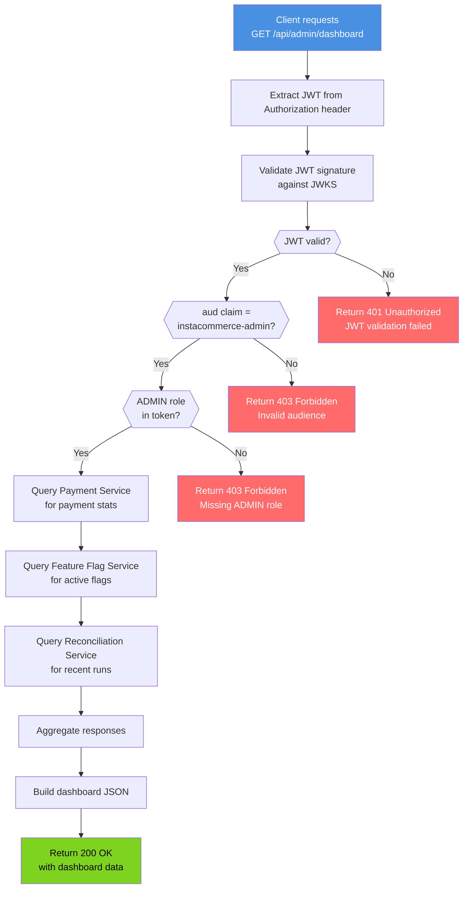
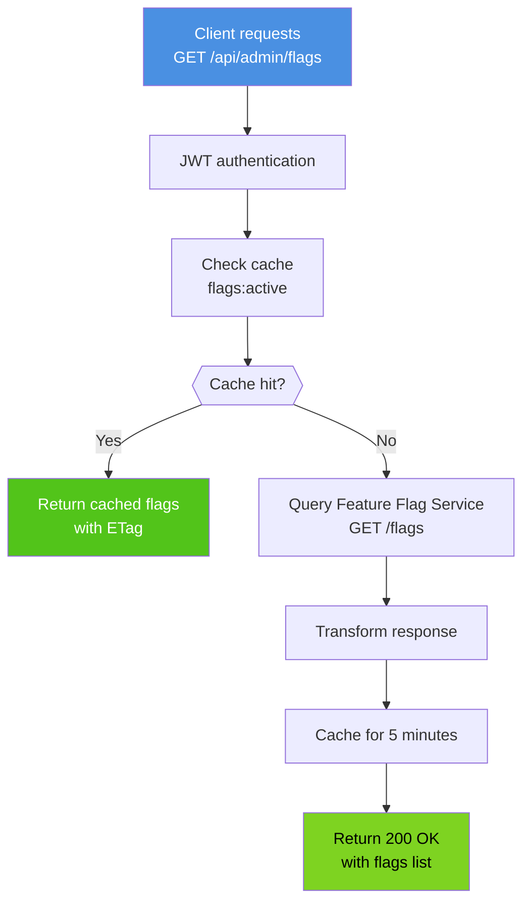
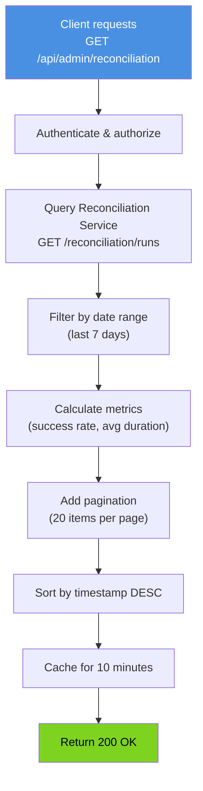

# Admin Gateway - Flowchart (Dashboard Query Read Path)

```mermaid
flowchart TD
    A["Client requests<br/>GET /api/admin/dashboard"]
    B["Extract JWT from Authorization header"]
    C["Validate JWT signature<br/>against JWKS"]
    D{{"JWT valid?"}}
    E{{"aud claim =<br/>instacommerce-admin?"}}
    F{{"ADMIN role<br/>in token?"}}
    G["Query Payment Service<br/>for payment stats"]
    H["Query Feature Flag Service<br/>for active flags"]
    I["Query Reconciliation Service<br/>for recent runs"]
    J["Aggregate responses"]
    K["Build dashboard JSON"]
    L["Return 200 OK<br/>with dashboard data"]
    M["Return 401 Unauthorized<br/>JWT validation failed"]
    N["Return 403 Forbidden<br/>Invalid audience"]
    O["Return 403 Forbidden<br/>Missing ADMIN role"]

    A --> B
    B --> C
    C --> D
    D -->|No| M
    D -->|Yes| E
    E -->|No| N
    E -->|Yes| F
    F -->|No| O
    F -->|Yes| G
    G --> H
    H --> I
    I --> J
    J --> K
    K --> L

    style A fill:#4A90E2,color:#fff
    style L fill:#7ED321,color:#000
    style M fill:#FF6B6B,color:#fff
    style N fill:#FF6B6B,color:#fff
    style O fill:#FF6B6B,color:#fff
```

## Flag Management Read Path

```mermaid
flowchart TD
    A["Client requests<br/>GET /api/admin/flags"]
    B["JWT authentication"]
    C["Check cache<br/>flags:active"]
    D{{"Cache hit?"}}
    E["Return cached flags<br/>with ETag"]
    F["Query Feature Flag Service<br/>GET /flags"]
    G["Transform response"]
    H["Cache for 5 minutes"]
    I["Return 200 OK<br/>with flags list"]

    A --> B
    B --> C
    C --> D
    D -->|Yes| E
    D -->|No| F
    F --> G
    G --> H
    H --> I

    style A fill:#4A90E2,color:#fff
    style E fill:#52C41A,color:#fff
    style I fill:#7ED321,color:#000
```

## Reconciliation Status Query

```mermaid
flowchart TD
    A["Client requests<br/>GET /api/admin/reconciliation"]
    B["Authenticate & authorize"]
    C["Query Reconciliation Service<br/>GET /reconciliation/runs"]
    D["Filter by date range<br/>(last 7 days)"]
    E["Calculate metrics<br/>(success rate, avg duration)"]
    F["Add pagination<br/>(20 items per page)"]
    G["Sort by timestamp DESC"]
    H["Cache for 10 minutes"]
    I["Return 200 OK"]

    A --> B
    B --> C
    C --> D
    D --> E
    E --> F
    F --> G
    G --> H
    H --> I

    style A fill:#4A90E2,color:#fff
    style I fill:#7ED321,color:#000
```
