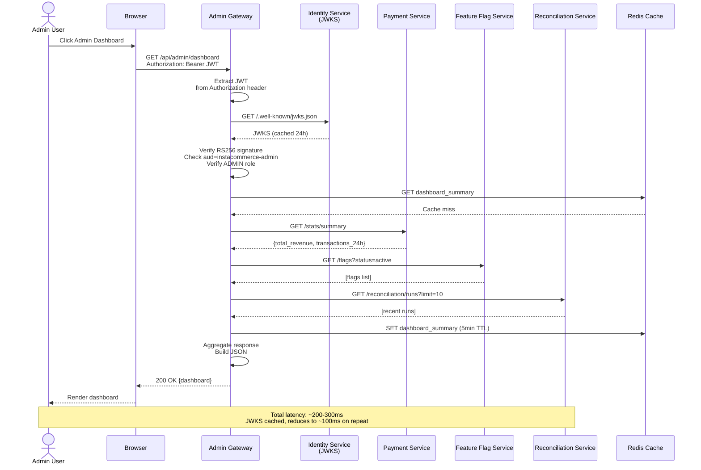
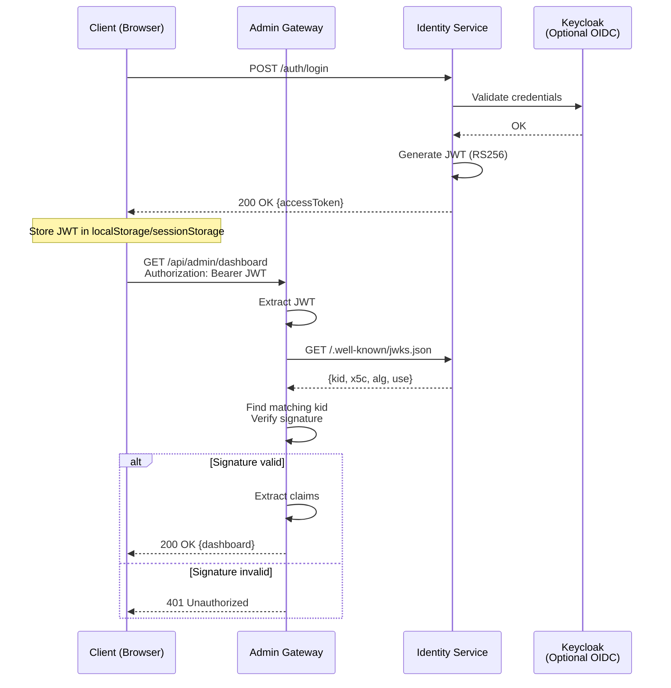

# Admin Gateway - Sequence Diagram (Dashboard Load)

```mermaid
sequenceDiagram
    actor AdminUser as Admin User
    participant Browser as Browser
    participant AdminGateway as Admin Gateway
    participant IdentityService as Identity Service<br/>(JWKS)
    participant PaymentSvc as Payment Service
    participant FlagSvc as Feature Flag Service
    participant ReconcileSvc as Reconciliation Service
    participant Cache as Redis Cache

    AdminUser->>Browser: Click Admin Dashboard
    Browser->>AdminGateway: GET /api/admin/dashboard<br/>Authorization: Bearer JWT
    AdminGateway->>AdminGateway: Extract JWT<br/>from Authorization header
    AdminGateway->>IdentityService: GET /.well-known/jwks.json
    IdentityService-->>AdminGateway: JWKS (cached 24h)
    AdminGateway->>AdminGateway: Verify RS256 signature<br/>Check aud=instacommerce-admin<br/>Verify ADMIN role
    AdminGateway->>Cache: GET dashboard_summary
    Cache-->>AdminGateway: Cache miss
    AdminGateway->>PaymentSvc: GET /stats/summary
    PaymentSvc-->>AdminGateway: {total_revenue, transactions_24h}
    AdminGateway->>FlagSvc: GET /flags?status=active
    FlagSvc-->>AdminGateway: [flags list]
    AdminGateway->>ReconcileSvc: GET /reconciliation/runs?limit=10
    ReconcileSvc-->>AdminGateway: [recent runs]
    AdminGateway->>Cache: SET dashboard_summary (5min TTL)
    AdminGateway->>AdminGateway: Aggregate response<br/>Build JSON
    AdminGateway-->>Browser: 200 OK {dashboard}
    Browser-->>AdminUser: Render dashboard

    Note over AdminUser,ReconcileSvc: Total latency: ~200-300ms<br/>JWKS cached, reduces to ~100ms on repeat
```

## JWT Token Flow

```mermaid
sequenceDiagram
    participant Client as Client (Browser)
    participant AdminGateway as Admin Gateway
    participant IdentityService as Identity Service
    participant Keycloak as Keycloak<br/>(Optional OIDC)

    Client->>IdentityService: POST /auth/login
    IdentityService->>Keycloak: Validate credentials
    Keycloak-->>IdentityService: OK
    IdentityService->>IdentityService: Generate JWT (RS256)
    IdentityService-->>Client: 200 OK {accessToken}

    Note over Client: Store JWT in localStorage/sessionStorage

    Client->>AdminGateway: GET /api/admin/dashboard<br/>Authorization: Bearer JWT
    AdminGateway->>AdminGateway: Extract JWT
    AdminGateway->>IdentityService: GET /.well-known/jwks.json
    IdentityService-->>AdminGateway: {kid, x5c, alg, use}
    AdminGateway->>AdminGateway: Find matching kid<br/>Verify signature
    alt Signature valid
        AdminGateway->>AdminGateway: Extract claims
        AdminGateway-->>Client: 200 OK {dashboard}
    else Signature invalid
        AdminGateway-->>Client: 401 Unauthorized
    end
```
