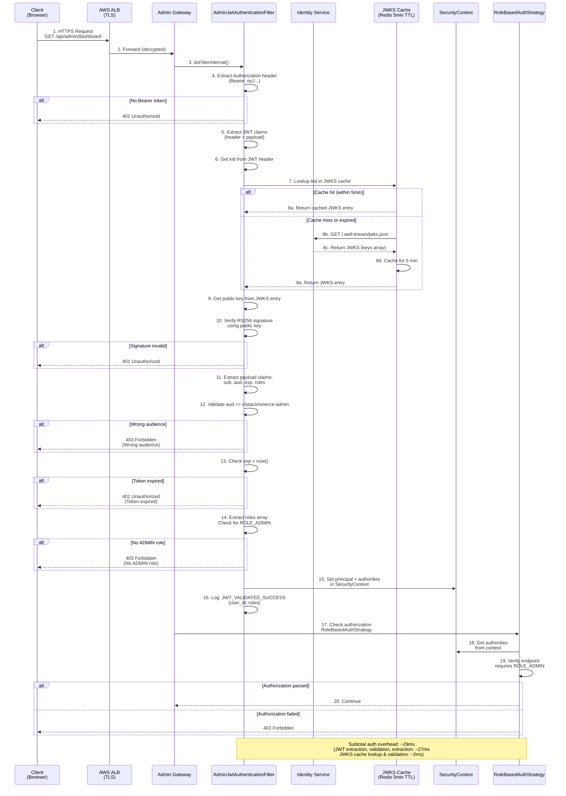
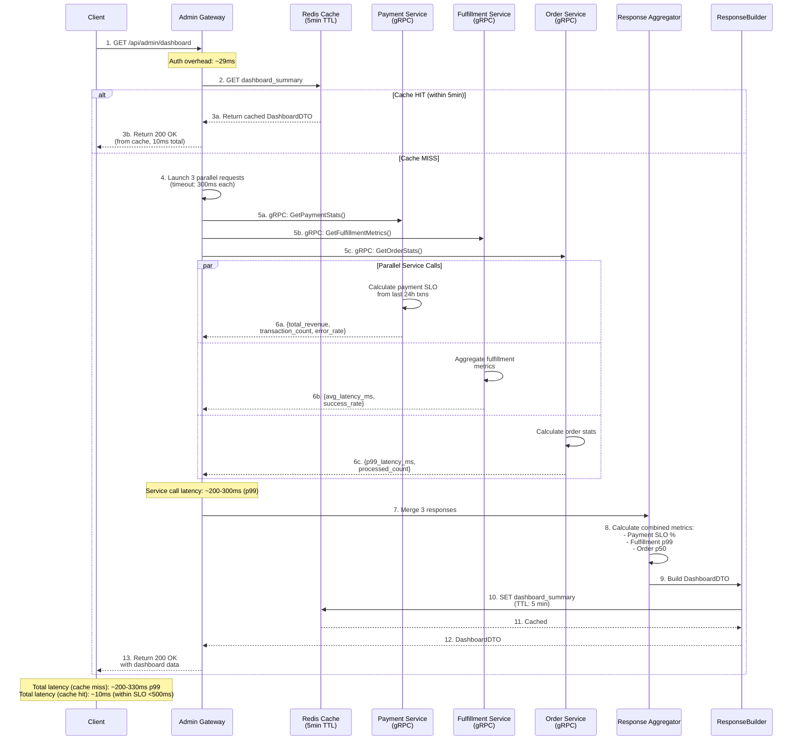
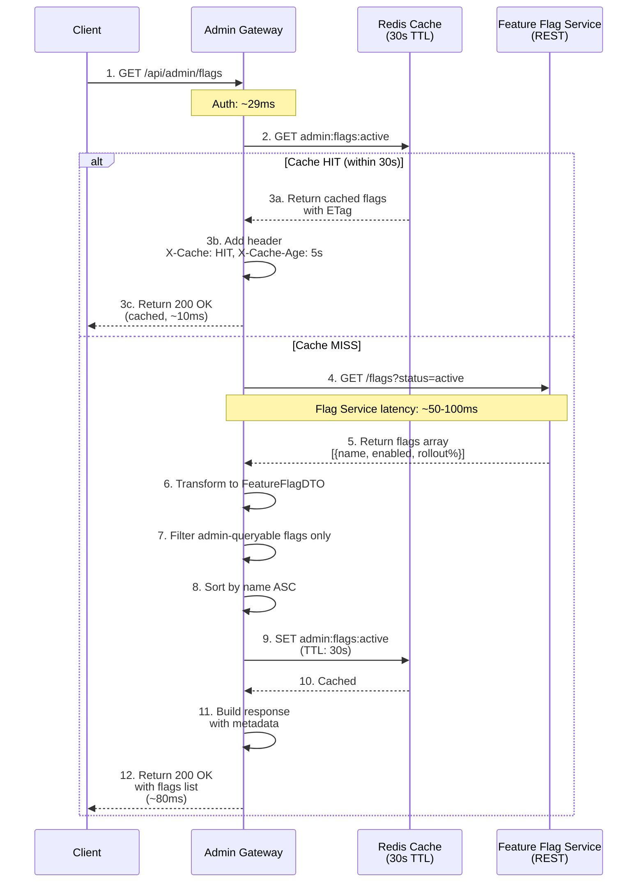
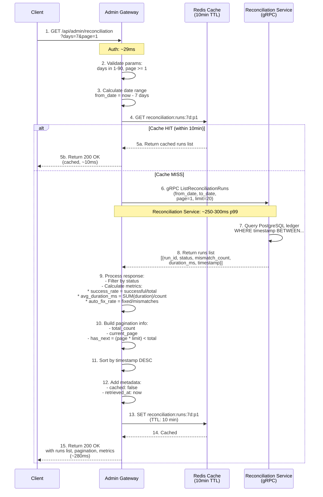
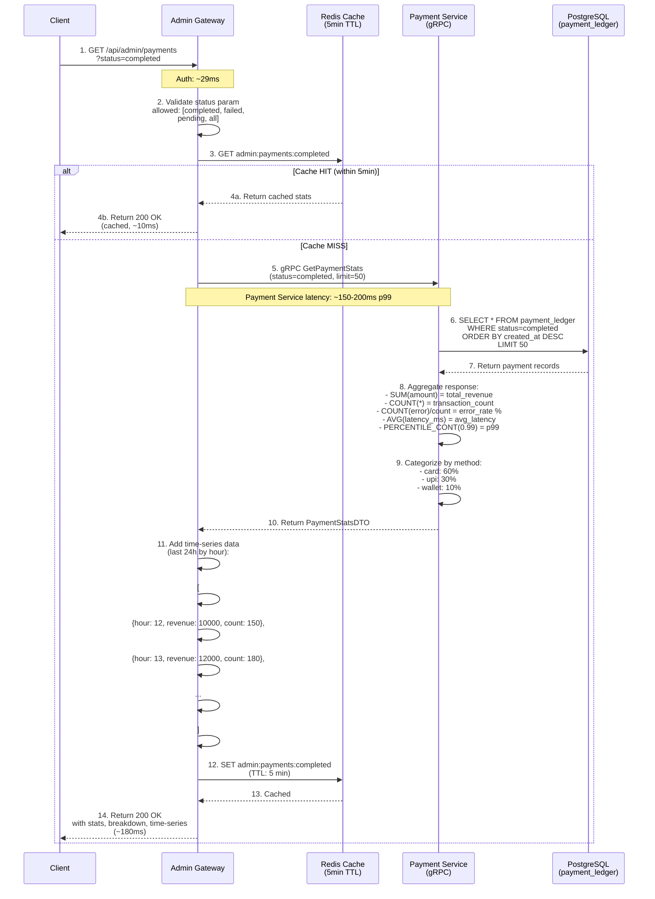

# Admin Gateway - Sequence Diagrams

## Complete JWT Authentication Sequence

## Dashboard Query Sequence (Full Request)

## Feature Flags Query Sequence

## Reconciliation Runs Query Sequence

## Payment Status Query Sequence

