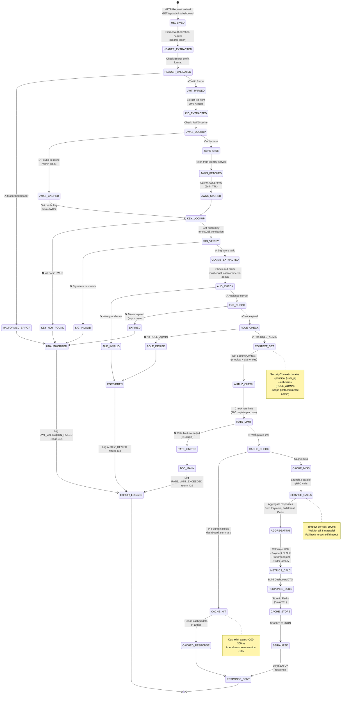
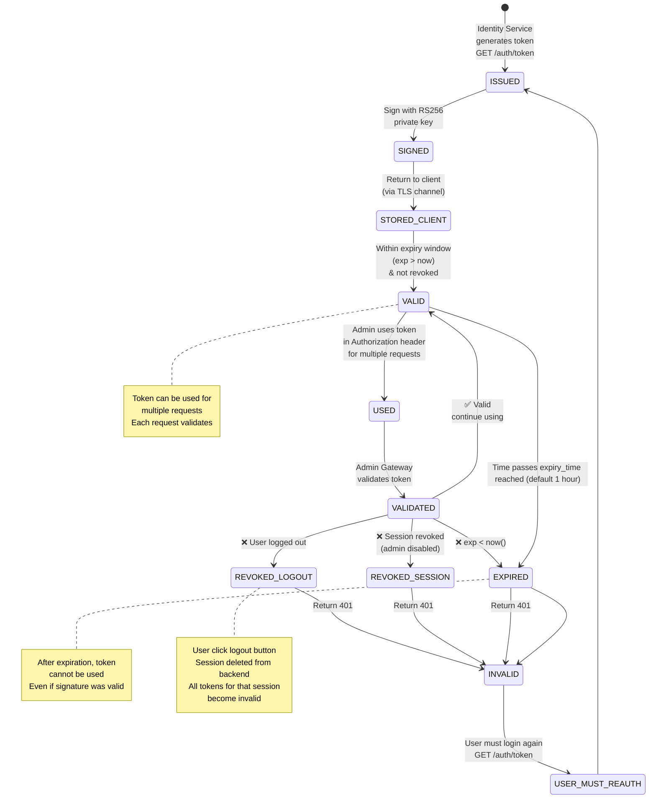
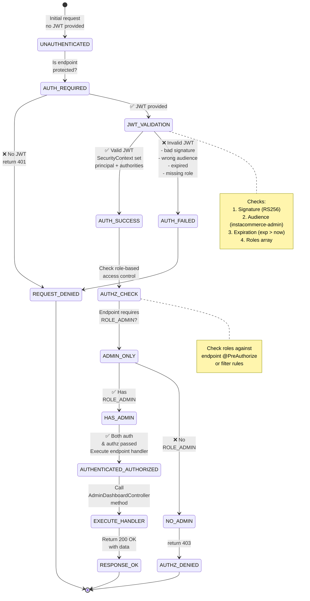
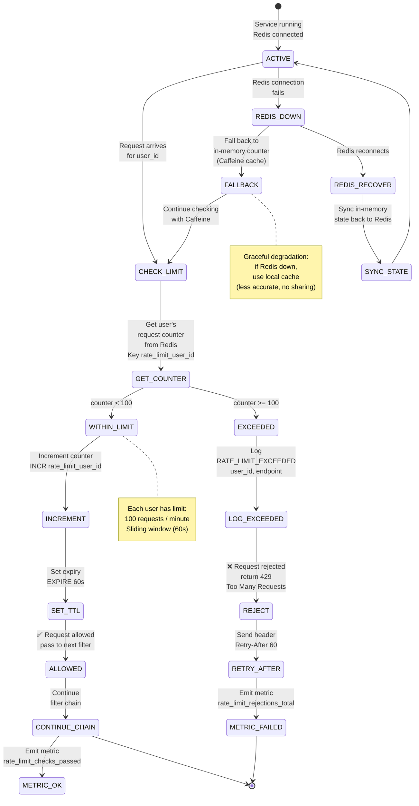
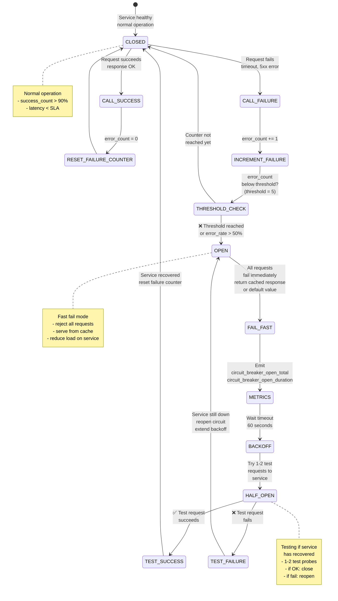
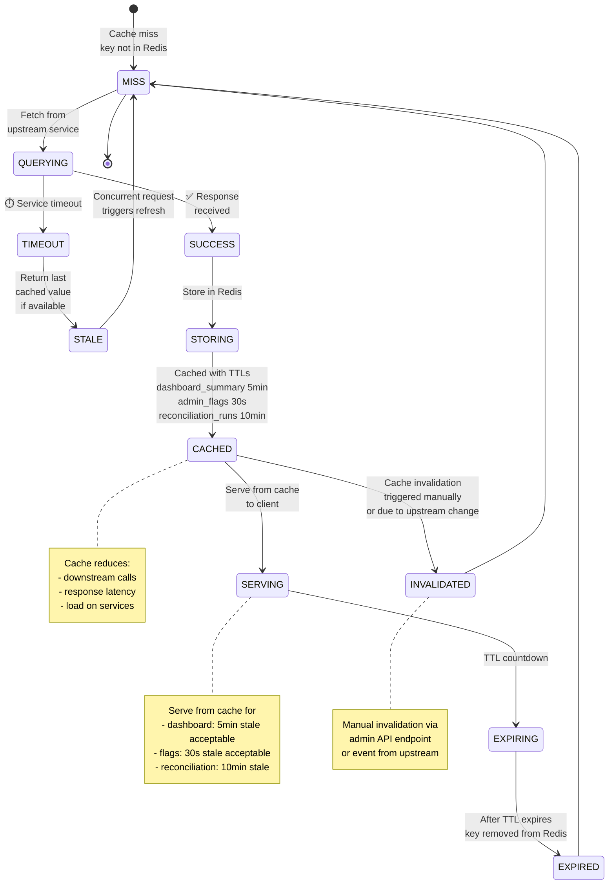

# Admin Gateway - State Machine Diagrams

## Request Processing State Machine (Complete Lifecycle)

## JWT Token Lifecycle (Issued → Expired/Revoked)

## Authentication & Authorization State Flow

## Rate Limiter State Machine

## Circuit Breaker State Machine (Downstream Services)

## Cache Entry State Machine

