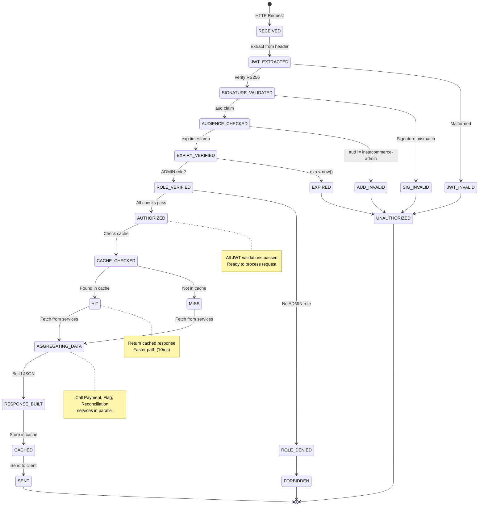
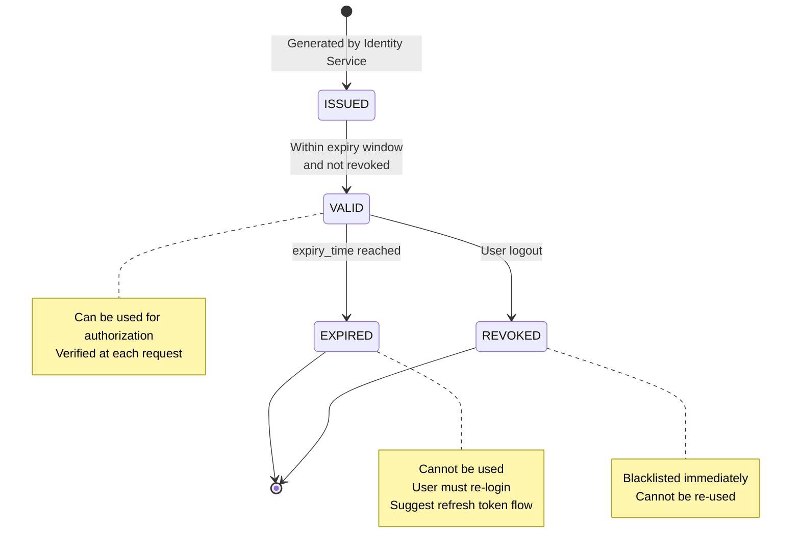
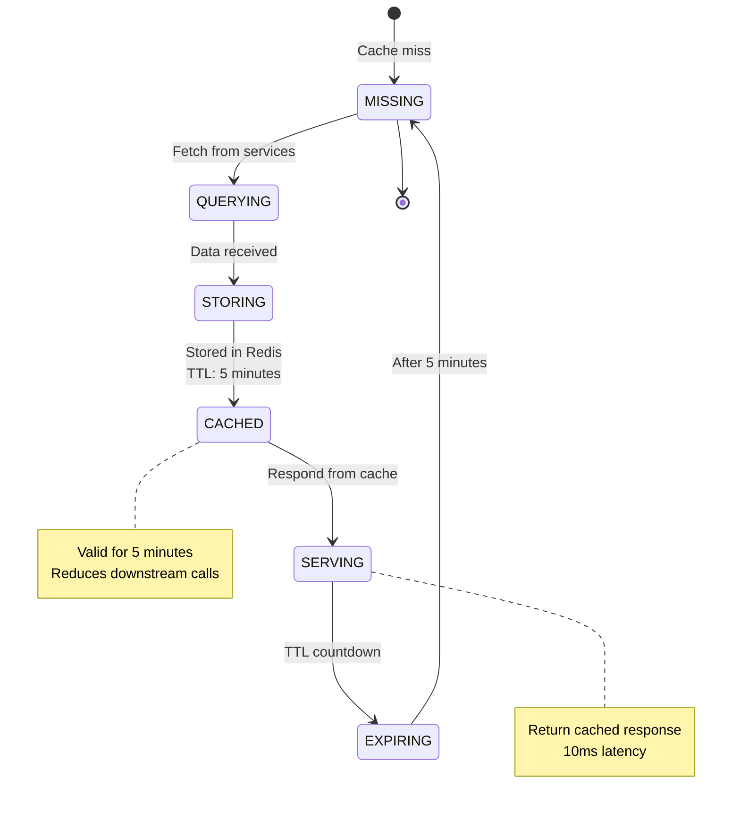
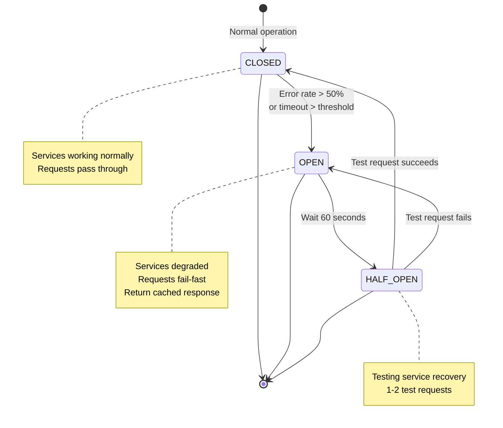

# Admin Gateway - State Machine Diagrams

## Request Processing State Machine

```mermaid
stateDiagram-v2
    [*] --> RECEIVED: HTTP Request
    RECEIVED --> JWT_EXTRACTED: Extract from header
    JWT_EXTRACTED --> SIGNATURE_VALIDATED: Verify RS256
    SIGNATURE_VALIDATED --> AUDIENCE_CHECKED: aud claim
    AUDIENCE_CHECKED --> EXPIRY_VERIFIED: exp timestamp
    EXPIRY_VERIFIED --> ROLE_VERIFIED: ADMIN role?
    ROLE_VERIFIED --> AUTHORIZED: All checks pass
    AUTHORIZED --> CACHE_CHECKED: Check cache
    CACHE_CHECKED --> HIT: Found in cache
    CACHE_CHECKED --> MISS: Not in cache
    HIT --> AGGREGATING_DATA: Fetch from services
    MISS --> AGGREGATING_DATA: Fetch from services
    AGGREGATING_DATA --> RESPONSE_BUILT: Build JSON
    RESPONSE_BUILT --> CACHED: Store in cache
    CACHED --> SENT: Send to client
    SENT --> [*]

    JWT_EXTRACTED --> JWT_INVALID: Malformed
    SIGNATURE_VALIDATED --> SIG_INVALID: Signature mismatch
    AUDIENCE_CHECKED --> AUD_INVALID: aud != instacommerce-admin
    EXPIRY_VERIFIED --> EXPIRED: exp < now()
    ROLE_VERIFIED --> ROLE_DENIED: No ADMIN role

    JWT_INVALID --> UNAUTHORIZED
    SIG_INVALID --> UNAUTHORIZED
    AUD_INVALID --> UNAUTHORIZED
    EXPIRED --> UNAUTHORIZED
    ROLE_DENIED --> FORBIDDEN
    UNAUTHORIZED --> [*]
    FORBIDDEN --> [*]

    note right of AUTHORIZED
        All JWT validations passed
        Ready to process request
    end note

    note right of HIT
        Return cached response
        Faster path (10ms)
    end note

    note right of AGGREGATING_DATA
        Call Payment, Flag, Reconciliation
        services in parallel
    end note
```

## JWT State Lifecycle

```mermaid
stateDiagram-v2
    [*] --> ISSUED: Generated by Identity Service
    ISSUED --> VALID: Within expiry window<br/>and not revoked
    VALID --> EXPIRED: expiry_time reached
    VALID --> REVOKED: User logout
    EXPIRED --> [*]
    REVOKED --> [*]

    note right of VALID
        Can be used for authorization
        Verified at each request
    end note

    note right of EXPIRED
        Cannot be used
        User must re-login
        Suggest refresh token flow
    end note

    note right of REVOKED
        Blacklisted immediately
        Cannot be re-used
    end note
```

## Cache Entry Lifecycle

```mermaid
stateDiagram-v2
    [*] --> MISSING: Cache miss
    MISSING --> QUERYING: Fetch from services
    QUERYING --> STORING: Data received
    STORING --> CACHED: Stored in Redis<br/>TTL: 5 minutes
    CACHED --> SERVING: Respond from cache
    SERVING --> EXPIRING: TTL countdown
    EXPIRING --> MISSING: After 5 minutes
    MISSING --> [*]

    note right of CACHED
        Valid for 5 minutes
        Reduces downstream calls
    end note

    note right of SERVING
        Return cached response
        10ms latency
    end note
```

## Circuit Breaker State for Downstream Services

```mermaid
stateDiagram-v2
    [*] --> CLOSED: Normal operation
    CLOSED --> OPEN: Error rate > 50%<br/>or timeout > threshold
    OPEN --> HALF_OPEN: Wait 60 seconds
    HALF_OPEN --> CLOSED: Test request succeeds
    HALF_OPEN --> OPEN: Test request fails
    CLOSED --> [*]
    OPEN --> [*]
    HALF_OPEN --> [*]

    note right of CLOSED
        Services working normally
        Requests pass through
    end note

    note right of OPEN
        Services degraded
        Requests fail-fast
        Return cached response
    end note

    note right of HALF_OPEN
        Testing service recovery
        1-2 test requests
    end note
```
