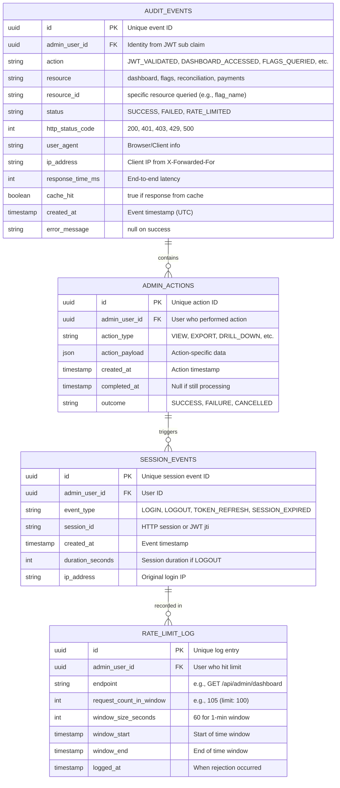
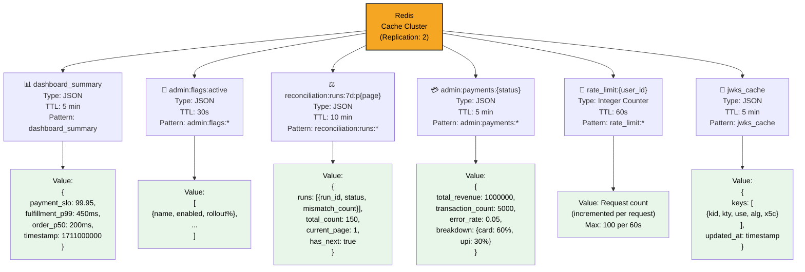
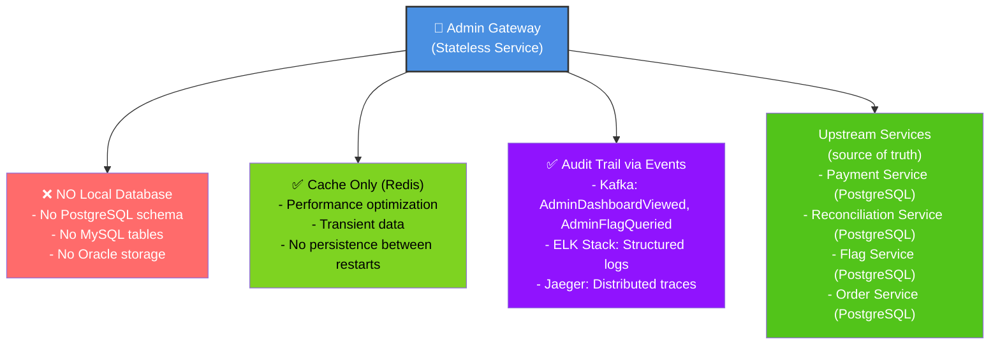
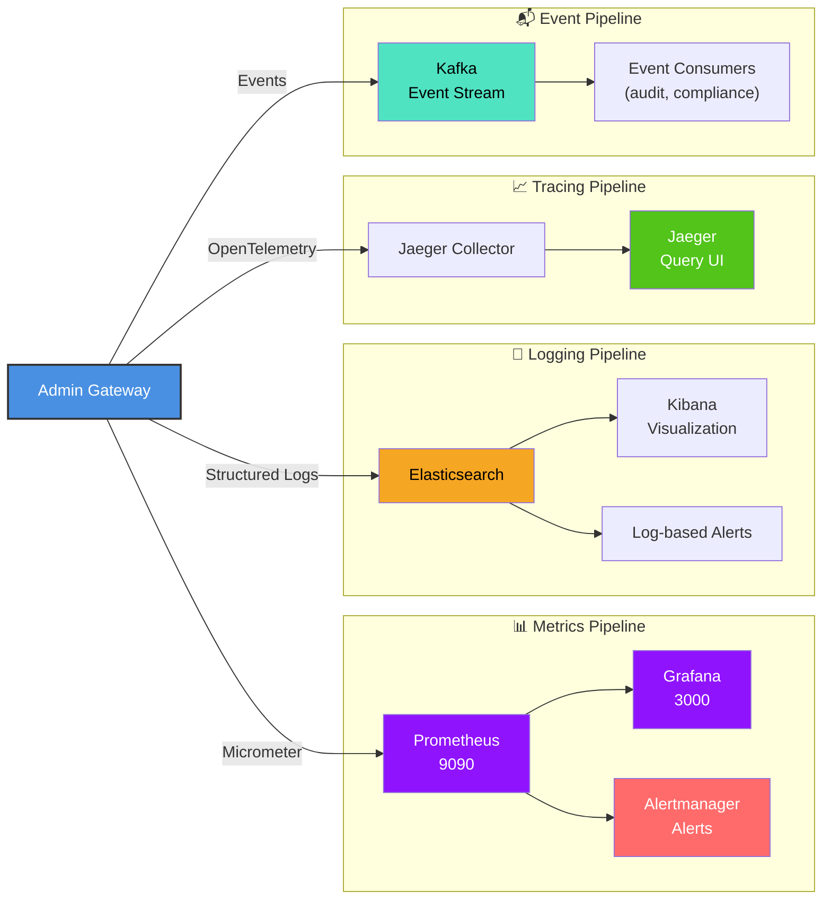

# Admin Gateway - ER Diagram & Storage Schema

## Audit & Observability Tables (Kafka + Logs)



## Redis Cache Schema & Keys



## Prometheus Metrics Schema

```
Admin Gateway Metrics
├─ http_server_requests_seconds{endpoint, method, status}
│  └ Histogram: latency distribution
│     - p50: 50ms, p99: <500ms, p99.9: <1s
│
├─ jwt_validation_duration_ms{endpoint}
│  └ Histogram: JWT validation latency
│     - RS256 verification
│     - JWKS lookup
│
├─ jwt_validations_total{status}
│  └ Counter: Total validations
│     - status: success, malformed_token, invalid_signature,
│               wrong_audience, expired, no_admin_role
│
├─ rate_limit_checks_total{endpoint, status}
│  └ Counter: Rate limit check results
│     - status: allowed, rejected
│
├─ rate_limit_rejections_total{user_id}
│  └ Counter: Total rate limit rejections
│     - per user tracking
│
├─ downstream_service_calls_duration_ms{service, endpoint}
│  └ Histogram: Service call latency
│     - service: payment-service, flag-service, reconciliation-service
│     - p99: <300ms per service
│
├─ cache_hits_total{endpoint}
│  └ Counter: Cache hits
│     - reduces downstream calls
│
├─ cache_misses_total{endpoint}
│  └ Counter: Cache misses
│     - triggers upstream fetch
│
├─ circuit_breaker_state{service}
│  └ Gauge: Circuit breaker status
│     - 0: CLOSED (healthy)
│     - 1: OPEN (degraded)
│     - 2: HALF_OPEN (testing)
│
├─ response_serialization_duration_ms
│  └ Histogram: JSON serialization time
│     - typically <20ms
│
└─ authentication_header_validation_duration_ms
   └ Histogram: Authorization header parse time
      - typically <2ms
```

## No Persistent Database (Stateless Gateway)



## Observability Pipeline


