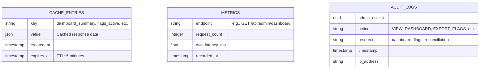
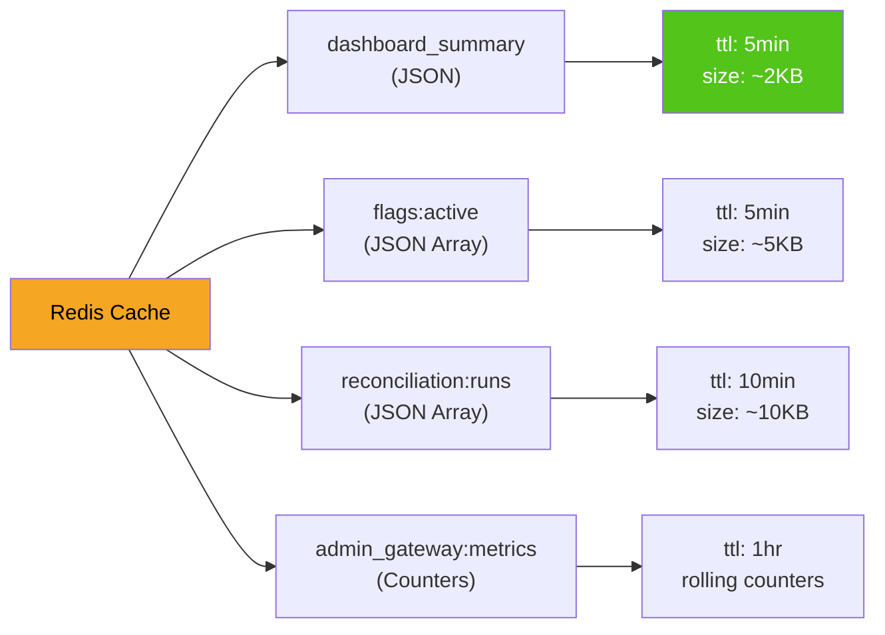
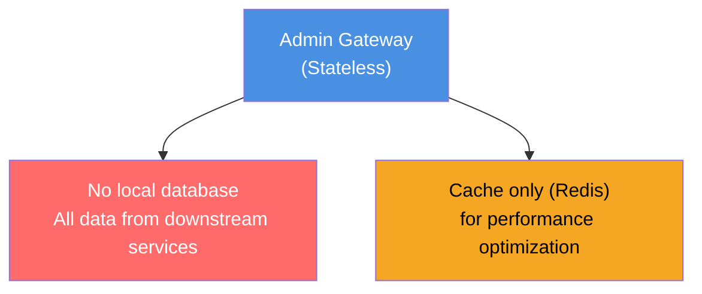
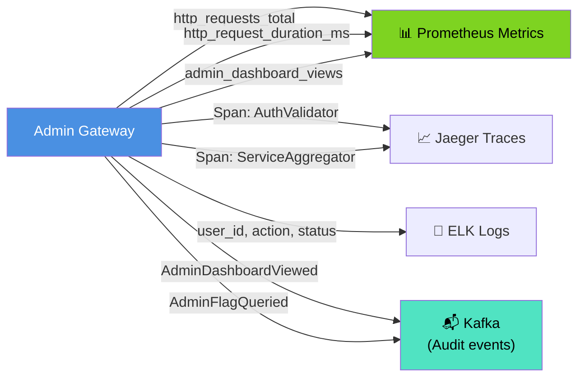

# Admin Gateway - ER & Storage Diagrams

## Data Storage Architecture

```mermaid
erDiagram
    CACHE_ENTRIES {
        string key "dashboard_summary, flags_active, etc."
        json value "Cached response data"
        timestamp created_at
        timestamp expires_at "TTL: 5 minutes"
    }

    METRICS {
        string endpoint "e.g., GET /api/admin/dashboard"
        integer request_count
        float avg_latency_ms
        timestamp recorded_at
    }

    AUDIT_LOGS {
        uuid admin_user_id
        string action "VIEW_DASHBOARD, EXPORT_FLAGS, etc."
        string resource "dashboard, flags, reconciliation"
        timestamp timestamp
        string ip_address
    }
```

## Redis Cache Schema

```mermaid
graph LR
    Redis["Redis Cache"]

    DashboardKey["dashboard_summary<br/>(JSON)"]
    FlagsKey["flags:active<br/>(JSON Array)"]
    ReconcileKey["reconciliation:runs<br/>(JSON Array)"]
    MetricsKey["admin_gateway:metrics<br/>(Counters)"]

    Redis --> DashboardKey
    Redis --> FlagsKey
    Redis --> ReconcileKey
    Redis --> MetricsKey

    DashboardKey --> DashContent["ttl: 5min<br/>size: ~2KB"]
    FlagsKey --> FlagsContent["ttl: 5min<br/>size: ~5KB"]
    ReconcileKey --> RecContent["ttl: 10min<br/>size: ~10KB"]
    MetricsKey --> MetricsContent["ttl: 1hr<br/>rolling counters"]

    style Redis fill:#F5A623,color:#000
    style DashContent fill:#52C41A,color:#fff
```

## No Persistent Database (Stateless Gateway)

```mermaid
graph TB
    AdminGateway["Admin Gateway<br/>(Stateless)"]
    Note1["No local database<br/>All data from downstream services"]
    Note2["Cache only (Redis)<br/>for performance optimization"]

    AdminGateway --> Note1
    AdminGateway --> Note2

    style AdminGateway fill:#4A90E2,color:#fff
    style Note1 fill:#FF6B6B,color:#fff
    style Note2 fill:#F5A623,color:#000
```

## Observability & Audit Trail

```mermaid
graph LR
    AdminGateway["Admin Gateway"]

    Metrics["📊 Prometheus Metrics"]
    Traces["📈 Jaeger Traces"]
    Logs["📝 ELK Logs"]
    Kafka["📬 Kafka<br/>(Audit events)"]

    AdminGateway -->|http_requests_total| Metrics
    AdminGateway -->|http_request_duration_ms| Metrics
    AdminGateway -->|admin_dashboard_views| Metrics

    AdminGateway -->|Span: AuthValidator| Traces
    AdminGateway -->|Span: ServiceAggregator| Traces

    AdminGateway -->|user_id, action, status| Logs

    AdminGateway -->|AdminDashboardViewed| Kafka
    AdminGateway -->|AdminFlagQueried| Kafka

    style AdminGateway fill:#4A90E2,color:#fff
    style Metrics fill:#7ED321,color:#000
    style Kafka fill:#50E3C2,color:#000
```
