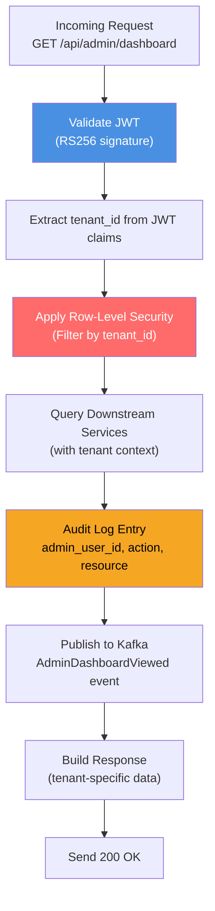
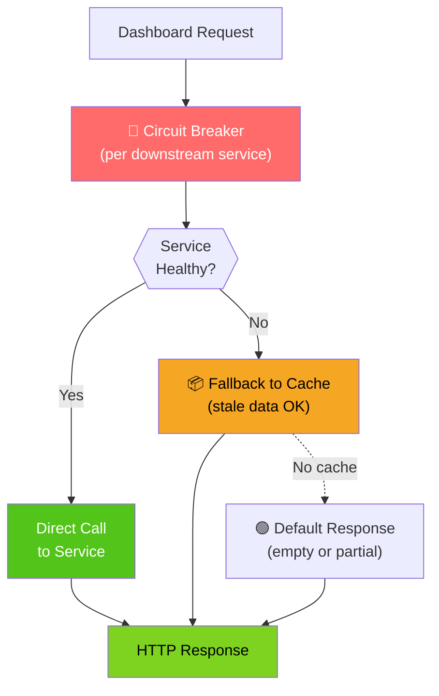
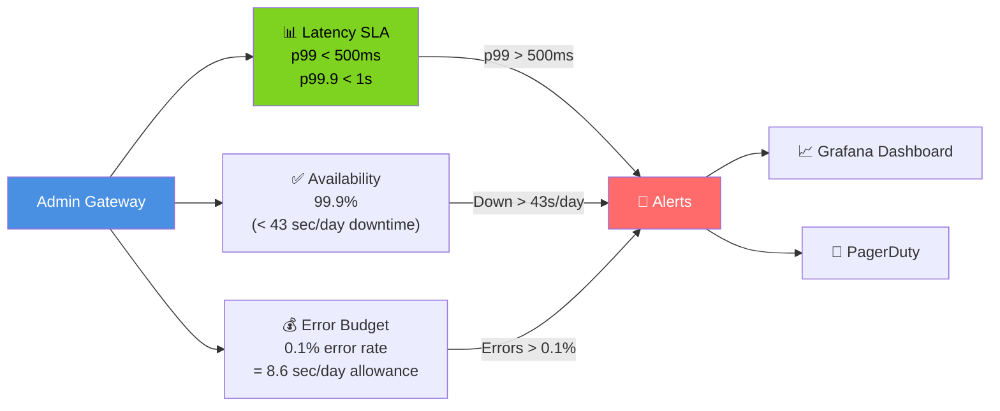

# Admin Gateway - End-to-End Diagram

## Complete Dashboard Query Flow

```mermaid
graph TB
    AdminUser["👨‍💼 Admin User<br/>(Browser)"]
    Browser["🌐 Browser"]
    CloudFront["🌍 CloudFront CDN"]
    ALB["⚖️ AWS ALB<br/>(SSL/TLS termination)"]
    AdminGW["🔐 Admin Gateway<br/>(Java Spring Boot)"]
    RateLimit["⏱️ Rate Limiter<br/>(Redis)"]
    AuthFilter["🔑 JWT Auth Filter"]
    IdentityService["🆔 Identity Service<br/>/.well-known/jwks.json"]
    PaymentSvc["💳 Payment Service<br/>/stats/summary"]
    FlagSvc["🚩 Flag Service<br/>/flags?status=active"]
    ReconcileSvc["⚖️ Reconciliation Service<br/>/reconciliation/runs"]
    ResponseCache["⚡ Redis Cache<br/>(Dashboard response)"]
    ResponseBuilder["📦 Response Builder"]

    AdminUser -->|1. Click Dashboard| Browser
    Browser -->|2. GET /api/admin/dashboard| CloudFront
    CloudFront -->|3. Cache miss, forward| ALB
    ALB -->|4. HTTPS connection| AdminGW
    AdminGW -->|5. Check rate limit| RateLimit
    RateLimit -->|6. Allowed (< 100 req/min)| AuthFilter
    AuthFilter -->|7. Extract JWT from header| AuthFilter
    AuthFilter -->|8. Verify signature against JWKS| IdentityService
    IdentityService -->|9. Return public keys| AuthFilter
    AuthFilter -->|10. Check aud & roles| AuthFilter
    AdminGW -->|11. Check cache| ResponseCache
    ResponseCache -->|12. Cache miss| AdminGW
    AdminGW -->|13. Query in parallel| PaymentSvc
    AdminGW -->|14. Query in parallel| FlagSvc
    AdminGW -->|15. Query in parallel| ReconcileSvc
    PaymentSvc -->|16. Return stats| AdminGW
    FlagSvc -->|17. Return flags| AdminGW
    ReconcileSvc -->|18. Return runs| AdminGW
    AdminGW -->|19. Aggregate responses| ResponseBuilder
    ResponseBuilder -->|20. Build JSON| ResponseBuilder
    ResponseBuilder -->|21. Cache for 5min| ResponseCache
    AdminGW -->|22. Send response| ALB
    ALB -->|23. HTTPS response| CloudFront
    CloudFront -->|24. Cache HTML/JS| Browser
    Browser -->|25. Render dashboard| AdminUser

    style AdminUser fill:#4A90E2,color:#fff
    style AuthFilter fill:#FF6B6B,color:#fff
    style PaymentSvc fill:#7ED321,color:#000
    style ResponseCache fill:#F5A623,color:#000

    classDef parallelCall fill:#50E3C2,color:#000
    class 13,14,15 parallelCall
```

## Multi-Tenant Request Flow with Audit



## Resilience Patterns in Action



## SLA & Monitoring


