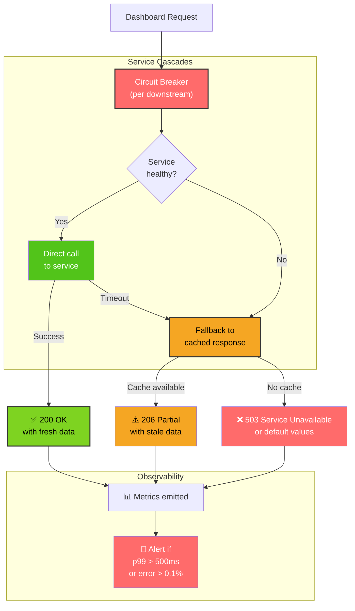
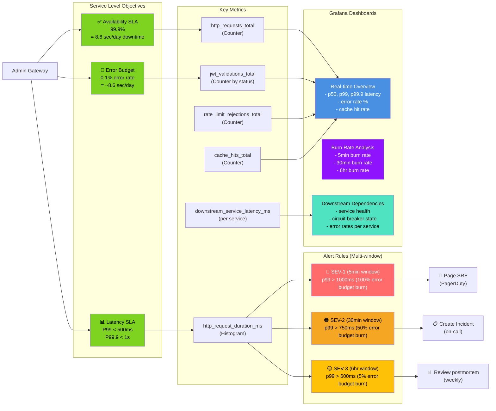

# Admin Gateway - End-to-End Flows

## Complete Admin Dashboard Query (E2E)

```mermaid
graph TB
    AdminUser["👨‍💼 Admin User<br/>(InstaCommerce Staff)"]
    Browser["🌐 Browser<br/>(Chrome, Firefox, Safari)"]
    CloudFront["🌍 AWS CloudFront<br/>(CDN, cache static assets)"]
    ALB["⚖️ AWS ALB<br/>(SSL/TLS termination,<br/>port 443)"]

    subgraph AdminGWService["Admin Gateway Service"]
        DispatcherServlet["DispatcherServlet"]
        RateLimitFilter["Rate Limit Filter<br/>(100 req/min per user)"]
        JwtAuth["AdminJwtAuthenticationFilter<br/>(JWT RS256 validation)"]
        SecurityContext["SecurityContext<br/>(principal + ROLE_ADMIN)"]
        AuthzFilter["RoleBasedAuthStrategy<br/>(ROLE_ADMIN check)"]
        DashboardController["AdminDashboardController<br/>(GET /api/admin/dashboard)"]
    end

    subgraph Cache["Redis Cache<br/>(2-node cluster)"]
        DashCache["dashboard_summary<br/>TTL: 5 min"]
    end

    subgraph Identity["Identity Service"]
        JWKS["JWKS Cache<br/>GET /.well-known/jwks.json<br/>TTL: 5 min"]
    end

    subgraph Downstream["Downstream Services (parallel)"]
        PaymentService["💳 Payment Service<br/>gRPC: GetPaymentStats"]
        FulfillmentService["📦 Fulfillment Service<br/>gRPC: GetFulfillmentMetrics"]
        OrderService["📋 Order Service<br/>gRPC: GetOrderStats"]
    end

    subgraph Aggregation["Data Aggregation"]
        Aggregator["Response Aggregator<br/>(merge 3 responses)"]
        ResponseBuilder["ResponseBuilder<br/>(build DTO)"]
    end

    subgraph Observability["Observability"]
        Metrics["📊 Prometheus Metrics"]
        Logs["📝 ELK Logs<br/>(structured)"]
        Traces["📈 Jaeger Traces"]
    end

    AdminUser -->|1. Click 'Dashboard'| Browser
    Browser -->|2. Send JWT in header<br/>GET /api/admin/dashboard| CloudFront
    CloudFront -->|3. Cache miss, forward| ALB
    ALB -->|4. Decrypt TLS,<br/>forward to gateway| DispatcherServlet

    DispatcherServlet -->|5. Route to filters| RateLimitFilter
    RateLimitFilter -->|6a. Check rate_limit:{user_id}<br/>GET from Redis| Cache
    Cache -->|6b. counter=35/100<br/>(allowed)| RateLimitFilter

    RateLimitFilter -->|7. Pass to JWT auth| JwtAuth
    JwtAuth -->|8a. Extract Bearer token<br/>from Authorization header| JwtAuth
    JwtAuth -->|8b. Get kid from JWT header| JwtAuth
    JwtAuth -->|8c. Lookup kid in JWKS| JWKS
    JWKS -->|8d. Return public key<br/>(cached, <2ms)| JwtAuth
    JwtAuth -->|8e. Verify RS256 signature<br/>Check aud=instacommerce-admin<br/>Verify ROLE_ADMIN<br/>Verify exp < now()| JwtAuth

    JwtAuth -->|9. Create SecurityContext<br/>(principal=user123,<br/>authorities=[ROLE_ADMIN])| SecurityContext
    SecurityContext -->|10. Store in ThreadLocal| JwtAuth

    JwtAuth -->|11. Pass to authz filter| AuthzFilter
    AuthzFilter -->|12. Check ROLE_ADMIN<br/>from SecurityContext| AuthzFilter
    AuthzFilter -->|13. Authorization PASSED| DashboardController

    Note over JwtAuth,AuthzFilter: Auth overhead: ~29ms

    DashboardController -->|14. Check cache| DashCache
    alt Cache HIT (within 5 min)
        DashCache -->|15a. Return cached<br/>DashboardDTO| DashboardController
        DashboardController -->|15b. Send 200 OK<br/>(from cache, ~10ms total)| ALB
    else Cache MISS
        DashboardController -->|16. Cache miss - fetch from services| DashboardController
        DashboardController -->|17a. Launch gRPC in parallel<br/>(timeout: 300ms each)| PaymentService
        DashboardController -->|17b. gRPC call| FulfillmentService
        DashboardController -->|17c. gRPC call| OrderService

        par Service Calls Parallel
            PaymentService -->|18a. Query payment_ledger<br/>Calculate SLO from 24h data| PaymentService
            PaymentService -->|19a. {slo: 99.95, revenue: 1M}| Aggregator
        and
            FulfillmentService -->|18b. Aggregate metrics| FulfillmentService
            FulfillmentService -->|19b. {p99: 450ms, success: 99.8}| Aggregator
        and
            OrderService -->|18c. Query order stats| OrderService
            OrderService -->|19c. {p50: 200ms, processed: 5000}| Aggregator
        end

        Note over PaymentService,OrderService: Service call latency: ~200-300ms (p99)

        Aggregator -->|20. Merge 3 responses| ResponseBuilder
        ResponseBuilder -->|21. Build DashboardDTO<br/>{payment_slo, fulfillment_p99, order_p50}| ResponseBuilder
        ResponseBuilder -->|22. Serialize to JSON| ResponseBuilder

        ResponseBuilder -->|23. Store in Redis<br/>Key: dashboard_summary<br/>TTL: 5 min| DashCache
        DashCache -->|24. Cached| ResponseBuilder

        ResponseBuilder -->|25. Return 200 OK<br/>with dashboard data| DashboardController
        DashboardController -->|26. Send response| ALB
    end

    DashboardController -->|27. Emit metrics<br/>http_request_duration_ms=XXms| Metrics
    DashboardController -->|28. Structured log<br/>user_id, endpoint, status| Logs
    DashboardController -->|29. Jaeger span<br/>trace_id, span_id| Traces

    ALB -->|30. Encrypt TLS,<br/>send response| CloudFront
    CloudFront -->|31. Cache HTML/JS| Browser
    Browser -->|32. Render dashboard UI<br/>display payment SLO, metrics| AdminUser

    style AdminUser fill:#4A90E2,color:#fff
    style JwtAuth fill:#7ED321,color:#000,stroke:#333,stroke-width:2px
    style AuthzFilter fill:#FF6B6B,color:#fff
    style DashboardController fill:#4A90E2,color:#fff,stroke:#333,stroke-width:2px
    style Aggregator fill:#9013FE,color:#fff
    style Metrics fill:#9013FE,color:#fff
    style Logs fill:#F5A623,color:#000
```

## Request Flow with Error Handling

```mermaid
graph TB
    Request["HTTP Request<br/>GET /api/admin/dashboard"]

    subgraph happy["Happy Path (<500ms)"]
        H1["✅ Auth validated<br/>(~29ms)"]
        H2["✅ Cache hit?<br/>Return cached<br/>(~10ms)"]
        H3["✅ Service calls<br/>return OK<br/>(~300ms p99)"]
        H4["✅ Aggregate<br/>& send response<br/>(~30ms)"]
        H5["✅ Return 200 OK<br/>Total: ~369ms p99"]
    end

    subgraph errors["Error Paths"]
        E1["❌ JWT validation fails<br/>- bad signature<br/>- wrong audience<br/>- expired"]
        E1_Response["Return 401 Unauthorized<br/>(~5ms)"]

        E2["❌ Missing ROLE_ADMIN"]
        E2_Response["Return 403 Forbidden<br/>(~10ms)"]

        E3["❌ Rate limit exceeded<br/>(>100 req/min)"]
        E3_Response["Return 429 Too Many Requests<br/>Retry-After: 60<br/>(~3ms)"]

        E4["⚠️ Service timeout<br/>(>300ms)"]
        E4_Fallback["Use cached response<br/>or partial data<br/>~100ms fallback"]

        E5["⚠️ Cache corruption"]
        E5_Fix["Invalidate & refetch<br/>~200ms"]
    end

    Request --> Request_Check{"JWT<br/>present?"}

    Request_Check -->|No| E1
    Request_Check -->|Yes| H1

    H1 --> Auth_Check{"Valid<br/>signature,<br/>aud, exp?"}

    Auth_Check -->|No| E1
    Auth_Check -->|Yes| Role_Check{"Has<br/>ROLE_ADMIN?"}

    Role_Check -->|No| E2
    Role_Check -->|Yes| Rate_Check{"Rate limit<br/>OK?"}

    Rate_Check -->|No| E3
    Rate_Check -->|Yes| H2

    H2 --> Cache_Hit{"Cache<br/>hit?"}

    Cache_Hit -->|Yes| H5
    Cache_Hit -->|No| H3

    H3 --> Service_Check{"Service<br/>calls<br/>OK?"}

    Service_Check -->|Timeout| E4
    Service_Check -->|Cache error| E5
    Service_Check -->|OK| H4

    E4_Fallback --> H5
    E5_Fix --> H5

    E1 --> E1_Response
    E2 --> E2_Response
    E3 --> E3_Response

    E1_Response --> [*]
    E2_Response --> [*]
    E3_Response --> [*]
    H5 --> [*]

    style happy fill:#E8F5E9,color:#000,stroke:#333,stroke-width:2px
    style errors fill:#FFEBEE,color:#000,stroke:#333,stroke-width:2px
    style H5 fill:#7ED321,color:#000,stroke:#333,stroke-width:3px
    style E1_Response fill:#FF6B6B,color:#fff
    style E2_Response fill:#FF6B6B,color:#fff
    style E3_Response fill:#FF6B6B,color:#fff
```

## Resilience & Degradation Patterns



## Multi-Admin Scenario (Concurrent Requests)

```mermaid
graph TB
    Admin1["👨 Admin 1"]
    Admin2["👩 Admin 2"]
    Admin3["👨‍💼 Admin 3"]

    Gateway["Admin Gateway<br/>(Stateless, 3 replicas)"]

    Request1["GET /api/admin/dashboard<br/>JWT1: sub=user_123"]
    Request2["GET /api/admin/flags<br/>JWT2: sub=user_456"]
    Request3["GET /api/admin/payments<br/>JWT3: sub=user_789"]

    Auth1["Auth filter 1<br/>validate JWT1"]
    Auth2["Auth filter 2<br/>validate JWT2"]
    Auth3["Auth filter 3<br/>validate JWT3"]

    RateLimit1["Rate limiter<br/>user_123: 35/100"]
    RateLimit2["Rate limiter<br/>user_456: 45/100"]
    RateLimit3["Rate limiter<br/>user_789: 20/100"]

    Cache["Shared Redis<br/>Cache"]

    Service1["Downstream<br/>Services"]
    Service2["Downstream<br/>Services"]
    Service3["Downstream<br/>Services"]

    Response1["Response 1<br/>dashboard data"]
    Response2["Response 2<br/>flags list"]
    Response3["Response 3<br/>payment stats"]

    Admin1 --> Request1
    Admin2 --> Request2
    Admin3 --> Request3

    Request1 --> Gateway
    Request2 --> Gateway
    Request3 --> Gateway

    Gateway --> Auth1
    Gateway --> Auth2
    Gateway --> Auth3

    Auth1 --> RateLimit1
    Auth2 --> RateLimit2
    Auth3 --> RateLimit3

    RateLimit1 --> Cache
    RateLimit2 --> Cache
    RateLimit3 --> Cache

    RateLimit1 --> Service1
    RateLimit2 --> Service2
    RateLimit3 --> Service3

    Service1 --> Response1
    Service2 --> Response2
    Service3 --> Response3

    Response1 --> Admin1
    Response2 --> Admin2
    Response3 --> Admin3

    Note over Admin1,Admin3: All 3 requests processed<br/>independently & in parallel<br/>No shared state (stateless)<br/>Rate limit per user_id
    Note over Cache: Shared cache reduces<br/>downstream calls<br/>Cache hit saves ~300ms

    style Gateway fill:#4A90E2,color:#fff,stroke:#333,stroke-width:2px
    style Cache fill:#F5A623,color:#000,stroke:#333,stroke-width:2px
    style Response1 fill:#7ED321,color:#000
    style Response2 fill:#7ED321,color:#000
    style Response3 fill:#7ED321,color:#000
```

## SLO & Monitoring Dashboard


