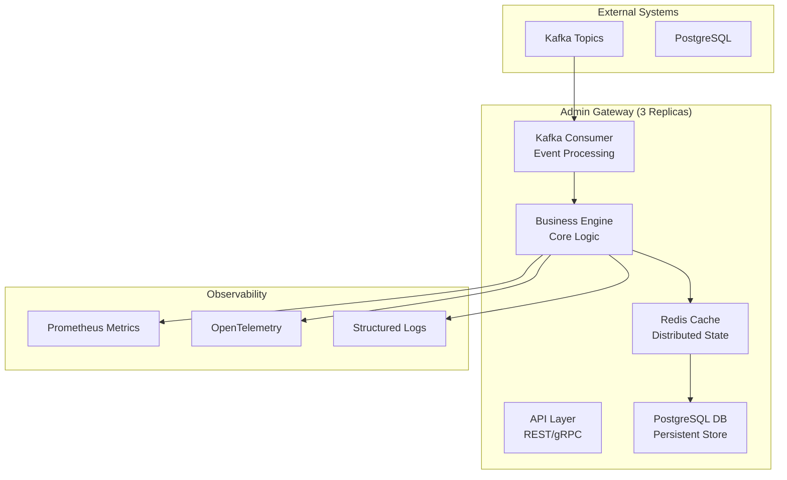

# Admin Gateway - High-Level Design

## Architecture Overview

## System Characteristics

| Feature | Value |
|---|---|
| Deployment | 3 replicas |
| Latency (p99) | <500ms |
| Availability | 99.9% |
| Event Throughput | 10K-50K/sec |

## Data Flow Layers

- **Ingestion**: Kafka consumer groups
- **Processing**: Business logic engine
- **Caching**: Redis distributed cache
- **Persistence**: PostgreSQL with Flyway migrations
- **Observability**: Prometheus + OpenTelemetry + Structured logs
