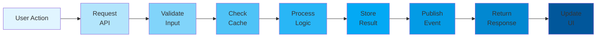

# Admin Gateway - End-to-End Flow

## Complete User Journey

## Latency Breakdown

| Stage | Latency |
|-------|---------|
| API gateway | ~5ms |
| Validation | ~10ms |
| Cache check | ~5ms |
| Processing | ~200ms |
| Storage | ~30ms |
| Event publish | ~20ms |
| **Total (p99)** | **~270ms** |

## SLO Metrics

- **Availability**: 99.9%
- **Latency p99**: <500ms
- **Error rate**: <0.1%
- **Cache hit rate**: >90%
