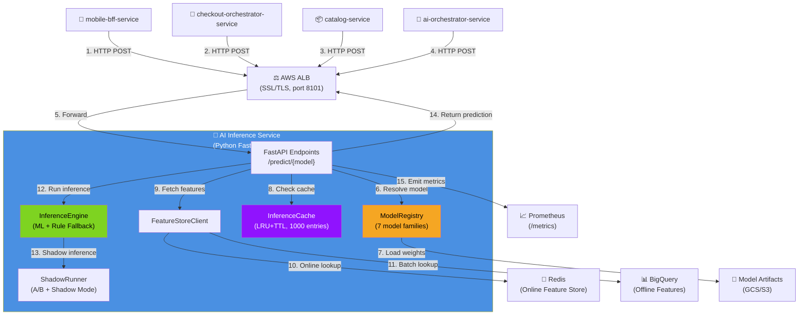
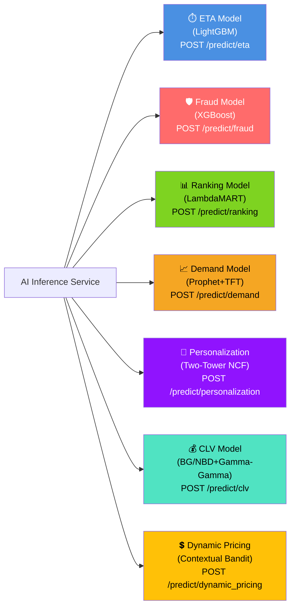
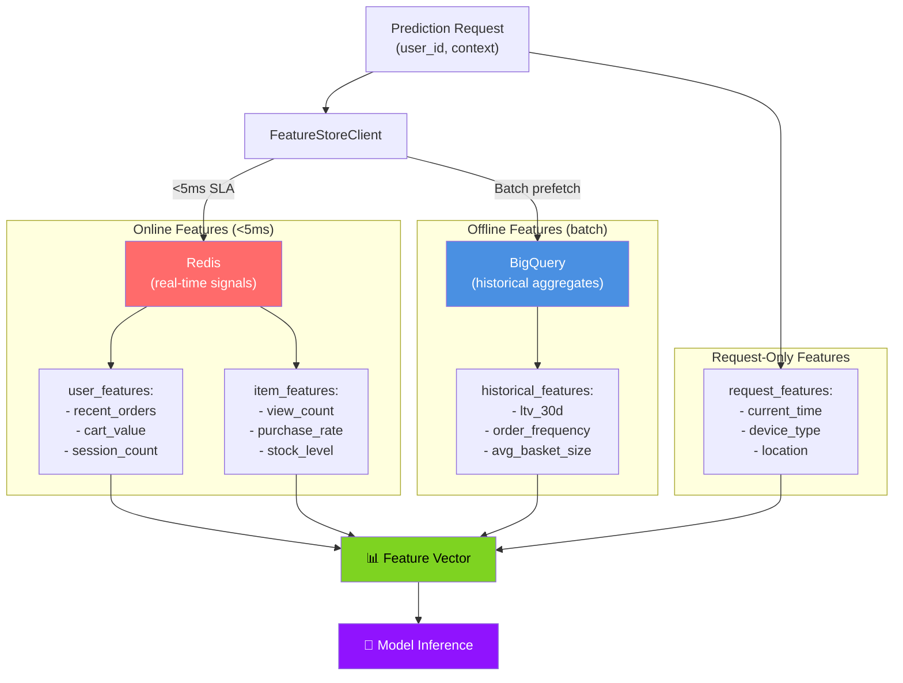
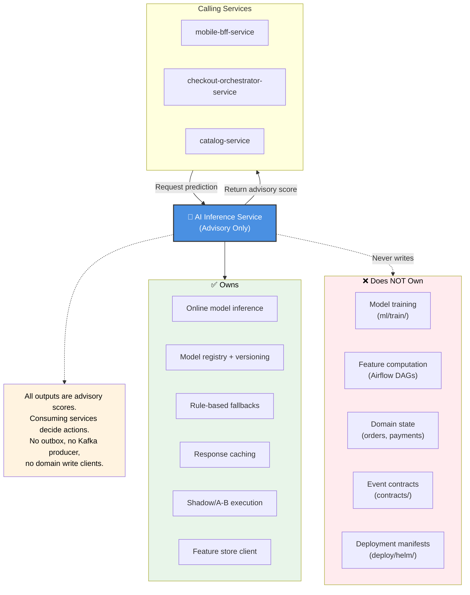

# AI Inference Service - High-Level Design

```mermaid
graph TB
    MobileBFF["📱 mobile-bff-service"]
    CheckoutOrch["🛒 checkout-orchestrator-service"]
    CatalogSvc["📦 catalog-service"]
    AIOrch["🤖 ai-orchestrator-service"]

    ALB["⚖️ AWS ALB<br/>(SSL/TLS, port 8101)"]

    subgraph AIINF["🧠 AI Inference Service<br/>(Python FastAPI :8101)"]
        API["FastAPI Endpoints<br/>/predict/{model}"]
        Registry["ModelRegistry<br/>(7 model families)"]
        Engine["InferenceEngine<br/>(ML + Rule Fallback)"]
        Cache["InferenceCache<br/>(LRU+TTL, 1000 entries)"]
        Shadow["ShadowRunner<br/>(A/B + Shadow Mode)"]
        FSClient["FeatureStoreClient"]
    end

    Redis["🔴 Redis<br/>(Online Feature Store)"]
    BQ["📊 BigQuery<br/>(Offline Features)"]
    Prom["📈 Prometheus<br/>(/metrics)"]
    ModelArtifacts["📁 Model Artifacts<br/>(GCS/S3)"]

    MobileBFF -->|1. HTTP POST| ALB
    CheckoutOrch -->|2. HTTP POST| ALB
    CatalogSvc -->|3. HTTP POST| ALB
    AIOrch -->|4. HTTP POST| ALB

    ALB -->|5. Forward| API
    API -->|6. Resolve model| Registry
    Registry -->|7. Load weights| ModelArtifacts
    API -->|8. Check cache| Cache
    API -->|9. Fetch features| FSClient
    FSClient -->|10. Online lookup| Redis
    FSClient -->|11. Batch lookup| BQ
    API -->|12. Run inference| Engine
    Engine -->|13. Shadow inference| Shadow
    API -->|14. Return prediction| ALB
    API -->|15. Emit metrics| Prom

    style AIINF fill:#4A90E2,color:#fff
    style Engine fill:#7ED321,color:#000
    style Registry fill:#F5A623,color:#000
    style Cache fill:#9013FE,color:#fff
```

## Seven Model Families

```mermaid
graph LR
    InferenceService["AI Inference Service"]

    ETA["⏱️ ETA Model<br/>(LightGBM)<br/>POST /predict/eta"]
    Fraud["🛡️ Fraud Model<br/>(XGBoost)<br/>POST /predict/fraud"]
    Ranking["📊 Ranking Model<br/>(LambdaMART)<br/>POST /predict/ranking"]
    Demand["📈 Demand Model<br/>(Prophet+TFT)<br/>POST /predict/demand"]
    Personalization["👤 Personalization<br/>(Two-Tower NCF)<br/>POST /predict/personalization"]
    CLV["💰 CLV Model<br/>(BG/NBD+Gamma-Gamma)<br/>POST /predict/clv"]
    DynamicPricing["💲 Dynamic Pricing<br/>(Contextual Bandit)<br/>POST /predict/dynamic_pricing"]

    InferenceService --> ETA
    InferenceService --> Fraud
    InferenceService --> Ranking
    InferenceService --> Demand
    InferenceService --> Personalization
    InferenceService --> CLV
    InferenceService --> DynamicPricing

    style ETA fill:#4A90E2,color:#fff
    style Fraud fill:#FF6B6B,color:#fff
    style Ranking fill:#7ED321,color:#000
    style Demand fill:#F5A623,color:#000
    style Personalization fill:#9013FE,color:#fff
    style CLV fill:#50E3C2,color:#000
    style DynamicPricing fill:#FFC107,color:#000
```

## Feature Store Integration

```mermaid
graph TD
    Request["Prediction Request<br/>(user_id, context)"]
    FSClient["FeatureStoreClient"]

    subgraph Online["Online Features (<5ms)"]
        Redis["Redis<br/>(real-time signals)"]
        UserFeatures["user_features:<br/>- recent_orders<br/>- cart_value<br/>- session_count"]
        ItemFeatures["item_features:<br/>- view_count<br/>- purchase_rate<br/>- stock_level"]
    end

    subgraph Offline["Offline Features (batch)"]
        BQ["BigQuery<br/>(historical aggregates)"]
        HistFeatures["historical_features:<br/>- ltv_30d<br/>- order_frequency<br/>- avg_basket_size"]
    end

    subgraph RequestOnly["Request-Only Features"]
        RequestFeatures["request_features:<br/>- current_time<br/>- device_type<br/>- location"]
    end

    Request --> FSClient
    FSClient -->|<5ms SLA| Redis
    Redis --> UserFeatures
    Redis --> ItemFeatures
    FSClient -->|Batch prefetch| BQ
    BQ --> HistFeatures
    Request --> RequestFeatures

    UserFeatures --> FeatureVector["📊 Feature Vector"]
    ItemFeatures --> FeatureVector
    HistFeatures --> FeatureVector
    RequestFeatures --> FeatureVector

    FeatureVector --> Inference["🧠 Model Inference"]

    style Redis fill:#FF6B6B,color:#fff
    style BQ fill:#4A90E2,color:#fff
    style FeatureVector fill:#7ED321,color:#000
    style Inference fill:#9013FE,color:#fff
```

## Advisory-Only Architecture

```mermaid
graph TB
    subgraph Callers["Calling Services"]
        BFF["mobile-bff-service"]
        Checkout["checkout-orchestrator-service"]
        Catalog["catalog-service"]
    end

    AIInference["🧠 AI Inference Service<br/>(Advisory Only)"]

    subgraph DoesOwn["✅ Owns"]
        O1["Online model inference"]
        O2["Model registry + versioning"]
        O3["Rule-based fallbacks"]
        O4["Response caching"]
        O5["Shadow/A-B execution"]
        O6["Feature store client"]
    end

    subgraph DoesNotOwn["❌ Does NOT Own"]
        N1["Model training<br/>(ml/train/)"]
        N2["Feature computation<br/>(Airflow DAGs)"]
        N3["Domain state<br/>(orders, payments)"]
        N4["Event contracts<br/>(contracts/)"]
        N5["Deployment manifests<br/>(deploy/helm/)"]
    end

    Callers -->|Request prediction| AIInference
    AIInference -->|Return advisory score| Callers

    AIInference --> DoesOwn
    AIInference -.->|Never writes| DoesNotOwn

    Note["All outputs are advisory scores.<br/>Consuming services decide actions.<br/>No outbox, no Kafka producer,<br/>no domain write clients."]
    AIInference -.-> Note

    style AIInference fill:#4A90E2,color:#fff,stroke:#333,stroke-width:2px
    style DoesOwn fill:#E8F5E9,color:#000
    style DoesNotOwn fill:#FFEBEE,color:#000
    style Note fill:#FFF3E0,color:#000
```
