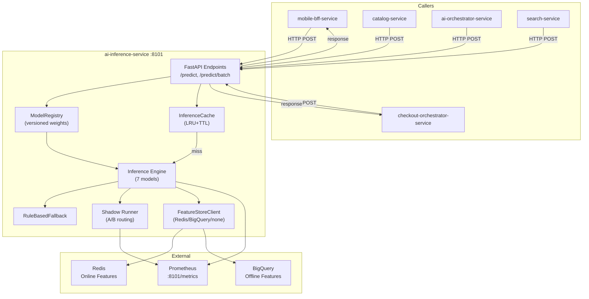

# AI Inference Service - High-Level Design

## Key Characteristics

- **Request Pattern**: All inbound traffic is read-only HTTP POST via FastAPI
- **7 Prediction Models**: ETA, Fraud, Ranking, Demand, Personalization, CLV, Dynamic Pricing
- **In-Memory LRU Cache**: Per-request memoization with configurable TTL (default 300s)
- **Feature Store Integration**: Pluggable (Redis online, BigQuery offline, or request-only)
- **Shadow Mode**: Per-model A/B routing for canary deployment
- **Fallbacks**: Deterministic rule-based scoring if ML artifacts unavailable
- **Observability**: Per-model counters, latency histograms, cache metrics
