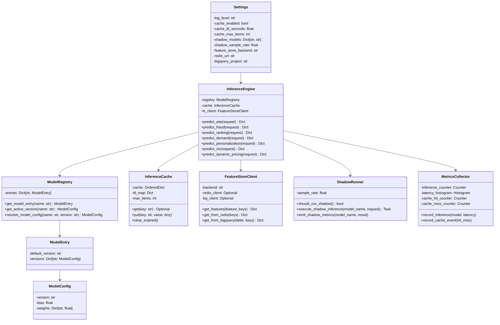

# AI Inference Service - Low-Level Design

## Component Responsibilities

| Component | Responsibility |
|-----------|-----------------|
| **Settings** | Runtime configuration from environment variables |
| **ModelRegistry** | Manages versioned model weights; version resolution |
| **InferenceCache** | LRU in-memory cache with TTL expiry |
| **InferenceEngine** | Orchestrates prediction across 7 model families |
| **FeatureStoreClient** | Pluggable feature retrieval (Redis/BigQuery/none) |
| **ShadowRunner** | A/B testing for new model versions |
| **MetricsCollector** | Prometheus metrics emission |
