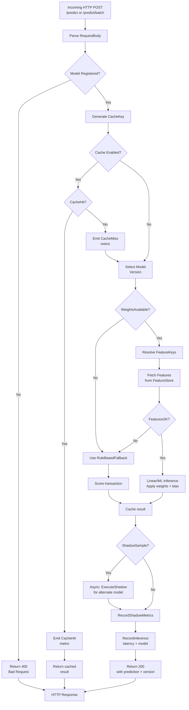

# AI Inference Service - Request Flowchart

## Flow Details

1. **Request Parsing**: Validate model name, features, version preference
2. **Cache Check**: If enabled, check LRU cache (key = model+features hash)
3. **Model Resolution**: Fetch active or specified version from registry
4. **Feature Retrieval**: Call FeatureStoreClient (Redis/BigQuery/none)
5. **Inference**: Linear regression or ML model application
6. **Fallback**: Rule-based scoring if weights/features unavailable
7. **Shadow Mode**: Optionally run alternate model asynchronously
8. **Metrics**: Emit Prometheus counters and histograms
9. **Response**: Return JSON with score, model version, confidence
