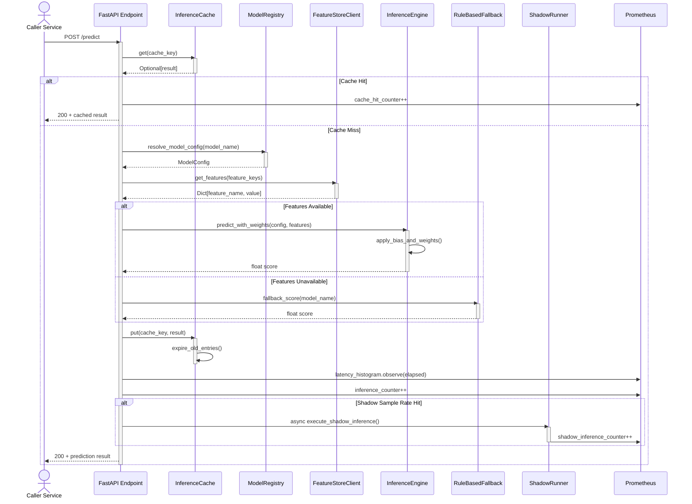

# AI Inference Service - Request Sequence

## Sequence Patterns

- **Cache-First**: Check in-memory LRU before fetching features or running inference
- **Feature Retrieval**: Blocking call to FeatureStoreClient (Redis or BigQuery)
- **Fallback Graceful**: If features unavailable, use rule-based scoring
- **Shadow Async**: A/B model execution does not block main response
- **Metrics Emission**: All paths emit latency and counters to Prometheus
