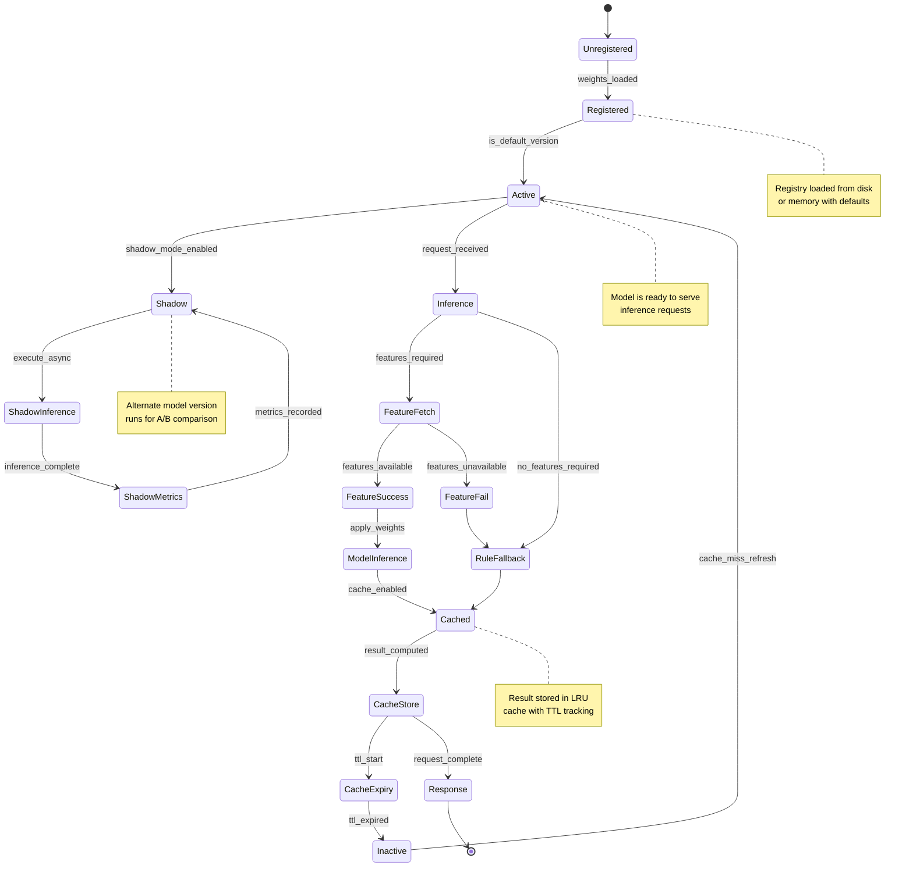

# AI Inference Service - Model Lifecycle State Machine

## State Transitions

- **Registered→Active**: Model weight fully loaded and version is default
- **Active→Inference**: HTTP request routed to model
- **FeatureFetch→RuleFallback**: Features unavailable, use rules
- **ModelInference→Cached**: Result stored in LRU with TTL
- **CacheExpiry→Inactive**: TTL expired, entry removed on next eviction
- **Inactive→Active**: On cache miss, re-fetch and re-infer
