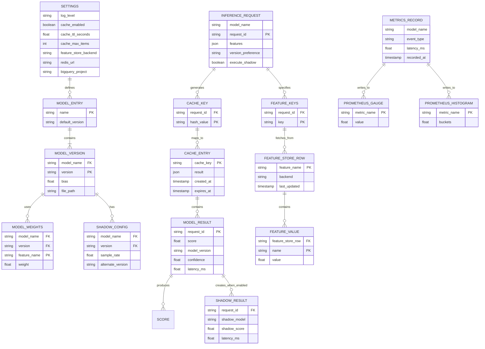

# AI Inference Service - Data Model

## Key Entities

| Entity | Purpose |
|--------|---------|
| **SETTINGS** | Runtime configuration |
| **MODEL_ENTRY** | Model family definition |
| **MODEL_VERSION** | Specific version with weights |
| **MODEL_WEIGHTS** | Individual feature weights |
| **INFERENCE_REQUEST** | Incoming prediction request |
| **CACHE_ENTRY** | Memoized result with TTL |
| **FEATURE_VALUE** | Retrieved feature data |
| **MODEL_RESULT** | Prediction output |
| **SHADOW_RESULT** | A/B test result |
