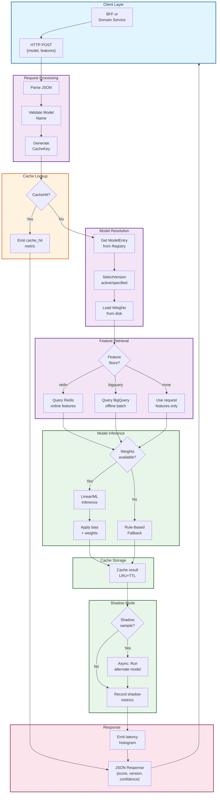

# AI Inference Service - End-to-End Request Flow

## End-to-End Latency Budget

| Phase | Typical Duration | Notes |
|-------|------------------|-------|
| Request parsing & validation | <1 ms | JSON schema check |
| Cache lookup | <1 ms | In-process LRU hash lookup |
| Model registry resolution | <1 ms | In-memory model entry lookup |
| Feature retrieval | 2-50 ms | Redis <5ms, BigQuery 10-50ms |
| Inference (ML or rule) | 1-10 ms | Linear algebra + fallback logic |
| Cache storage & metrics | <1 ms | Async metric emission |
| **Total (cache hit)** | **<2 ms** | LRU lookup + response |
| **Total (cache miss)** | **<100 ms** | Full pipeline at p99 |

## Key Guarantees

✓ All predictions are **advisory only** — consuming service decides action
✓ **No side effects** — no state mutations, no outbox writes
✓ **Fallback scoring** if ML artifacts unavailable
✓ **Shadow A/B testing** without blocking main response
✓ **Sub-100ms p99 latency** for cache misses
