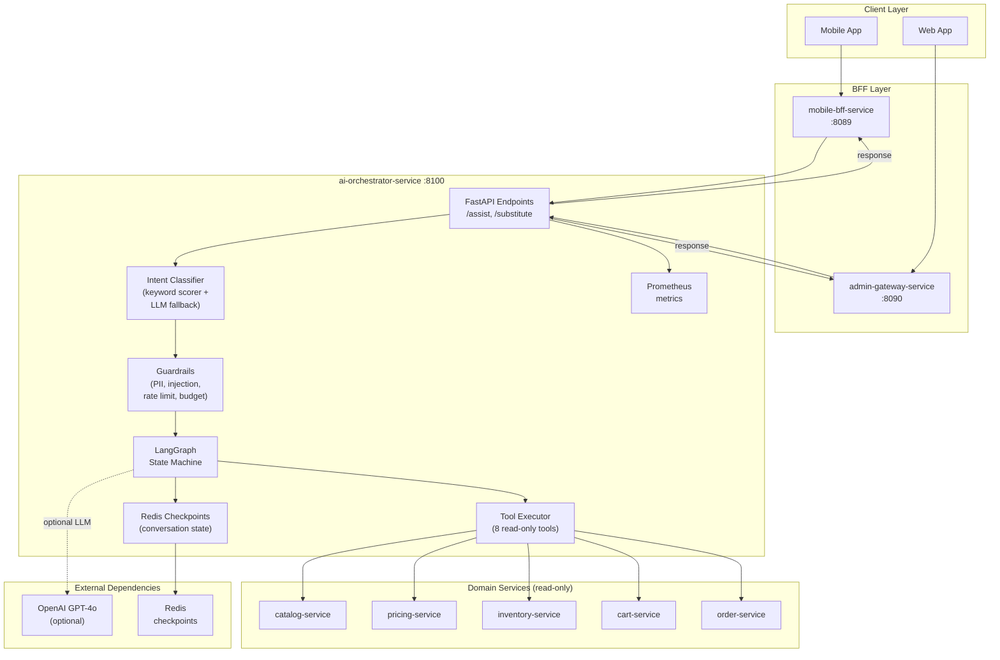

# AI Orchestrator Service - High-Level Design

## Key Characteristics

- **LangGraph Orchestration**: Multi-step agentic conversation with stateful checkpointing
- **Intent Classification**: Deterministic keyword scorer + optional LLM
- **Read-Only Design**: All 8 tools are read-only; no mutations allowed
- **Policy Gates**: Cost, latency, tool-call budgets per request
- **Guardrails**: PII redaction, prompt injection detection, output validation
- **Resilience**: Per-tool circuit breakers, timeouts, retries
- **Observability**: OpenTelemetry tracing + structured JSON logging with PII redaction
