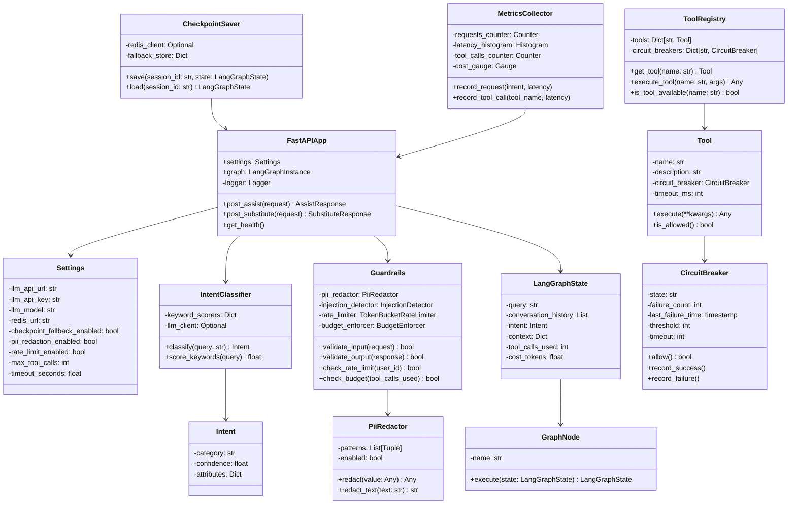

# AI Orchestrator Service - Low-Level Design

## Component Responsibilities

| Component | Responsibility |
|-----------|-----------------|
| **FastAPIApp** | HTTP server, request routing |
| **IntentClassifier** | Query classification (keyword + optional LLM) |
| **Guardrails** | Input/output validation, rate limiting, budget enforcement |
| **LangGraphState** | Orchestration state tracking |
| **ToolRegistry** | Manages 8 read-only tools with circuit breakers |
| **CircuitBreaker** | Per-tool failure tracking and fallback |
| **CheckpointSaver** | Conversation state persistence (Redis + fallback) |
| **PiiRedactor** | Email, SSN, card, phone masking |
| **MetricsCollector** | Prometheus metrics emission |
