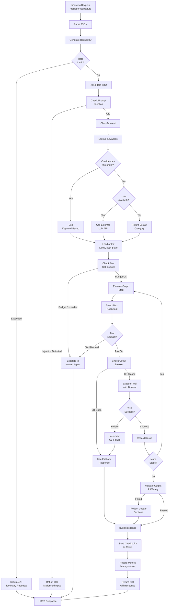

# AI Orchestrator Service - Request Flowchart

## Flow Details

1. **Input Validation**: Rate limit check, PII redaction, injection detection
2. **Intent Classification**: Keyword scoring or optional LLM call
3. **State Management**: Load or initialize LangGraph conversation state
4. **Budget Enforcement**: Check remaining tool calls, cost tokens
5. **Graph Execution**: Iterate through state machine nodes
6. **Tool Selection**: Determine next tool to execute
7. **Resilience**: Circuit breaker per tool, timeouts, fallbacks
8. **Output Safety**: PII redaction, content validation
9. **Checkpoint**: Save conversation state to Redis
10. **Metrics**: Record latency and tool usage
