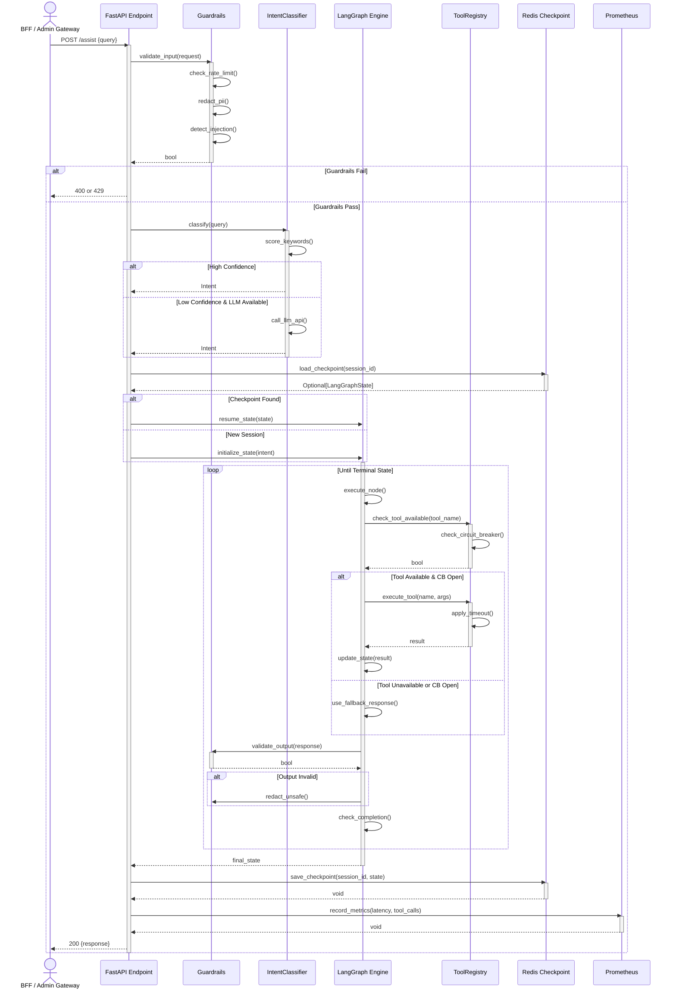

# AI Orchestrator Service - Request Sequence

## Sequence Patterns

- **Input Validation First**: Guardrails block before any processing
- **Intent Classification**: Keyword-based fast path, LLM fallback for ambiguity
- **Checkpoint Resumption**: Restore conversation context from Redis
- **Iterative Graph Execution**: Multi-step reasoning with per-tool circuit breakers
- **Graceful Fallbacks**: Tool failures trigger fallback responses without breaking flow
- **Output Validation**: PII redaction and safety checks before response
- **Metrics Emission**: Latency, tool calls, and cost tracking
