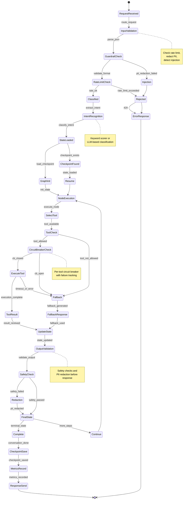

# AI Orchestrator Service - Conversation State Machine

## State Transitions

- **RequestReceived→InputValidation**: New request arrives
- **InputValidation→GuardrailCheck**: JSON parsing succeeds
- **GuardrailCheck→RateLimitCheck**: PII redaction successful
- **RateLimitCheck→Classified**: Rate limit OK
- **Classified→StateLoaded**: Intent determined
- **StateLoaded→NodeExecution**: Conversation state loaded/initialized
- **SelectTool→ExecuteTool**: Circuit breaker closed
- **ExecuteTool→UpdateState**: Tool execution succeeds
- **UpdateState→Complete**: Terminal state reached
- **Complete→ResponseSend**: Checkpoint saved and metrics recorded
