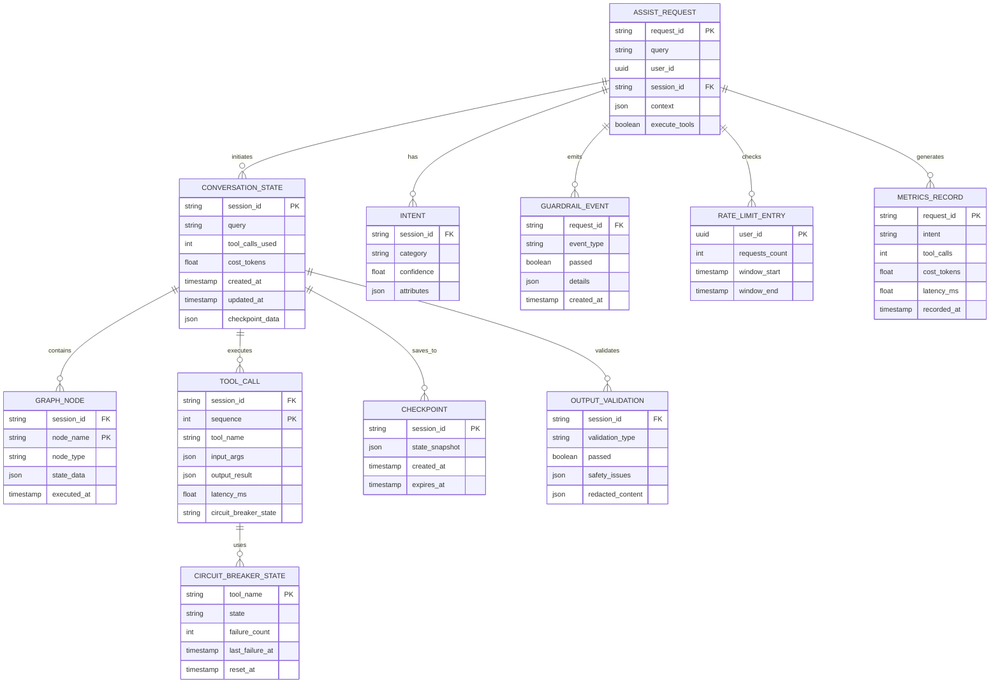

# AI Orchestrator Service - Data Model

## Key Entities

| Entity | Purpose |
|--------|---------|
| **ASSIST_REQUEST** | Incoming assistant query |
| **CONVERSATION_STATE** | Multi-turn conversation context |
| **GRAPH_NODE** | LangGraph node execution history |
| **TOOL_CALL** | Individual tool invocation record |
| **INTENT** | Classified user intent with confidence |
| **GUARDRAIL_EVENT** | Rate limit, injection, PII detection events |
| **CIRCUIT_BREAKER_STATE** | Per-tool failure tracking |
| **CHECKPOINT** | Serialized state for resumption |
| **METRICS_RECORD** | Aggregated latency and tool metrics |
| **OUTPUT_VALIDATION** | Safety checks and PII redaction results |
