# AI Orchestrator Service - End-to-End Orchestration Flow

```mermaid
graph TD
    subgraph Client["Client Request"]
        USER["User Query"]
        REQ["HTTP POST /assist<br/>{query, context}"]
    end

    subgraph Input["Input Safety Gates"]
        RATE["Rate Limit<br/>Check"]
        PII["PII Redaction<br/>Apply"]
        INJ["Injection Detection<br/>Check"]
    end

    subgraph Classification["Intent Classification"]
        KW["Keyword Scorer<br/>Fast Path"]
        KW_CONF{Confidence<br/>>80%?}
        LLM_OPT["LLM Optional<br/>Fallback"]
        INTENT_RESULT["Intent<br/>Determined"]
    end

    subgraph StateMgmt["State Management"]
        CP_LOAD["Load Checkpoint<br/>from Redis"]
        CP_FOUND{Session<br/>Exists?}
        INIT["Initialize<br/>State"]
        STATE["LangGraph<br/>State"]
    end

    subgraph BudgetGates["Budget Enforcement"]
        BUDGET_CHK{Tool Calls<br/>/Cost?}
        BUDGET_OK["Within Budget"]
        ESCALATE["Escalate to<br/>Human"]
    end

    subgraph Orchestration["Graph Execution Loop"]
        NODE["Select Next<br/>Graph Node"]
        TOOL_SELECT["Select Tool"]
        TOOL_ALLOWED{Tool<br/>Allowed?}
        CB_CHECK{Circuit<br/>Breaker?}
        EXECUTE["Execute Tool<br/>w/ Timeout"]
        CB_OPEN["Use Fallback<br/>Response"]
        TOOL_RESULT["Tool Result"]
        MORE_STEPS{Terminal?}
    end

    subgraph Safety["Output Safety"]
        VAL["Validate Output<br/>Content Safety"]
        VAL_PASS{Validation<br/>OK?}
        REDACT["Redact Unsafe<br/>Sections"]
        SAFE_RESULT["Safe Response"]
    end

    subgraph Finalize["Finalization"]
        CP_SAVE["Save Checkpoint<br/>to Redis"]
        METRICS["Record Metrics<br/>latency + tools"]
        RESPONSE["JSON Response"]
    end

    USER --> REQ
    REQ --> RATE
    RATE -->|OK| PII
    RATE -->|Fail| ESCALATE

    PII -->|OK| INJ
    PII -->|Redaction Failed| ESCALATE

    INJ -->|OK| KW
    INJ -->|Injection Detected| ESCALATE

    KW --> KW_CONF
    KW_CONF -->|Yes| INTENT_RESULT
    KW_CONF -->|No| LLM_OPT
    LLM_OPT --> INTENT_RESULT

    INTENT_RESULT --> CP_LOAD
    CP_LOAD --> CP_FOUND

    CP_FOUND -->|Yes| STATE
    CP_FOUND -->|No| INIT
    INIT --> STATE

    STATE --> BUDGET_CHK
    BUDGET_CHK -->|OK| BUDGET_OK
    BUDGET_CHK -->|Exceeded| ESCALATE

    BUDGET_OK --> NODE
    NODE --> TOOL_SELECT
    TOOL_SELECT --> TOOL_ALLOWED

    TOOL_ALLOWED -->|No| ESCALATE
    TOOL_ALLOWED -->|Yes| CB_CHECK

    CB_CHECK -->|Open| CB_OPEN
    CB_CHECK -->|Closed| EXECUTE

    EXECUTE --> TOOL_RESULT
    CB_OPEN --> TOOL_RESULT
    TOOL_RESULT --> MORE_STEPS

    MORE_STEPS -->|No| VAL
    MORE_STEPS -->|Yes| NODE

    VAL --> VAL_PASS
    VAL_PASS -->|Fail| REDACT
    REDACT --> SAFE_RESULT
    VAL_PASS -->|Pass| SAFE_RESULT

    SAFE_RESULT --> CP_SAVE
    ESCALATE --> CP_SAVE
    CP_SAVE --> METRICS
    METRICS --> RESPONSE

    RESPONSE -->|200 OK| Client

    classDef client fill:#e1f5ff,stroke:#01579b,stroke-width:2px
    classDef safety fill:#ffe0b2,stroke:#e65100,stroke-width:2px
    classDef logic fill:#f3e5f5,stroke:#6a1b9a,stroke-width:2px
    classDef orchestration fill:#e8f5e9,stroke:#1b5e20,stroke-width:2px
    classDef finalization fill:#fce4ec,stroke:#c2185b,stroke-width:2px

    class Client client
    class Input,Safety safety
    class Classification,StateMgmt,BudgetGates logic
    class Orchestration orchestration
    class Finalize finalization
```

## E2E Orchestration Phases

| Phase | Components | Duration | Notes |
|-------|-----------|----------|-------|
| **Input Validation** | Rate limit, PII, injection | <5 ms | Fail-fast guardrails |
| **Classification** | Keywords or LLM | 10-500 ms | LLM optional, keyword fast |
| **State Management** | Checkpoint load/init | 5-50 ms | Redis or in-memory fallback |
| **Budget Check** | Tool calls and tokens | <1 ms | In-process counter |
| **Graph Execution** | Loop through nodes/tools | 100-5000 ms | Per-tool timeout enforced |
| **Output Validation** | Safety + PII checks | 10-50 ms | Always applied |
| **Finalization** | Checkpoint + metrics | 5-20 ms | Async metrics possible |
| **Total (p99)** | All phases | **<10s** | Conversation or escalation |

## Guarantees

✓ All 8 tools are **read-only** — no mutations
✓ **Budget enforcement** prevents runaway costs
✓ **Circuit breakers** per tool prevent cascade failures
✓ **Escalation path** for budget exceeded or unavailable tools
✓ **PII redaction** on input and output
✓ **Checkpoint resumption** for multi-turn conversations
