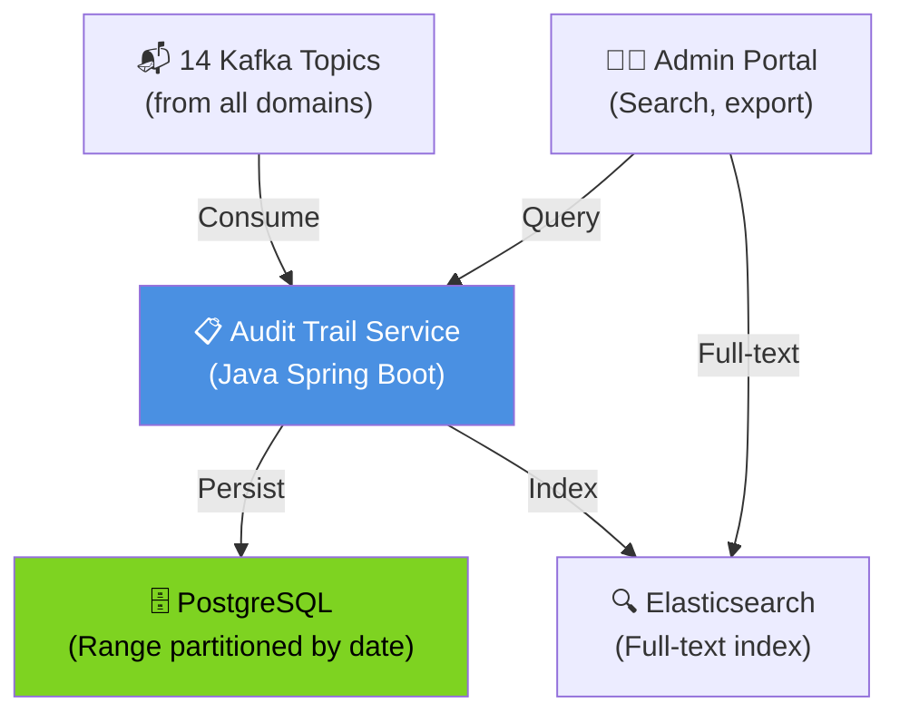
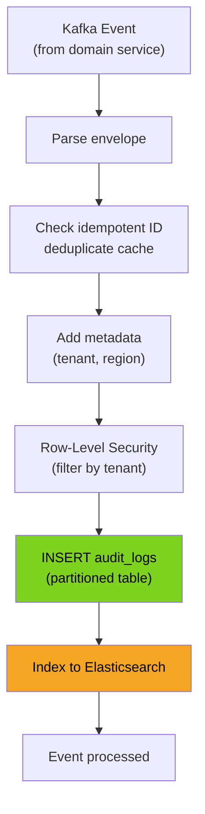
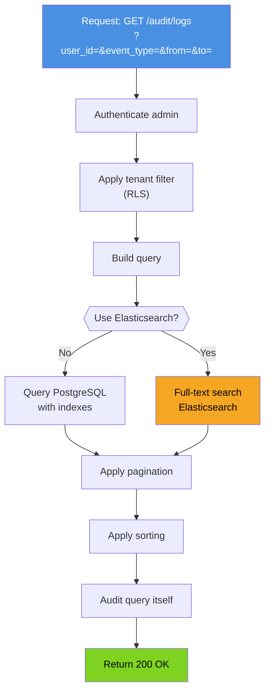
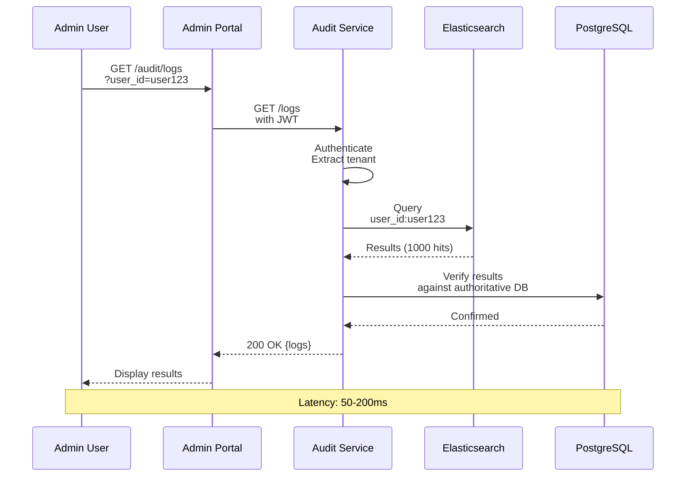
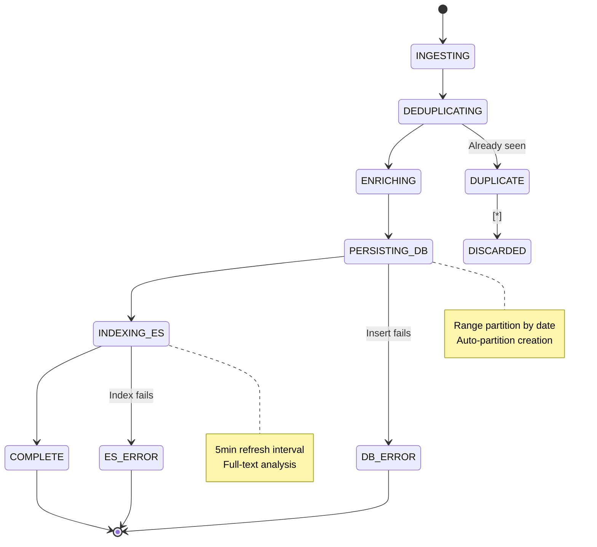
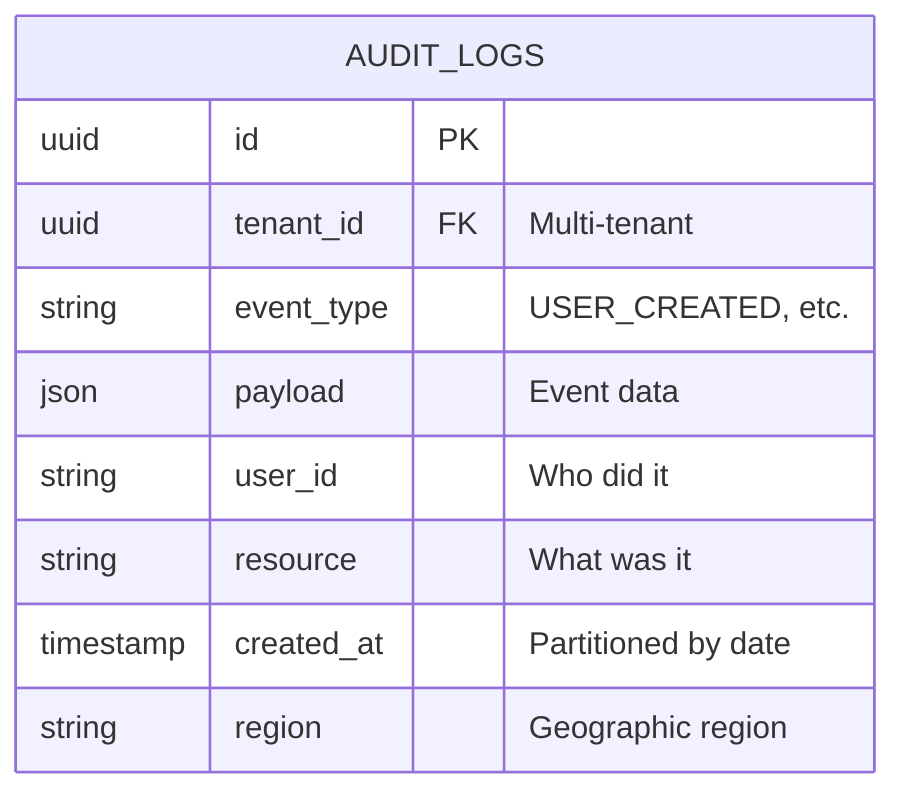
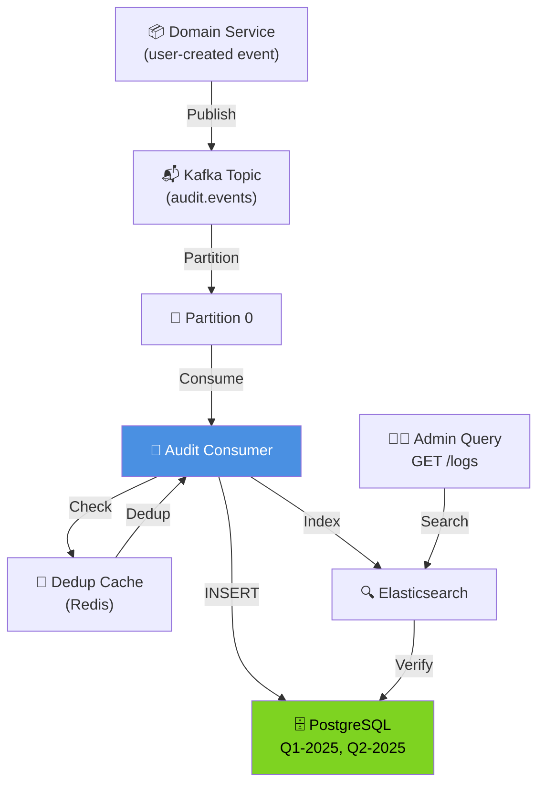

# Audit Trail Service - All 7 Diagrams

## 1. High-Level Design

## 2. Low-Level Design

## 3. Flowchart - Audit Log Search

## 4. Sequence - Log Search

## 5. State Machine

## 6. ER - Audit Schema

## 7. End-to-End

