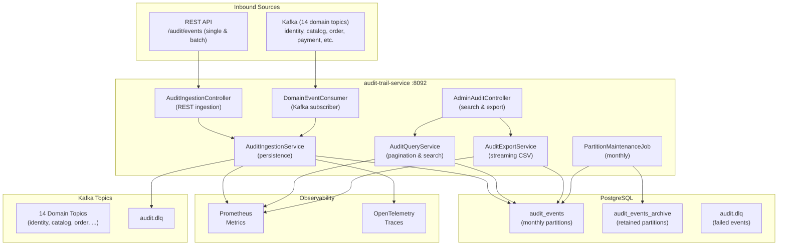

# Audit Trail Service - High-Level Design

## Key Characteristics

- **Immutable Append-Only**: No UPDATE/DELETE on audit rows
- **Monthly Partitions**: Range partitioning by event date
- **14 Domain Topics**: Identity, Catalog, Order, Payment, Inventory, Fulfillment, Rider, Notification, Search, Pricing, Promotion, Support, Returns, Warehouse
- **REST + Kafka Ingestion**: Single, batch, and event stream sources
- **Paginated Search**: JPA Specifications for dynamic querying
- **Streaming CSV Export**: Batched 500-row chunks
- **Compliance**: 365-day retention, partition management
- **Observability**: Prometheus ingestion/query latencies + OTLP traces
