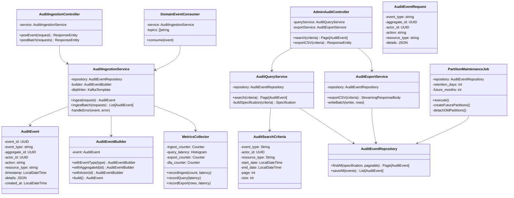

# Audit Trail Service - Low-Level Design

## Component Responsibilities

| Component | Responsibility |
|-----------|-----------------|
| **AuditIngestionController** | REST POST endpoints for events |
| **AdminAuditController** | Search and export endpoints (admin-only) |
| **DomainEventConsumer** | Kafka listener for 14 domain topics |
| **AuditIngestionService** | Persistence and DLQ routing |
| **AuditEventBuilder** | Fluent builder pattern for audit events |
| **AuditQueryService** | Dynamic JPA Specification queries |
| **AuditExportService** | Streaming CSV export in batches |
| **PartitionMaintenanceJob** | Monthly partition lifecycle |
| **AuditEventRepository** | JPA data access layer |
| **MetricsCollector** | Prometheus metrics emission |
