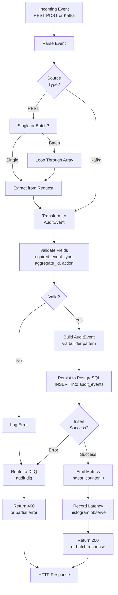

# Audit Trail Service - Event Ingestion Flowchart

## Flow Details

1. **Event Source**: REST API (single/batch) or Kafka subscription
2. **Parsing**: JSON deserialization and validation
3. **Field Validation**: Required fields check (event_type, aggregate_id, action)
4. **Transformation**: Map to AuditEvent entity
5. **Builder Pattern**: Fluent construction for immutability
6. **Persistence**: INSERT to monthly-partitioned audit_events table
7. **DLQ Fallback**: Failed events routed to audit.dlq for replay
8. **Metrics**: Record ingestion counter and latency
9. **Response**: 200 OK or partial error for batch
