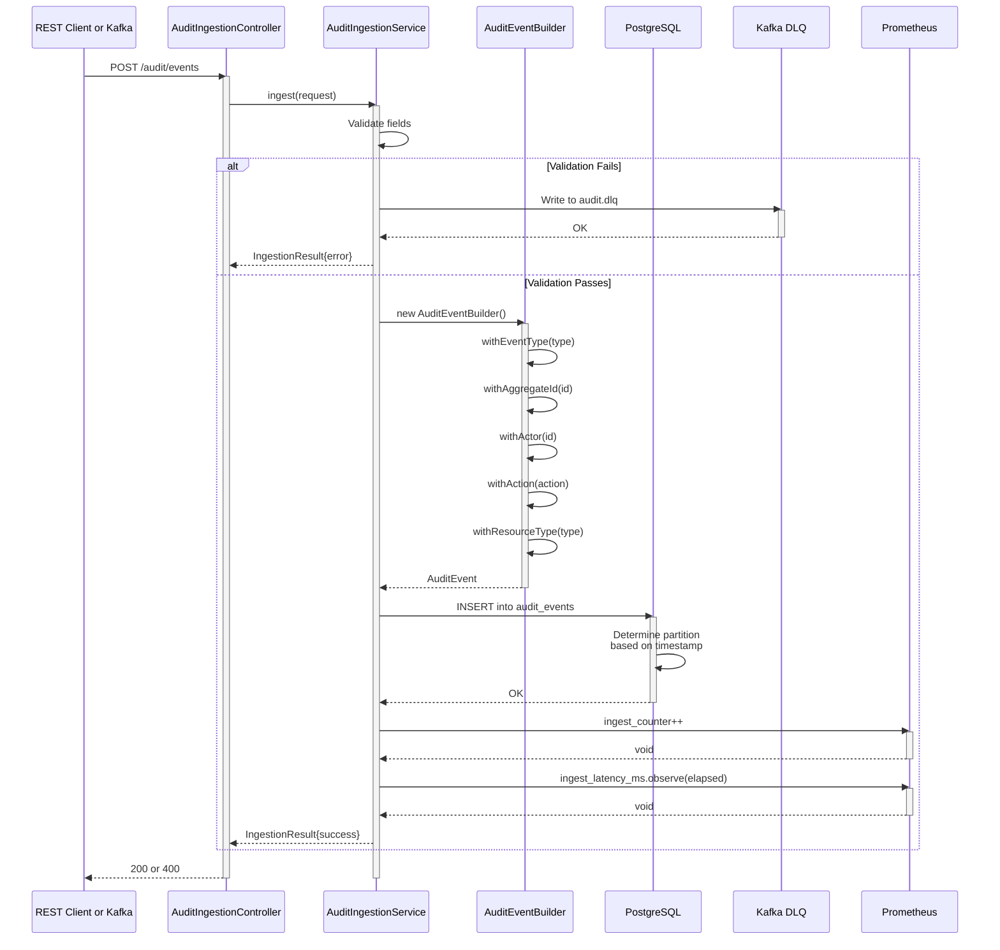

# Audit Trail Service - Event Ingestion Sequence

## Sequence Patterns

- **Validation First**: Early error detection
- **Builder Pattern**: Fluent immutable event construction
- **Partition Routing**: Automatic based on timestamp
- **Transactional Insert**: Single DB call
- **DLQ Fallback**: Failed events persisted for replay
- **Metrics Async**: Non-blocking Prometheus emission
