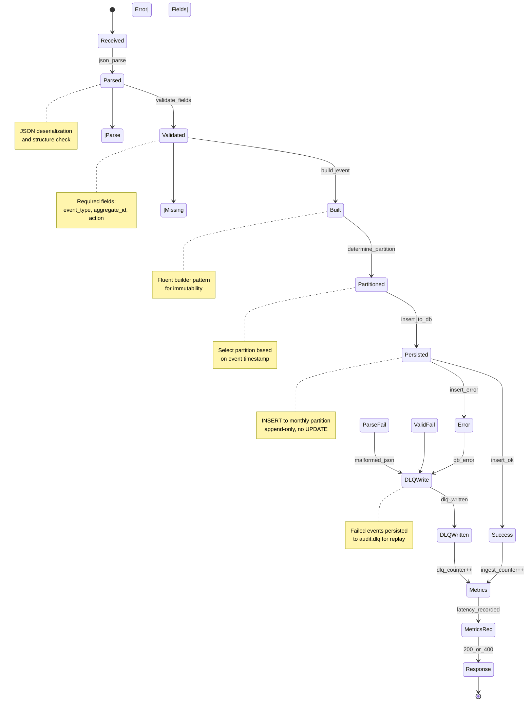

# Audit Trail Service - Event State Machine

## State Transitions

- **Received→Parsed**: Event received via REST or Kafka
- **Parsed→Validated**: JSON parsing successful
- **Validated→Built**: Field validation passed
- **Built→Partitioned**: Determine target partition
- **Partitioned→Persisted**: Insert to PostgreSQL
- **Persisted→Success**: Insert succeeded
- **Persisted→Error**: Insert failed
- **Error→DLQWrite**: Route failed event to DLQ
- **Success→Metrics**: Record ingestion metrics
- **DLQWrite→Metrics**: Record DLQ metrics
- **Metrics→Response**: Send HTTP response
