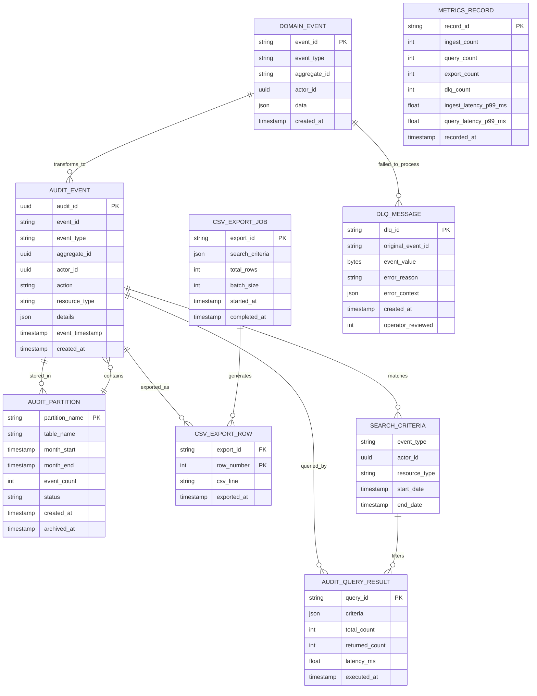

# Audit Trail Service - Data Model

## Key Entities

| Entity | Purpose |
|--------|---------|
| **DOMAIN_EVENT** | Event from Kafka producer |
| **AUDIT_EVENT** | Immutable audit log entry |
| **AUDIT_PARTITION** | Monthly partition metadata |
| **AUDIT_QUERY_RESULT** | Paginated search result |
| **CSV_EXPORT_JOB** | Export job tracking |
| **CSV_EXPORT_ROW** | Individual CSV row |
| **SEARCH_CRITERIA** | Dynamic query filters |
| **DLQ_MESSAGE** | Failed ingestion for replay |
| **METRICS_RECORD** | Ingestion/query/export metrics |
