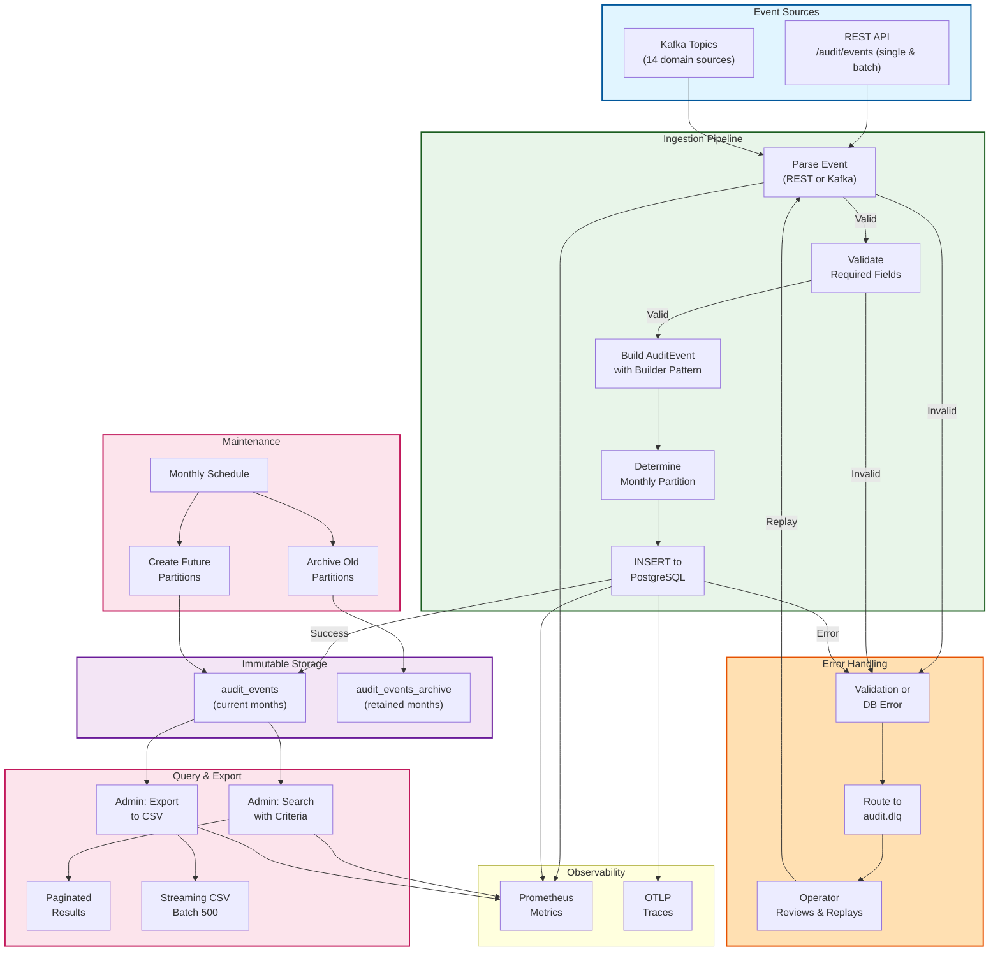

# Audit Trail Service - End-to-End Audit Pipeline



## E2E Audit Pipeline Latency

| Phase | Duration | Notes |
|-------|----------|-------|
| **Parse** | <1 ms | JSON deserialization |
| **Validate** | <1 ms | Field checks |
| **Build** | <1 ms | Builder pattern fluent API |
| **Partition** | <1 ms | Timestamp-based routing |
| **Insert** | 1-10 ms | DB persistence |
| **Metrics** | <1 ms | Prometheus async |
| **Total (p99)** | **<20 ms** | Per-event ingestion |
| **Query (p99)** | **<500 ms** | Page of 50 events |
| **Export (p99)** | **<5s** | Per 500-row batch |

## Immutability Guarantees

✓ **Append-only**: No UPDATE/DELETE on audit rows
✓ **Compliance**: 365-day retention enforced
✓ **Monthly partitions**: Range partitioning by event date
✓ **Archive**: Old partitions detached but retained
✓ **DLQ recovery**: Failed events persisted for operator replay

## Data Flow - 14 Domain Topics

| Topic | Events | Audit Type |
|-------|--------|-----------|
| identity.events | User login, role change | AUTH |
| catalog.events | Product add/update | PRODUCT |
| order.events | Order creation, status change | ORDER |
| payment.events | Payment attempt, success/failure | PAYMENT |
| inventory.events | Stock reservation, release | INVENTORY |
| fulfillment.events | Fulfillment status | FULFILLMENT |
| rider.events | Rider acceptance, delivery | RIDER |
| notification.events | Notification sent | NOTIFICATION |
| search.events | Search query, ranking | SEARCH |
| pricing.events | Price update, rules | PRICING |
| promotion.events | Coupon apply, redemption | PROMOTION |
| support.events | Support ticket action | SUPPORT |
| returns.events | Return initiation, processing | RETURN |
| warehouse.events | Warehouse operation | WAREHOUSE |

## Admin Query Examples

```
1. All orders by customer {customer_id} between dates
2. All payments by user {user_id} with failed attempts
3. Inventory changes for SKU {sku_id} in last 24h
4. All admin actions (ADMIN role) on date
5. Export all events for {customer_id} to CSV
```

## Failure Modes

| Mode | Handling | Recovery |
|------|----------|----------|
| Parse error | DLQ + log | Operator manual review |
| Validation fail | DLQ + log | Operator correction + replay |
| DB insert fail | DLQ + retry | Async retry or manual |
| Partition missing | Auto-create | Create on demand |
| Partition full | Auto-rotate | Next month partition |
