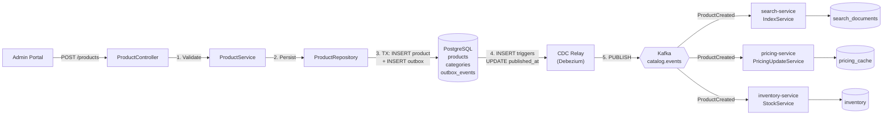

# Catalog Service

## Overview

The catalog-service is the single source of truth for product master data in InstaCommerce. It manages the complete product lifecycle (creation, updates, pricing rules, categorization) and publishes reliable events via transactional outbox pattern to drive the read-plane (search-service, pricing-service, inventory-service). Admin-facing APIs enable rapid product onboarding, bulk updates, and category hierarchy management. Read-optimized for customer-facing APIs via mobile-bff.

**Service Ownership**: Platform Team - Catalog & Taxonomy
**Language**: Java 21 / Spring Boot 4.0
**Default Port**: 8088
**Status**: Tier 2 Critical (master data SoT; impacts all read-planes)
**Database**: PostgreSQL 15+ (products, categories, pricing rules)
**Messaging**: Kafka producer (catalog.events via outbox/CDC)

## SLOs & Availability

- **Availability SLO**: 99.95% (45 minutes downtime/month)
- **P50 Latency**: 30ms (product lookups; cached by CDN for mobile)
- **P99 Latency**: 100ms (product reads)
- **Error Rate**: < 0.1% (excludes validation errors)
- **Outbox Publish Latency**: < 5 seconds (events reach Kafka)
- **Max Throughput**: 1,000 product creates/updates per minute

## Key Responsibilities

1. **Product Master Data**: CRUD operations on products (name, description, brand, category, pricing)
2. **Dynamic Pricing Rules**: Store tier pricing, bulk discounts, seasonal promotions
3. **Category Hierarchy**: Manage category taxonomy (parent-child relationships, sorting)
4. **Product Images**: CDN URL management; image metadata (order, alt text)
5. **Reliable Event Publishing**: Transactional outbox pattern ensures no lost events
6. **Admin Audit Trail**: Log all product changes (who, when, what) for compliance
7. **Read-Plane Synchronization**: ProductCreated/Updated/Delisted events drive search, pricing, inventory
8. **Soft Deletes**: Preserve historical product data; mark inactive instead of hard delete

## Deployment

### GKE Deployment
- **Namespace**: default
- **Replicas**: 2 (Tier 2; write-volume not high)
- **CPU Request/Limit**: 500m / 1000m
- **Memory Request/Limit**: 512Mi / 1Gi
- **Readiness Probe**: `/actuator/health/ready` (checks DB + Kafka producer)

### Database
- **Name**: `catalog` (PostgreSQL 15+)
- **Migrations**: Flyway (V1-V6) auto-applied
- **Connection Pool**: HikariCP 15 connections
- **Replication**: Async (eventual consistency acceptable for products)
- **Indexes**: category_id, status, store_id, created_at

### Outbox Infrastructure
- **CDC Relay**: Debezium (or custom) polls outbox table every 1s
- **Kafka Topic**: `catalog.events` (partition key: productId)
- **Guarantee**: Exactly-once via transactional outbox

## Architecture

### System Context (Master Data)

```
Admin Portal / API
    ↓ (Product CRUD, Category Management)
catalog-service (Write Path)
    ↓ (Transactional Write)
PostgreSQL (Master Data)
    ├─ products
    ├─ categories
    ├─ pricing_rules
    └─ outbox_events (CDC trigger)
    ↓ (CDC Relay polls every 1s)
Kafka: catalog.events
    ├─ → search-service (index)
    ├─ → pricing-service (pricing)
    ├─ → inventory-service (stock)
    └─ → analytics platform
```

### Data Flow (Product Creation)

```
1. Admin: POST /products { name, brand, category, price }
2. CatalogService validates input
3. DB Transaction starts:
   a. INSERT INTO products
   b. INSERT INTO outbox_events (ProductCreated)
4. Transaction commits (atomic)
5. CDC Relay detects outbox entry within 1s
6. Publishes to catalog.events Kafka
7. search-service, pricing-service consume and update
```

### Component Architecture



## Integrations

### Synchronous Clients
| Client | Endpoint | Timeout | Purpose |
|--------|----------|---------|---------|
| mobile-bff | GET /products/{id}, GET /products | 2s | Customer product browsing |
| admin-gateway | POST/PUT/DELETE /products | 5s | Admin product management |
| pricing-service | GET /products (bulk) | 3s | Pricing calculation |

### Event Publishing (Kafka)
| Topic | Events | Partition Key | Guarantee |
|-------|--------|---------------|-----------|
| catalog.events | ProductCreated, ProductUpdated, ProductDelisted, CategoryCreated | productId | Exactly-once (via outbox) |

### Downstream Subscribers
| Service | Consumes | Action |
|---------|----------|--------|
| search-service | ProductCreated, ProductUpdated, ProductDelisted | Index/re-index/delete from FTS |
| pricing-service | ProductCreated, ProductUpdated | Calculate pricing, apply rules |
| inventory-service | ProductCreated, ProductDelisted | Create/deactivate stock record |
| analytics | ProductCreated, ProductUpdated | Populate data warehouse |

## Data Model

### Products Table

```sql
products:
  id              UUID PRIMARY KEY
  name            VARCHAR(512) NOT NULL
  description     TEXT
  brand           VARCHAR(255)
  category_id     UUID NOT NULL (FK → categories.id)
  price_cents     BIGINT NOT NULL
  status          ENUM('ACTIVE', 'INACTIVE', 'DELISTED') DEFAULT 'ACTIVE'
  store_id        UUID nullable (multi-tenancy)
  created_by      VARCHAR(255) (admin user ID)
  created_at      TIMESTAMP NOT NULL DEFAULT now()
  updated_at      TIMESTAMP NOT NULL DEFAULT now()
  version         BIGINT NOT NULL DEFAULT 0 (optimistic locking)

Indexes:
  - category_id (filter by category)
  - status (query active products)
  - store_id, status (tenant + active)
  - created_at DESC (recent products)
```

### Categories Table

```sql
categories:
  id              UUID PRIMARY KEY
  name            VARCHAR(255) NOT NULL UNIQUE
  slug            VARCHAR(255) NOT NULL UNIQUE
  description     TEXT
  parent_id       UUID nullable (FK → categories.id, NULL = root)
  sort_order      INT DEFAULT 0
  created_at      TIMESTAMP NOT NULL
  updated_at      TIMESTAMP NOT NULL

Indexes:
  - parent_id (hierarchy queries)
  - slug (URL-friendly lookups)
```

### Pricing Rules Table

```sql
pricing_rules:
  id              UUID PRIMARY KEY
  product_id      UUID NOT NULL (FK → products.id)
  rule_type       ENUM('TIER', 'BULK', 'SEASONAL', 'PROMOTION')
  min_qty         INT nullable
  max_qty         INT nullable
  discount_pct    DECIMAL(5,2)
  valid_from      TIMESTAMP NOT NULL
  valid_to        TIMESTAMP NOT NULL
  created_at      TIMESTAMP NOT NULL
  updated_at      TIMESTAMP NOT NULL

Indexes:
  - product_id, valid_from, valid_to (active rules query)
```

### Product Images Table

```sql
product_images:
  id              UUID PRIMARY KEY
  product_id      UUID NOT NULL (FK → products.id)
  image_url       VARCHAR(2048) NOT NULL (CDN URL)
  alt_text        VARCHAR(255)
  order_index     INT NOT NULL DEFAULT 0
  created_at      TIMESTAMP NOT NULL

Indexes:
  - product_id, order_index (sort by order)
```

### Outbox Events Table (CDC)

```sql
outbox_events:
  id              UUID PRIMARY KEY
  aggregate_id    UUID NOT NULL (product_id)
  event_type      VARCHAR(100) NOT NULL (ProductCreated, ProductUpdated, etc.)
  payload         JSONB NOT NULL
  created_at      TIMESTAMP NOT NULL DEFAULT now()
  published_at    TIMESTAMP nullable (CDC relay updates when published)

Indexes:
  - created_at (CDC relay polls WHERE published_at IS NULL)
  - published_at (track unpublished events)
```

### Audit Log Table

```sql
audit_log:
  id              UUID PRIMARY KEY
  admin_id        UUID NOT NULL (JWT sub claim)
  resource_type   VARCHAR(100) (Product, Category)
  resource_id     UUID
  action          ENUM('CREATE', 'UPDATE', 'DELETE')
  before_data     JSONB (previous state)
  after_data      JSONB (current state)
  ip_address      VARCHAR(45)
  timestamp       TIMESTAMP NOT NULL DEFAULT now()

Indexes:
  - resource_type, resource_id, timestamp (audit trail by resource)
  - admin_id, timestamp (admin actions)
```

## API Documentation

### Create Product (Admin)

**POST /products**
```bash
Authorization: Bearer {JWT_TOKEN}
Content-Type: application/json

Request Body:
{
  "name": "Fresh Milk 1L",
  "description": "High-quality pasteurized milk",
  "brand": "Amul",
  "categoryId": "cat-uuid",
  "priceCents": 5000,
  "images": [
    {
      "url": "https://cdn.example.com/milk-1.jpg",
      "altText": "Product image",
      "orderIndex": 0
    }
  ]
}

Response (201 Created):
{
  "id": "prod-uuid",
  "name": "Fresh Milk 1L",
  "status": "ACTIVE",
  "createdAt": "2025-03-21T10:00:00Z"
}

Side Effects:
  1. INSERT into products + image records
  2. INSERT into outbox_events (ProductCreated)
  3. INSERT into audit_log
  4. CDC relay publishes within 1-5s
```

### Get Product

**GET /products/{id}**
```bash
Response (200):
{
  "id": "prod-uuid",
  "name": "Fresh Milk 1L",
  "description": "...",
  "brand": "Amul",
  "category": {
    "id": "cat-uuid",
    "name": "Dairy",
    "slug": "dairy"
  },
  "priceCents": 5000,
  "images": [...],
  "status": "ACTIVE",
  "createdAt": "2025-03-21T10:00:00Z",
  "updatedAt": "2025-03-21T10:00:00Z"
}
```

### Update Product (Admin)

**PUT /products/{id}**
```bash
Request Body:
{
  "name": "Fresh Milk 1L Premium",
  "priceCents": 5500
}

Response (200):
- Publishes ProductUpdated event
- CDC relay publishes within 1-5s
- Optimistic locking prevents race conditions via version field
```

### List Products (Paginated)

**GET /products**
```bash
Query Parameters:
  category: string optional
  status: ACTIVE|INACTIVE|DELISTED (default: ACTIVE)
  page: int (0-based, default: 0)
  size: int (1-100, default: 20)
  sort: name|created_at|price (default: name)

Response (200):
{
  "content": [...],
  "page": 0,
  "size": 20,
  "totalElements": 1500,
  "totalPages": 75
}
```

### Curl Examples

```bash
# 1. Create product
curl -s -X POST http://catalog-service:8088/products \
  -H "Authorization: Bearer $JWT_TOKEN" \
  -H "Content-Type: application/json" \
  -d '{
    "name": "Fresh Milk 1L",
    "brand": "Amul",
    "categoryId": "cat-uuid",
    "priceCents": 5000
  }' | jq '.id'

# 2. Get product
curl -s http://catalog-service:8088/products/prod-uuid \
  -H "Authorization: Bearer $JWT_TOKEN" | jq '.name'

# 3. Update product
curl -s -X PUT http://catalog-service:8088/products/prod-uuid \
  -H "Authorization: Bearer $JWT_TOKEN" \
  -H "Content-Type: application/json" \
  -d '{"priceCents": 5500}' | jq '.updatedAt'

# 4. List products by category
curl -s 'http://catalog-service:8088/products?category=dairy&page=0&size=20' \
  -H "Authorization: Bearer $JWT_TOKEN" | jq '.content | length'
```

## Error Handling & Resilience

### Optimistic Locking

```java
@Version
private Long version;  // Automatically managed by JPA

// Detects concurrent updates; throws OptimisticLockingFailureException
// Client should retry with exponential backoff
```

### Circuit Breaker (Kafka)

```yaml
resilience4j:
  circuitbreaker:
    instances:
      kafkaProducer:
        failureRateThreshold: 50%
        waitDurationInOpenState: 30s
```

### Failure Scenarios

**Scenario 1: Kafka Producer Unavailable**
- Product successfully written to DB
- Outbox entry created
- Kafka publish fails; circuit breaker opens
- CDC relay continues polling
- Events published when Kafka recovers

**Scenario 2: CDC Relay Stalled**
- Outbox table accumulates unpublished events
- Alert: SEV-2 if unpublished_count > 100
- Manual recovery: trigger CDC relay restart or manual replay

**Scenario 3: Concurrent Product Update**
- Two admins update same product simultaneously
- Optimistic lock version mismatch → 409 Conflict
- Client retries with fetched version
- Guaranteed consistency without pessimistic locking

## Monitoring & Observability

### Key Metrics

| Metric | Type | Alert Threshold |
|--------|------|-----------------|
| `catalog.product.create.count` | Counter | N/A |
| `catalog.product.update.count` | Counter | N/A |
| `catalog.product.delete.count` | Counter | N/A |
| `catalog.outbox.unpublished` | Gauge | > 100 = SEV-2 |
| `catalog.outbox.publish.latency_ms` | Histogram | p99 > 5000ms = alert |
| `kafka.producer.record-send-total` | Counter | N/A |
| `catalog.optimistic_lock_failures` | Counter | rate > 1% = alert |

### Alert Rules (YAML)

```yaml
alerts:
  - name: CatalogOutboxUnpublishedBacklog
    condition: catalog_outbox_unpublished > 100
    duration: 5m
    severity: SEV-2
    action: Investigate CDC relay; restart if needed

  - name: CatalogOutboxPublishLatency
    condition: histogram_quantile(0.99, catalog_outbox_publish_latency_ms) > 5000
    duration: 5m
    severity: SEV-2
    action: Alert; check Kafka broker health

  - name: CatalogOptimisticLockContentionHigh
    condition: rate(catalog_optimistic_lock_failures[5m]) > 0.01
    duration: 5m
    severity: SEV-3
    action: Investigate; may indicate frequent concurrent updates

  - name: CatalogProductCreateErrorRate
    condition: rate(catalog_product_create_errors_total[5m]) > 0.001
    duration: 5m
    severity: SEV-2
    action: Investigate; may be database or validation issue
```

### Logging
- **INFO**: Product created/updated/deleted, audit trail
- **WARN**: Optimistic lock failure (retry suggested), CDC relay lag
- **ERROR**: Kafka publish failure, DB constraint violation, unhandled exception
- **DEBUG**: Product payload, rule evaluation (disabled in prod)

### Tracing
- **Spans**: Product CRUD, transaction, Kafka publish, audit logging
- **Sampling**: 10% (write-heavy; non-critical)
- **Retention**: 7 days

## Security Considerations

### Authentication & Authorization
- **JWT Validation**: RS256 via identity-service JWKS
- **Admin APIs**: Requires `ADMIN` role
- **Audit**: All admin actions logged with user ID

### Data Protection
- **Sensitive Data**: CDN URLs (public); no payment or PII
- **Audit Trail**: Complete history of all changes

### Known Risks
1. **Unauthorized Product Update**: Attacker with stolen JWT → Mitigated by ADMIN role requirement
2. **Product Deletion**: Accidental hard delete → Mitigated by soft deletes (status = INACTIVE)
3. **Price Manipulation**: Admin changes price maliciously → Mitigated by audit trail + approval workflow (future)

## Troubleshooting

### Issue: Products Not Appearing in Search (Created But Not Indexed)

**Diagnosis:**
```bash
# Check product in catalog DB
kubectl exec -n default pod/catalog-service-0 -- psql -U postgres -d catalog -c \
  "SELECT * FROM products WHERE name LIKE '%milk%';"

# Check outbox table for unpublished events
kubectl exec -n default pod/catalog-service-0 -- psql -U postgres -d catalog -c \
  "SELECT COUNT(*) FROM outbox_events WHERE published_at IS NULL;"

# Check CDC relay status
kubectl logs -n default deployment/cdc-relay | tail -20

# Check Kafka topic for events
kafka-console-consumer --bootstrap-server kafka:9092 --topic catalog.events --from-beginning | head -5
```

**Resolution:**
- If outbox table has unpublished events: Restart CDC relay
- If Kafka has no events: Check relay logs for errors
- If search index missing: Manual rebuild or trigger replay from DLQ

### Issue: Audit Log Shows No Product Changes (Compliance Issue)

**Diagnosis:**
```bash
# Check audit table for recent entries
psql -d catalog -c "SELECT * FROM audit_log WHERE resource_type='Product' ORDER BY timestamp DESC LIMIT 10;"

# Check if audit trigger is active
psql -d catalog -c "\dt audit_log"

# Check DB logs for trigger errors
kubectl logs -n default deployment/catalog-service | grep -i "audit\|trigger"
```

**Resolution:**
- Verify audit trigger exists on products table
- Check if audit_log table has write permissions
- May need to manually reconstruct from outbox events

### Issue: Outbox Backlog Growing (CDC Relay Stalled)

**Diagnosis:**
```bash
# Check outbox table size and age
psql -d catalog -c "SELECT COUNT(*), MIN(created_at), MAX(created_at) FROM outbox_events WHERE published_at IS NULL;"

# Check CDC relay pod health
kubectl get pods -n default -l app=cdc-relay

# Check CDC relay logs
kubectl logs -n default deployment/cdc-relay | grep -i "error\|exception"

# Check Kafka connectivity from relay
kubectl exec -n default pod/cdc-relay-0 -- \
  /bin/bash -c "echo 'test' | nc -zv kafka-broker-1:9092"
```

**Resolution:**
- Restart CDC relay pod: `kubectl rollout restart deployment/cdc-relay`
- Verify Kafka connectivity
- Manual trigger replay if needed: Delete relay offset and restart

## Configuration

### Environment Variables
```env
# Server
SERVER_PORT=8088
SPRING_PROFILES_ACTIVE=gcp

# Database
SPRING_DATASOURCE_URL=jdbc:postgresql://cloudsql-proxy:5432/catalog
SPRING_DATASOURCE_USERNAME=${DB_USER}
SPRING_DATASOURCE_PASSWORD=${DB_PASSWORD}
SPRING_DATASOURCE_HIKARI_POOL_SIZE=15

# Kafka
SPRING_KAFKA_BOOTSTRAP_SERVERS=kafka-broker-1:9092,kafka-broker-2:9092
KAFKA_TOPIC_CATALOG_EVENTS=catalog.events

# JWT
JWT_ISSUER=instacommerce-identity
JWT_PUBLIC_KEY=${JWT_PUBLIC_KEY_PEM}

# Tracing
OTEL_EXPORTER_OTLP_TRACES_ENDPOINT=http://otel-collector.monitoring:4318/v1/traces
```

### application.yml
```yaml
server:
  port: 8088
spring:
  jpa:
    hibernate:
      ddl-auto: none
    show-sql: false
  datasource:
    hikari:
      pool-size: 15
      idle-timeout: 300000

catalog-service:
  outbox:
    enabled: true
  audit:
    enabled: true
    log-all-changes: true
```

## Kubernetes Deployment

```yaml
apiVersion: apps/v1
kind: Deployment
metadata:
  name: catalog-service
  namespace: default
spec:
  replicas: 2
  selector:
    matchLabels:
      app: catalog-service
  template:
    metadata:
      labels:
        app: catalog-service
      annotations:
        prometheus.io/scrape: "true"
        prometheus.io/port: "8088"
    spec:
      containers:
      - name: catalog-service
        image: catalog-service:v1.2.3
        ports:
        - containerPort: 8088
        env:
        - name: SPRING_PROFILES_ACTIVE
          value: gcp
        resources:
          requests:
            cpu: 500m
            memory: 512Mi
          limits:
            cpu: 1000m
            memory: 1Gi
        livenessProbe:
          httpGet:
            path: /actuator/health/live
            port: 8088
          initialDelaySeconds: 10
        readinessProbe:
          httpGet:
            path: /actuator/health/ready
            port: 8088
          initialDelaySeconds: 15
---
apiVersion: v1
kind: Service
metadata:
  name: catalog-service
  namespace: default
spec:
  selector:
    app: catalog-service
  ports:
  - port: 8088
    targetPort: 8088
  type: ClusterIP
```

## Advanced Product Lifecycle Management

### Product State Machine
```
DRAFT → ACTIVE → (INACTIVE or DELISTED)

Transitions:
- DRAFT→ACTIVE: Manual admin approval (requires audit entry)
- ACTIVE→INACTIVE: Can be reversed (soft state)
- ACTIVE/INACTIVE→DELISTED: Permanent (cannot reverse)

State Retention:
- ACTIVE products: Live on catalog and search
- INACTIVE products: Hidden from search, retained in DB (6 months history)
- DELISTED products: Retained permanently (compliance: 7-year retention)
```

### Batch Product Operations
```
Supported operations:
- Bulk import (CSV): 10K products/minute
- Bulk update (prices/availability): 5K products/minute
- Bulk deactivate: 1K products/minute (for seasonal items)

Flow:
1. Admin uploads CSV file
2. Validate rows (schema + business rules)
3. Generate SQL diff (preview mode)
4. Admin reviews and approves
5. Execute in batches of 100 (to prevent lock contention)
6. Publish ProductUpdated events for each
7. Track job progress with checkpoint persistence
```

### Dynamic Pricing Rule Engine
```
Price calculation hierarchy:
1. Base price (from products table)
2. Apply tier pricing (if customer tier exists)
3. Apply bulk discount (if qty > threshold)
4. Apply seasonal promotion (if active for category)
5. Apply coupon discount (applied by pricing-service, not here)

Rules are time-based and can be scheduled:
- Valid from: 2025-03-21 00:00:00 UTC
- Valid to: 2025-03-28 23:59:59 UTC
- Auto-disable after valid_to (no manual cleanup needed)
```

## Operational Monitoring & Management

### Real-Time Product Metrics
```
Metrics collected hourly:
- Total products (active): 150,000
- Products added today: 2,500
- Products updated today: 500
- Product deletion rate: 10/day
- Category distribution (top 10)
- Brand distribution (top 20)
- Price range analysis (p10, p50, p90)
```

### Inventory Synchronization Health Check
```
Daily automated health check:
1. Count products in catalog vs search-service index
   Expected: 100% match (within 5 minutes)
2. Count products in catalog vs inventory-service
   Expected: 100% match (within 2 minutes)
3. Price sync: Compare pricing-service cache vs catalog
   Expected: 100% match (within 1 minute)

Alert triggers:
- Mismatch > 1% for 10+ minutes: SEV-2 alert
- Mismatch > 5%: SEV-1 (immediate page)
```

## Advanced Troubleshooting

### Issue: Product Appears in Catalog but Missing in Search
**Investigation Path**:
1. Verify product exists in catalog DB
   ```sql
   SELECT id, name, status FROM products WHERE id = 'product-uuid';
   ```
2. Check if outbox event was generated
   ```sql
   SELECT * FROM outbox_events
   WHERE aggregate_id = 'product-uuid'
   ORDER BY created_at DESC LIMIT 5;
   ```
3. Check if CDC relay published to Kafka
   ```bash
   kafka-console-consumer --bootstrap-server kafka:9092 \
     --topic catalog.events --from-beginning \
     --max-messages 100 | grep "product-uuid"
   ```
4. Check if search-service consumed the event
   ```bash
   kafka-consumer-groups --bootstrap-server kafka:9092 \
     --group search-service --describe
   ```
5. Final check: Search database directly
   ```sql
   SELECT * FROM search_documents WHERE product_id = 'product-uuid';
   ```

**Resolution by root cause**:
- If outbox missing: Republish from snapshot
- If CDC relay lag high: Restart relay pod
- If Kafka has no events: Check relay logs for exceptions
- If search index missing: Manual rebuild from snapshot

### Issue: Concurrent Product Update Conflict (409 Errors)
**Root cause**: Optimistic locking version mismatch

**Solution workflow**:
```
1. Client fetches product (version=5)
2. Admin simultaneously updates product (triggers version→6)
3. Client attempts update with version=5
4. DB rejects: version != 5 (current is 6)
5. Return 409 Conflict to client
6. Client should:
   - Fetch latest version (version=6)
   - Reapply their change
   - Submit with version=6
   - Should succeed (version=6→7)
```

### Issue: Audit Log Empty (No Product Changes Recorded)
**Diagnostic steps**:
```bash
# 1. Check if audit_log table exists
psql -d catalog -c "\dt audit_log"

# 2. Check if trigger exists on products table
psql -d catalog -c "SELECT trigger_name FROM information_schema.triggers WHERE event_object_table='products';"

# 3. Manually log a change
INSERT INTO audit_log (admin_id, resource_type, resource_id, action, ip_address, timestamp)
VALUES ('admin-uuid', 'Product', 'prod-123', 'UPDATE', '10.0.0.1', NOW());

# 4. Verify insert succeeded
SELECT COUNT(*) FROM audit_log WHERE resource_type='Product';

# 5. If zero results after insert: Permission or data issue
```

**Recovery**:
- Rebuild audit_log from outbox_events (if available)
- Enable trigger logging to capture future changes
- Manual cleanup: Add missing entries

## Production Runbook Patterns

### Runbook 1: Emergency Product Delisting (Recall/Quality Issue)
**Scenario**: Supplier reports contamination in product batch

1. **Immediate (< 2 min)**:
   ```bash
   curl -X PUT http://catalog-service:8088/products/prod-uuid \
     -d '{"status":"DELISTED","reason":"Quality recall - batch ABC123"}'
   ```
2. **Verification** (< 1 min):
   - Search service: Verify product no longer searchable
   - Inventory service: Verify stock marked unavailable
   - Mobile app: Verify product hidden from browse
3. **Communication** (< 5 min):
   - Notify affected customers (order history)
   - Update marketing banners if product heavily promoted
   - Create support ticket explaining recall
4. **Post-incident**:
   - Document recall reason in audit trail
   - Review supplier for future issues
   - Update SOP for product recalls

### Runbook 2: Bulk Price Update for Sale Event
**Scenario**: Sales team wants to run flash sale on dairy products

1. **Preparation**:
   - Export product list (category=Dairy, status=ACTIVE)
   - Download current prices
   - Apply discount: new_price = old_price * 0.8 (20% off)
   - Prepare CSV file

2. **Execution**:
   ```bash
   # Upload bulk update
   curl -X POST http://catalog-service:8088/admin/bulk-update \
     -F "file=@pricing_update.csv"
   ```

3. **Validation**:
   - Check preview (shows which products updated, price deltas)
   - Spot-check 5 random products
   - Verify pricing-service cache updated

4. **Monitoring** (15 min into sale):
   - Check order volume spike
   - Verify search results show sale prices
   - Monitor conversion rate impact

5. **Rollback** (if issues):
   - Revert prices: `new_price = old_price / 0.8`
   - Publish new pricing events
   - Communicate to customers (sale extended or ending)

### Runbook 3: Category Hierarchy Restructuring
**Scenario**: Need to reorganize category tree (e.g., merge Dairy+Frozen Foods)

1. **Planning**:
   - Design new hierarchy (draw diagram)
   - Identify affected products (2,000+ products in Dairy)
   - Plan migration (phase by phase)

2. **Dry Run**:
   - Test on staging environment
   - Verify search still works
   - Check mobile app navigation

3. **Execution**:
   ```bash
   # Step 1: Create new parent category
   curl -X POST http://catalog-service:8088/categories \
     -d '{"name":"Grocery Essentials","slug":"grocery-essentials"}'

   # Step 2: Reparent subcategories
   curl -X PUT http://catalog-service:8088/categories/dairy \
     -d '{"parentId":"grocery-essentials-uuid"}'
   ```

4. **Propagation** (< 1 hour):
   - Wait for search-service to reindex
   - Monitor mobile app category menu updates
   - Track user navigation patterns (A/B test impact)

5. **Rollback** (if navigation broken):
   - Restore previous parent_id values
   - Republish category events
   - Customers may see cached old hierarchy (< 5 min)

## Configuration & Deployment

### Kubernetes StatefulSet
```yaml
spec:
  replicas: 2
  serviceName: catalog-service
  template:
    spec:
      containers:
      - name: catalog-service
        image: catalog-service:v1.2.3
        ports:
        - containerPort: 8088
        livenessProbe:
          httpGet:
            path: /actuator/health/live
            port: 8088
          initialDelaySeconds: 30
          periodSeconds: 10
        readinessProbe:
          httpGet:
            path: /actuator/health/ready
            port: 8088
          initialDelaySeconds: 20
          periodSeconds: 5
```

## Related Documentation

- **ADR-005**: Event-Driven Architecture (outbox pattern)
- **ADR-014**: Reconciliation Authority Model (catalog as source of truth)
- **ADR-015**: Product Lifecycle & State Management
- [High-Level Design](diagrams/hld.md)
- [Low-Level Architecture](diagrams/lld.md)
- [Database Schema (ERD)](diagrams/erd.md)
- [Runbook](runbook.md)
- [State Machine Diagram](diagrams/state.md)
- [Event Flow Diagram](diagrams/sequence.md)