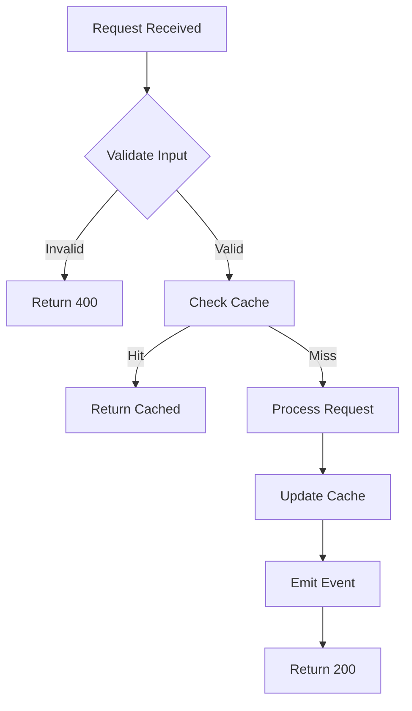
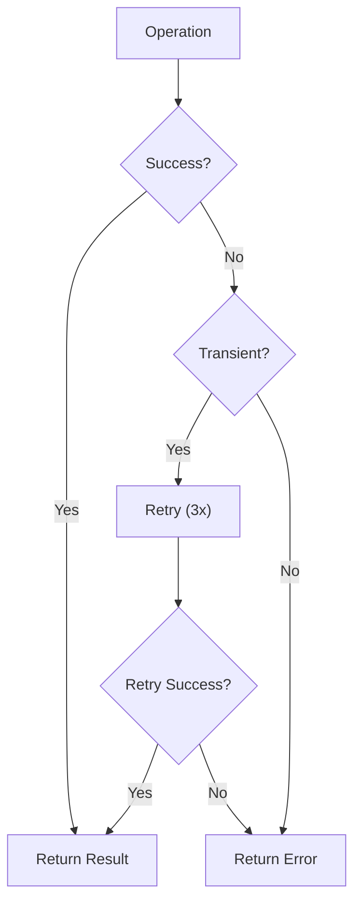

# Catalog - Flowchart

## Request Processing

```mermaid
flowchart TD
    A["Request Received"] --> B{Validate Input}
    B -->|Invalid| C["Return 400"]
    B -->|Valid| D["Check Cache"]
    D -->|Hit| E["Return Cached"]
    D -->|Miss| F["Process Request"]
    F --> G["Update Cache"]
    G --> H["Emit Event"]
    H --> I["Return 200"]
```

## Error Handling

```mermaid
flowchart TD
    A["Operation"] --> B{Success?}
    B -->|Yes| C["Return Result"]
    B -->|No| D{Transient?}
    D -->|Yes| E["Retry (3x)"]
    D -->|No| F["Return Error"]
    E --> G{Retry Success?}
    G -->|Yes| C
    G -->|No| F
```
