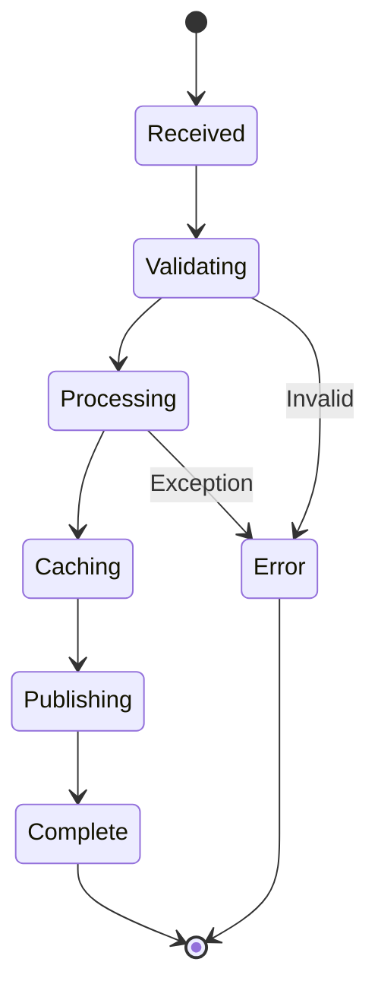
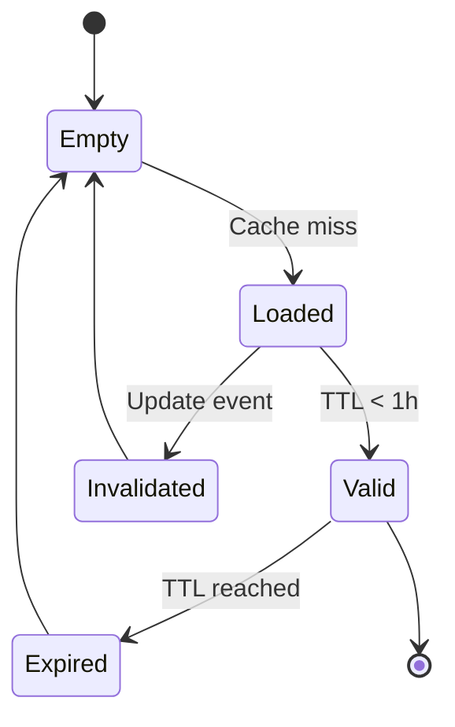

# Catalog - State Machines

## Request Lifecycle

```mermaid
stateDiagram-v2
    [*] --> Received
    Received --> Validating
    Validating --> Processing
    Processing --> Caching
    Caching --> Publishing
    Publishing --> Complete
    Complete --> [*]
    
    Validating --> Error: Invalid
    Processing --> Error: Exception
    Error --> [*]
```

## Cache Lifecycle

```mermaid
stateDiagram-v2
    [*] --> Empty
    Empty --> Loaded: Cache miss
    Loaded --> Valid: TTL < 1h
    Valid --> Expired: TTL reached
    Loaded --> Invalidated: Update event
    Expired --> Empty
    Invalidated --> Empty
    Valid --> [*]
```
