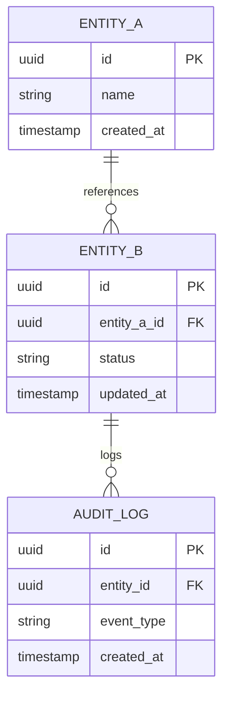

# Catalog - Entity-Relationship & Schema

## Core Entities



## PostgreSQL Schema

```sql
CREATE TABLE entity_a (
    id UUID PRIMARY KEY,
    name VARCHAR(255) NOT NULL,
    created_at TIMESTAMP DEFAULT CURRENT_TIMESTAMP
);

CREATE TABLE entity_b (
    id UUID PRIMARY KEY,
    entity_a_id UUID NOT NULL REFERENCES entity_a(id) ON DELETE CASCADE,
    status VARCHAR(50) DEFAULT 'ACTIVE',
    updated_at TIMESTAMP DEFAULT CURRENT_TIMESTAMP
);

CREATE TABLE audit_log (
    id UUID PRIMARY KEY,
    entity_id UUID NOT NULL,
    event_type VARCHAR(50),
    created_at TIMESTAMP DEFAULT CURRENT_TIMESTAMP
);

CREATE INDEX idx_entity_b_entity_a_id ON entity_b(entity_a_id);
CREATE INDEX idx_entity_b_status ON entity_b(status);
CREATE INDEX idx_audit_log_created_at ON audit_log(created_at);
```
