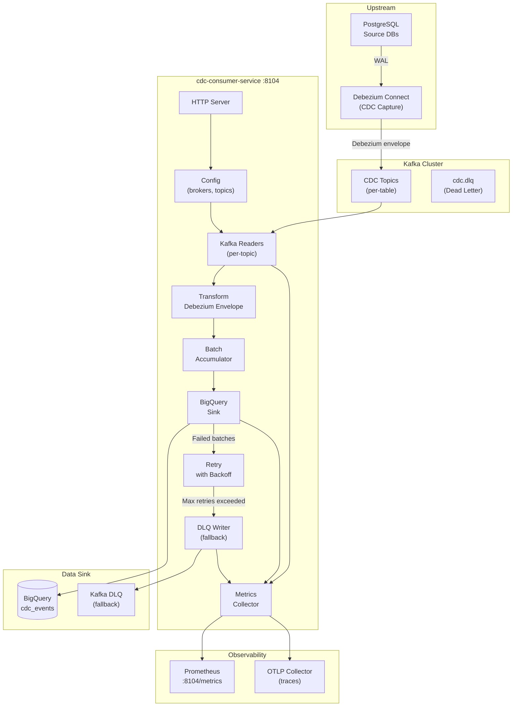

# CDC Consumer Service - High-Level Design

## Key Characteristics

- **CDC Source**: Debezium-managed Kafka topics with WAL-level capture
- **Stateless Design**: No persistent state; consumer group tracks offsets
- **Envelope Parsing**: Debezium after/before/source/op extraction
- **Batch Streaming**: Accumulate messages, batch insert to BigQuery
- **Idempotency**: insertID deduplication within ~1 minute BQ window
- **Dead-Letter Queue**: Failed batches with provenance for operator replay
- **Resilience**: Exponential backoff with max retries
- **Observability**: Per-topic lag gauges, batch latency histograms
