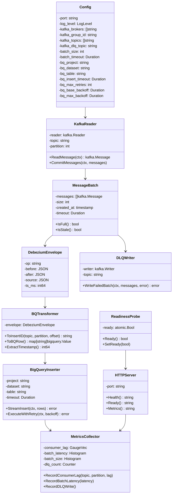

# CDC Consumer Service - Low-Level Design

## Component Responsibilities

| Component | Responsibility |
|-----------|-----------------|
| **Config** | Load and validate environment configuration |
| **KafkaReader** | Consume messages per topic with group management |
| **MessageBatch** | Accumulate messages by size or timeout |
| **DebeziumEnvelope** | Parse Debezium message structure |
| **BQTransformer** | Convert envelope to BigQuery-compatible row |
| **BigQueryInserter** | Batch streaming insert with retries |
| **DLQWriter** | Route failed batches to Kafka DLQ |
| **MetricsCollector** | Prometheus metrics emission |
| **HTTPServer** | Health, readiness, and metrics endpoints |
| **ReadinessProbe** | Track service readiness state |
