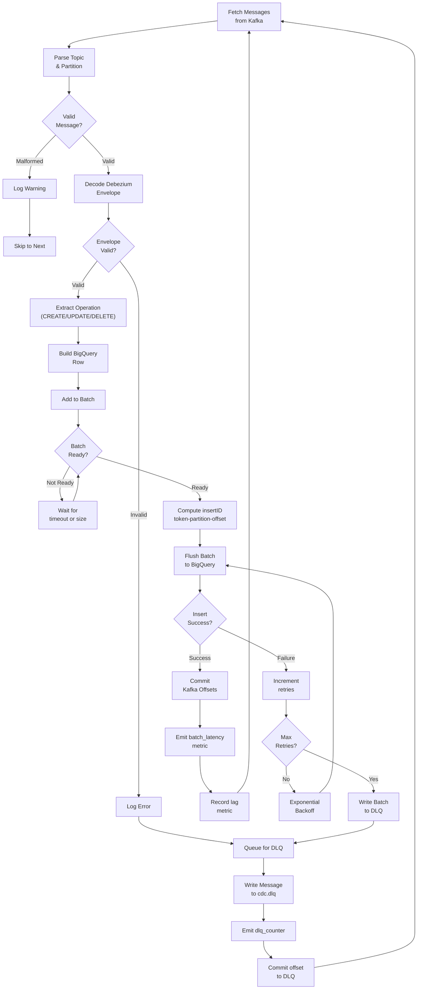

# CDC Consumer Service - Message Processing Flowchart

## Flow Details

1. **Message Fetch**: Read from Kafka consumer group
2. **Validation**: Check JSON structure and Debezium envelope format
3. **Envelope Parsing**: Extract op, before, after, source, ts_ms
4. **Row Transformation**: Convert to BigQuery schema
5. **Batching**: Accumulate by size or timeout
6. **Deduplication ID**: insertID = topic-partition-offset for within-window dedup
7. **BigQuery Insert**: Streaming batch insert
8. **Retry Logic**: Exponential backoff up to max retries
9. **DLQ Fallback**: Failed batches written to cdc.dlq
10. **Offset Commit**: Only after successful insert or DLQ write
11. **Metrics**: Record latency, lag, and DLQ counters
