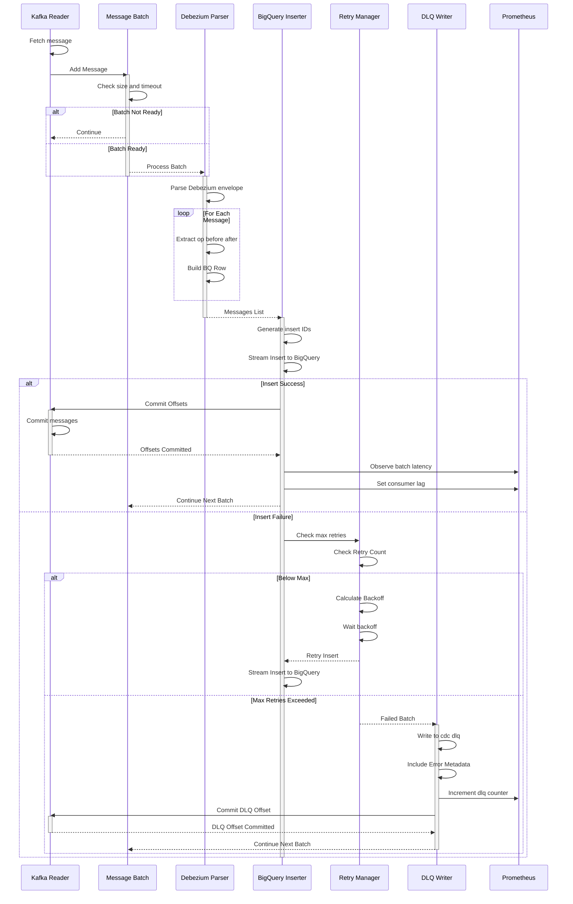

# CDC Consumer Service - Message Processing Sequence

## Sequence Patterns

- **Batch Accumulation**: Messages collected until size or timeout threshold
- **Envelope Parsing**: Debezium structure extraction for all messages
- **Row Transformation**: Convert per-message to BigQuery schema
- **Deduplication**: insertID provides idempotency within ~1 min window
- **Streaming Insert**: BigQuery batch API call
- **Retry Loop**: Exponential backoff on transient failures
- **DLQ Fallback**: Operator-managed replay after max retries
- **Offset Management**: Commit only after BQ or DLQ success
- **Metrics Emission**: Latency, lag, and DLQ counters per batch
