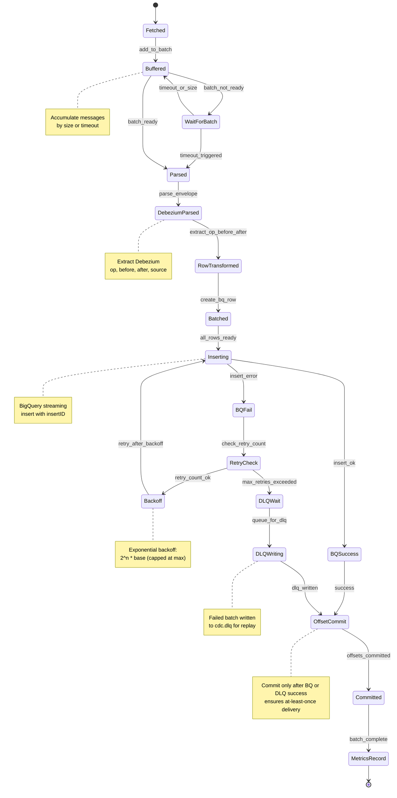

# CDC Consumer Service - Message State Machine

## State Transitions

- **Fetched→Buffered**: Message added to accumulator
- **Buffered→Parsed**: Batch size or timeout reached
- **Parsed→DebeziumParsed**: JSON envelope extracted
- **DebeziumParsed→RowTransformed**: Operation and values extracted
- **RowTransformed→Batched**: BigQuery row created for all messages
- **Batched→Inserting**: Batch ready for BigQuery insert
- **Inserting→BQSuccess**: Insert succeeds (idempotent within window)
- **Inserting→BQFail→RetryCheck**: Transient failure, check retry count
- **RetryCheck→Backoff**: Below max retries, exponential backoff
- **RetryCheck→DLQWait**: Max retries exceeded, queue for DLQ
- **BQSuccess/DLQWriting→OffsetCommit**: Commit Kafka offsets
- **OffsetCommit→MetricsRecord**: Record latency and lag
