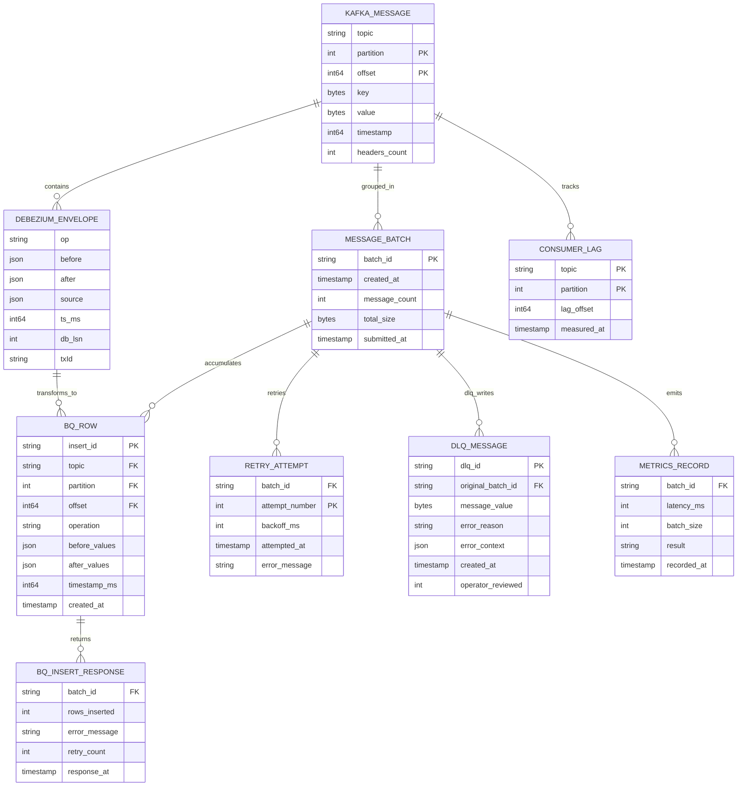

# CDC Consumer Service - Data Model

## Key Entities

| Entity | Purpose |
|--------|---------|
| **KAFKA_MESSAGE** | Individual Kafka record from CDC topic |
| **DEBEZIUM_ENVELOPE** | Parsed Debezium message (op, before, after) |
| **MESSAGE_BATCH** | Accumulated messages ready for insert |
| **BQ_ROW** | Transformed row for BigQuery insert |
| **BQ_INSERT_RESPONSE** | Result of streaming insert operation |
| **RETRY_ATTEMPT** | Track exponential backoff per batch |
| **DLQ_MESSAGE** | Failed batch routed to dead-letter queue |
| **METRICS_RECORD** | Latency and size metrics per batch |
| **CONSUMER_LAG** | Per-topic/partition lag tracking |
