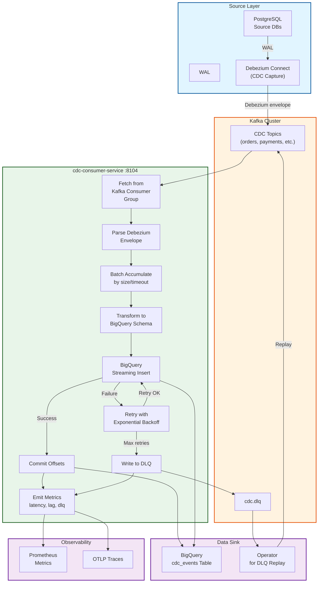

# CDC Consumer Service - End-to-End Data Flow

## E2E Data Flow Summary

| Stage | Operation | Latency | Guarantee |
|-------|-----------|---------|-----------|
| **Source** | WAL capture by Debezium | Real-time | CDC completeness |
| **Kafka** | Event availability in topics | <100ms | Consumer group offset tracking |
| **Fetch** | Kafka consumer polling | 1-10s window | Consumer group coordination |
| **Parse** | Debezium envelope extraction | <1ms | JSON schema validation |
| **Batch** | Size or timeout accumulation | 100-5000ms | Configurable thresholds |
| **Insert** | BigQuery streaming insert | 1-5s | Deduplication within 1 min |
| **Commit** | Offset commit to Kafka | <1s | Only after BQ or DLQ success |
| **Retry** | Exponential backoff | 1s-5min | Max 10 retries by default |
| **DLQ** | Fallback queue for failures | <1s | Operator-managed replay |
| **Metrics** | Prometheus emission | <100ms | Async recording |

## Data Integrity Guarantees

✓ **At-least-once delivery**: Offsets committed only after BQ/DLQ success
✓ **Deduplication**: insertID = topic-partition-offset within BQ 1-min window
✓ **Error recovery**: DLQ with full provenance for operator replay
✓ **No data loss**: Failed batches queued for human review
✓ **Ordered replay**: Topics maintain insertion order

## Failure Modes

| Mode | Response | Recovery |
|------|----------|----------|
| BQ transient error | Retry with backoff | Succeeds within 5 min |
| BQ persistent error | DLQ write | Operator manual replay |
| Kafka fetch timeout | Restart consumer | Consumer group rebalance |
| Message malformed | Skip + log | Continues processing |
| Batch accumulation timeout | Flush batch | Configurable duration |
