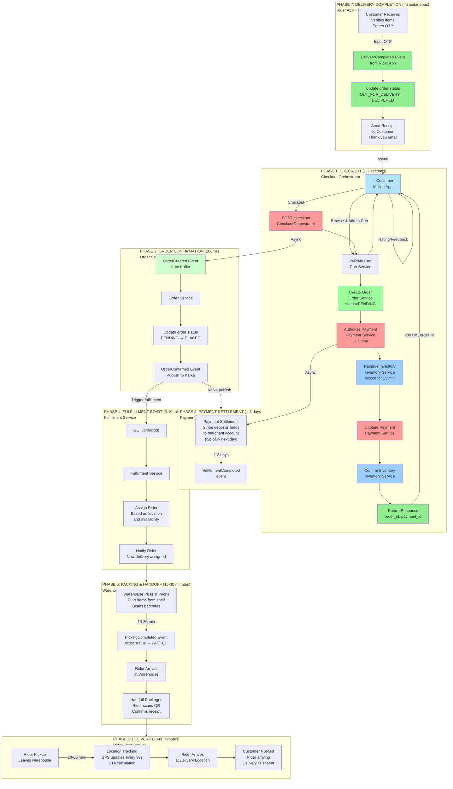
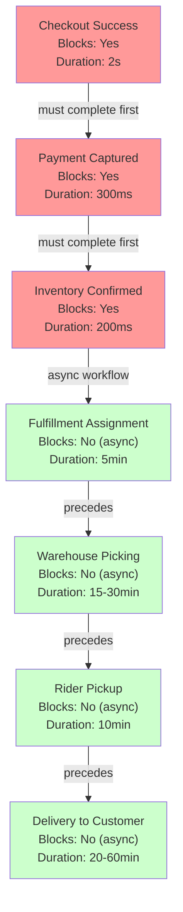

# Checkout Orchestrator Service - Complete Order Lifecycle (End-to-End)

## Full Journey: Order Placement through Delivery



## Timeline with SLO Targets

```mermaid
graph LR
    T0["T0: 00:00:00<br/>User initiates checkout"]
    T1["T1: 00:00:02<br/>Checkout response<br/>SLO: <2s p99"]
    T2["T2: 00:00:05<br/>Order confirmation<br/>received by backend<br/>SLO: <5s async"]
    T3["T3: 00:05:00<br/>Fulfillment starts<br/>Rider assigned<br/>SLO: <5min"]
    T4["T4: 00:30:00<br/>Packing complete<br/>SLO: <30min warehouse"]
    T5["T5: 00:45:00<br/>Rider pickup<br/>Leaves warehouse"]
    T6["T6: 01:00:00<br/>Delivery<br/>to customer<br/>SLO: <1hour<br/>end-to-end"]
    T7["T7: 24:00:00<br/>Payment settlement<br/>SLO: 1-3 days"]

    T0 -->|Checkout API| T1
    T1 -->|Kafka events| T2
    T2 -->|Auto-fulfillment| T3
    T3 -->|Warehouse ops| T4
    T4 -->|Rider dispatch| T5
    T5 -->|Delivery route| T6
    T6 -->|Order complete| T7

    style T1 fill:#ff9999
    style T6 fill:#90EE90
    style T7 fill:#ffffcc
```



## Data Transformations During Journey

```
T0: User Input
├─ user_id: "uuid-user-123"
├─ items: [{product_id, qty, sku}, ...]
├─ delivery_address: {lat, lng, street, ...}
└─ payment_method_id: "pm_stripe_xyz"
│
T1: Checkout Response (Checkout Orchestrator)
├─ order_id: "ord-uuid-001"
├─ payment_id: "pay-uuid-001"
├─ total_cents: 50000 (500 INR)
├─ status: "SUCCESS"
├─ reservation_id: "res-uuid-001"
└─ timestamp: "2024-03-21T10:00:00Z"
│
T2: Order Created Event (Kafka → Order Service)
├─ order_id: "ord-uuid-001"
├─ user_id: "uuid-user-123"
├─ items: [{product_id, qty, unit_price}, ...]
├─ total_cents: 50000
├─ delivery_address: {...}
├─ status: "PLACED"
└─ event_timestamp: "2024-03-21T10:00:01Z"
│
T3: Payment Captured Event (Kafka → Order Service)
├─ payment_id: "pay-uuid-001"
├─ order_id: "ord-uuid-001"
├─ amount_cents: 50000
├─ status: "CAPTURED"
├─ psp_reference: "ch_stripe_abc123"
└─ event_timestamp: "2024-03-21T10:00:02Z"
│
T4: Fulfillment Assignment (Fulfillment Service)
├─ order_id: "ord-uuid-001"
├─ fulfillment_id: "ful-uuid-001"
├─ assigned_rider_id: "rider-uuid-456"
├─ pickup_store_id: "store-mumbai-001"
├─ delivery_address: {lat, lng}
├─ eta_minutes: 45
└─ status: "RIDER_ASSIGNED"
│
T5: Picked Event (Warehouse System)
├─ order_id: "ord-uuid-001"
├─ picked_items: [{sku, qty_picked}, ...]
├─ warehouse_id: "warehouse-mumbai-001"
├─ pack_timestamp: "2024-03-21T10:30:00Z"
└─ status: "PACKED"
│
T6: Started Delivery Event (Rider App)
├─ order_id: "ord-uuid-001"
├─ rider_id: "rider-uuid-456"
├─ current_location: {lat, lng}
├─ destination: {lat, lng}
├─ eta_seconds: 1200
└─ status: "OUT_FOR_DELIVERY"
│
T7: Delivered Event (Rider App)
├─ order_id: "ord-uuid-001"
├─ rider_id: "rider-uuid-456"
├─ delivery_timestamp: "2024-03-21T10:59:00Z"
├─ proof_of_delivery: "photo_url"
├─ customer_otp_verified: true
└─ status: "DELIVERED"
│
T8: Settlement Event (Payment Service)
├─ order_id: "ord-uuid-001"
├─ payment_id: "pay-uuid-001"
├─ amount_cents: 50000
├─ settlement_reference: "settle_stripe_xyz"
├─ settlement_date: "2024-03-22"
└─ status: "SETTLED"
```

## Critical Path (What Blocks Delivery)



## Compensation Paths (Rollback Scenarios)

```
Scenario 1: Payment Declined
├─ Checkout Orchestrator receives decline from PSP
├─ Action: Void authorization (if any)
├─ Action: Cancel order (status=CANCELLED)
├─ Action: Return 402 to customer
└─ User can retry with different payment method

Scenario 2: Inventory Unavailable
├─ Inventory Service returns insufficient stock
├─ Action: Void payment authorization
├─ Action: Cancel order
├─ Action: Return 503 to customer
├─ Action: Release inventory reservation
└─ Item available for other customers

Scenario 3: Timeout During Fulfillment
├─ Order status is PENDING (payment not yet captured)
├─ Action: Retry activity up to 2x
├─ Action: If still timeout, void payment
├─ Action: Cancel order
└─ TTL: 15 minutes (auto-cancel if not captured)

Scenario 4: Rider Cancellation Before Delivery
├─ Rider unable to deliver (vehicle breakdown, etc.)
├─ Action: Re-assign to another rider
├─ If no riders available:
├─ Action: Refund customer (captured payment)
├─ Action: Cancel order
├─ Action: Release inventory for resale
└─ Customer notified of cancellation

Scenario 5: Customer Rejects Delivery
├─ Customer refuses to accept items
├─ Action: Rider returns to warehouse
├─ Action: Refund customer (full payment)
├─ Action: Update order status to RETURNED
├─ Action: Re-stock items in inventory
└─ Return reason recorded for analytics
```

## SLO Compliance Checkpoints

| Checkpoint | SLO | Measurement | Pass Criteria |
|---|---|---|---|
| **Checkout API Response** | <2s p99 | Time from POST /checkout to 200 OK | Response received in <2s |
| **Order Confirmation** | <5s | Time from response to OrderCreated event | Event published in <5s |
| **Payment Capture** | <300ms | Time from authorize to capture activity | Capture succeeds in <300ms |
| **Inventory Confirmation** | <200ms | Time from reserve to confirm activity | Confirmation in <200ms |
| **Fulfillment Assignment** | <5min | Time from PLACED to RIDER_ASSIGNED | Rider assigned in <5min |
| **End-to-End Delivery** | <1hour | Time from PLACED to DELIVERED | Delivery completed in <1hour |
| **Payment Settlement** | 1-3 days | Time from CAPTURED to SETTLED | Settlement in 1-3 business days |
| **Error Budget** | 99.9% | Monthly availability | Max 8.6 min downtime/month |
