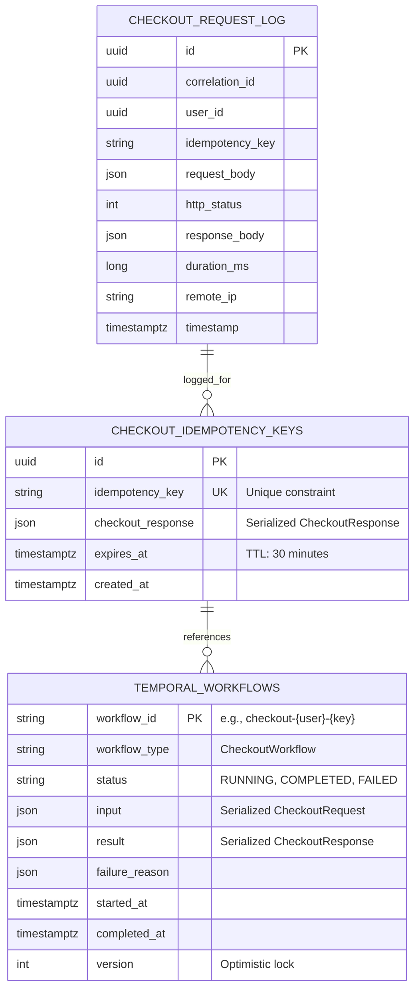
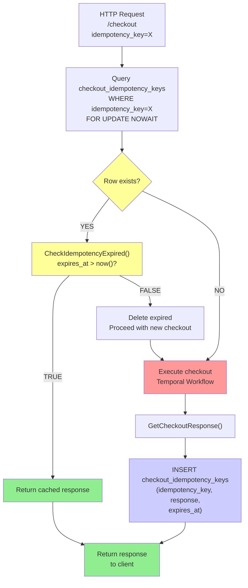

# Checkout Orchestrator Service - Entity Relationship Diagram

## Database Schema



## Detailed Table Definitions

### checkout_idempotency_keys

```sql
CREATE TABLE checkout_idempotency_keys (
    id                  UUID PRIMARY KEY DEFAULT gen_random_uuid(),
    idempotency_key     VARCHAR(64)  NOT NULL,
    checkout_response   JSONB        NOT NULL,
    expires_at          TIMESTAMPTZ  NOT NULL,
    created_at          TIMESTAMPTZ  NOT NULL DEFAULT now(),
    CONSTRAINT uq_checkout_idempotency UNIQUE (idempotency_key),
    CONSTRAINT chk_expires_future CHECK (expires_at > now())
);

CREATE INDEX idx_checkout_idempotency_key ON checkout_idempotency_keys(idempotency_key);
CREATE INDEX idx_checkout_expires_at ON checkout_idempotency_keys(expires_at);
```

**Columns:**
- `id`: UUID primary key
- `idempotency_key`: SHA256 hash of request hash (64 chars), used for duplicate detection
- `checkout_response`: Full JSON response serialized (order_id, payment_id, status, total, etc.)
- `expires_at`: Expiration timestamp (now + 30 minutes at insert)
- `created_at`: When the checkout was first processed

**Indexes:**
- `uq_checkout_idempotency`: Enforces unique constraint on idempotency_key
- `idx_checkout_expires_at`: For cleanup job: delete expired keys

**Queries:**
```sql
-- Idempotency check
SELECT checkout_response FROM checkout_idempotency_keys
WHERE idempotency_key = $1
  AND expires_at > now()
FOR UPDATE;

-- Cleanup expired keys
DELETE FROM checkout_idempotency_keys
WHERE expires_at < now() - interval '1 day';
```

## Data Flow Through Database



## Temporal Execution History (Event Sourcing)

While Checkout Orchestrator doesn't persist workflow history directly (Temporal handles this), the workflow execution follows this immutable event log pattern:

```
WorkflowStarted
├─ WorkflowExecutionStarted (workflowId, input, timestamp)
│
├─ Activity: validateCart
│  ├─ ActivityTaskScheduled (cartValidationActivityId, timeout=2s)
│  ├─ ActivityTaskStarted
│  └─ ActivityTaskCompleted (result: cart_valid)
│
├─ Activity: createOrder
│  ├─ ActivityTaskScheduled (orderCreationActivityId, timeout=5s)
│  ├─ ActivityTaskStarted
│  └─ ActivityTaskCompleted (result: order_id)
│
├─ Activity: authorizePayment
│  ├─ ActivityTaskScheduled (paymentAuthActivityId, timeout=5s)
│  ├─ ActivityTaskStarted
│  └─ ActivityTaskCompleted (result: payment_id, status=AUTHORIZED)
│
├─ Activity: reserveStock
│  ├─ ActivityTaskScheduled (inventoryReserveActivityId, timeout=3s)
│  ├─ ActivityTaskStarted
│  └─ ActivityTaskCompleted (result: reservation_id)
│
├─ Activity: capturePayment
│  ├─ ActivityTaskScheduled (paymentCaptureActivityId, timeout=3s)
│  ├─ ActivityTaskStarted
│  └─ ActivityTaskCompleted (result: status=CAPTURED)
│
├─ Activity: confirmStock
│  ├─ ActivityTaskScheduled (inventoryConfirmActivityId, timeout=2s)
│  ├─ ActivityTaskStarted
│  └─ ActivityTaskCompleted (result: confirmed)
│
└─ WorkflowExecutionCompleted (result: CheckoutResponse, timestamp)
```

**Key Properties:**
- **Immutable**: History never changes after record
- **Deterministic replay**: Can replay from any point
- **Idempotent**: Activities must be idempotent (no duplicate charges)
- **Retention**: 30 days (PCI DSS requirement)
- **Storage**: Temporal cluster (PostgreSQL backend)

## Schema Characteristics

| Property | Value | Rationale |
|---|---|---|
| **Primary Key** | UUID (natural) | Globally unique, no sequence dependency |
| **Idempotency** | Unique constraint on key | Enforces 1-to-1 mapping key→response |
| **TTL** | expires_at TIMESTAMPTZ | Allows cleanup without job scheduler |
| **Locking** | FOR UPDATE | Serialize concurrent requests with same key |
| **Index Strategy** | Composite on (idempotency_key, expires_at) | Supports both lookup and cleanup queries |
| **Audit Trail** | created_at timestamp | Track when checkout was first processed |
| **JSON Storage** | JSONB (PostgreSQL native) | Query response fields if needed, good compression |

## Connection Pool Configuration

```
Database: PostgreSQL checkout_db
Min Pool: 5 connections
Max Pool: 20 connections
Connection Timeout: 30 seconds
Idle Timeout: 900 seconds (15 min)
Validation Query: SELECT 1
```

## Key Constraints & Validations

```sql
-- Enforce idempotency key uniqueness
ALTER TABLE checkout_idempotency_keys
ADD CONSTRAINT uq_checkout_idempotency UNIQUE (idempotency_key);

-- Prevent storing expired keys
ALTER TABLE checkout_idempotency_keys
ADD CONSTRAINT chk_expires_future CHECK (expires_at > now());

-- Ensure response is not null
ALTER TABLE checkout_idempotency_keys
ADD CONSTRAINT nn_response CHECK (checkout_response IS NOT NULL);
```
