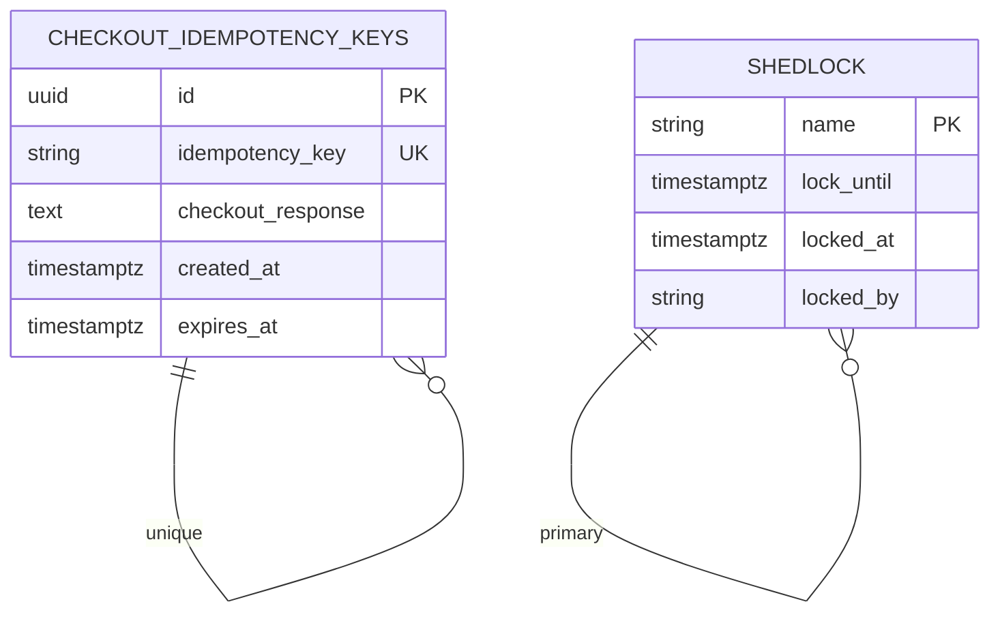

# Checkout Orchestrator Service - Entity Relationship Diagram

## Database Schema (ERD)



## Tables

### checkout_idempotency_keys
**Purpose**: Store checkout request responses for idempotent retries

| Column | Type | Constraint | Description |
|--------|------|-----------|-------------|
| id | UUID | PRIMARY KEY DEFAULT gen_random_uuid() | Unique row identifier |
| idempotency_key | VARCHAR(255) | UNIQUE NOT NULL | Client-provided or generated UUID |
| checkout_response | TEXT | NOT NULL | Serialized CheckoutResponse JSON |
| created_at | TIMESTAMPTZ | NOT NULL DEFAULT now() | Insertion timestamp |
| expires_at | TIMESTAMPTZ | NOT NULL | TTL expiry (30 min from creation) |

**Indexes**:
- `idx_idempotency_key` (idempotency_key) - For fast duplicate detection

**Retention**: Rows auto-expire after 30 minutes (manual cleanup or TTL-based)

### shedlock
**Purpose**: Distributed lock table for ShedLock (scheduled job locking)

| Column | Type | Constraint | Description |
|--------|------|-----------|-------------|
| name | VARCHAR(64) | PRIMARY KEY | Lock identifier (job name) |
| lock_until | TIMESTAMPTZ | NOT NULL | Lock timeout |
| locked_at | TIMESTAMPTZ | NOT NULL DEFAULT now() | Lock acquisition time |
| locked_by | VARCHAR(255) | NOT NULL | Node ID holding lock |

**Indexes**:
- `pk_shedlock` (name) - Primary key lock

**Usage**: Prevents concurrent execution of distributed scheduled tasks

## Data Model

```
CheckoutIdempotencyKey {
  id: UUID                    // Auto-generated
  idempotencyKey: String      // User or system generated
  checkoutResponse: {         // JSON serialization of:
    orderId: UUID
    status: String            // "COMPLETED" | "FAILED"
    message: String
    totalCents: Long
  }
  createdAt: Instant          // System time
  expiresAt: Instant          // createdAt + 30 minutes
}
```

## Query Patterns

```sql
-- Idempotency check
SELECT * FROM checkout_idempotency_keys
WHERE idempotency_key = ?
AND expires_at > now();

-- Insert cache
INSERT INTO checkout_idempotency_keys
(idempotency_key, checkout_response, expires_at)
VALUES (?, ?, ?);

-- Cleanup expired entries
DELETE FROM checkout_idempotency_keys
WHERE expires_at < now();
```
