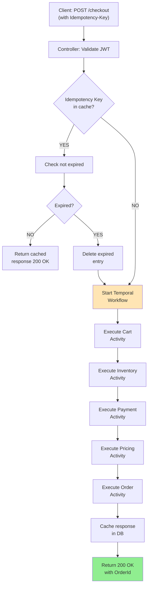
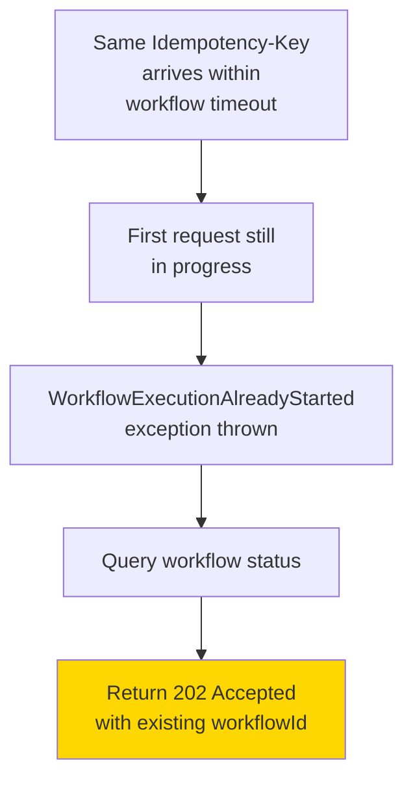
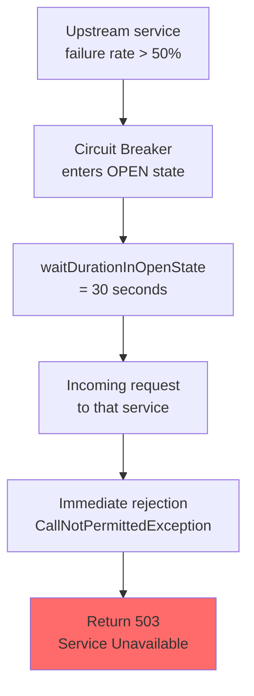
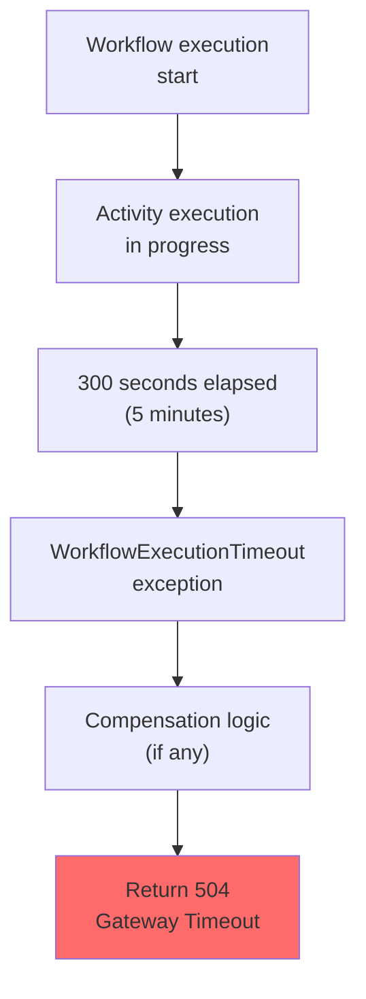
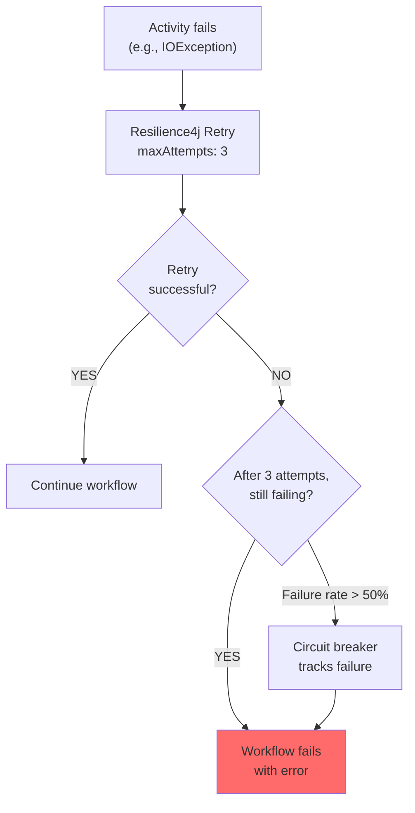
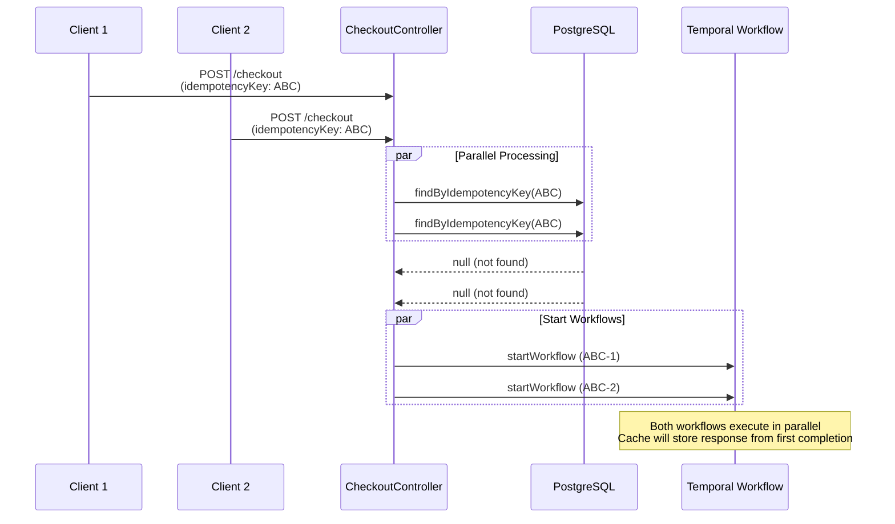

# Checkout Orchestrator Service - Request/Response Flows

## Happy Path: Successful Checkout

## Error Paths

### Path 1: Duplicate Workflow (WorkflowExecutionAlreadyStarted)

### Path 2: Circuit Breaker Open

### Path 3: Timeout (5 minute execution window)

## Failure Recovery

## Concurrent Request Scenario

